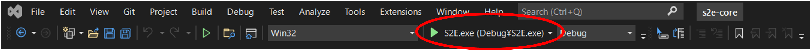

# How to make VS project from Cmake

## 1.  Overview

1. Functions

   - CMake can support multi-platform compiling
   - 

2. Related files

   - ./CmakeLists.txt

     - Base file for CMake
   - ./CMakeSettings.json
     - Setting file for VS to use CMake
   - Other CMakeLists.txt
     - Currently, we don't have, but we will make CMakeLists in sub directories.

## 2. Flow of compiling in VS

1. Launch VS 2017

2. Select CMakeLists.txt you want to use

   - Files/Open/CMake

3. Build the CMake file

   - CMake/Build All

   

4. Check errors

5. Run the program

   - Users can use break point similar with normal sln file based projects.

   

6. Check log files
