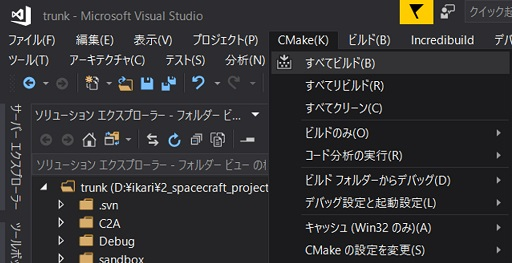

# How to compile with Visual Studio

## 1.  Overview

1. Functions

   - CMake can support multi-platform compiling
   
2. Related files

   - ./CmakeLists.txt

     - Base file for CMake
   - ./CMakeSettings.json
     - Setting file for VS to use CMake
   - Other CMakeLists.txt in subdirectories

## 2. Flow of compiling in VS

1. Launch VS 2017 or 2019

2. Select CMakeLists.txt you want to use

   - Files/Open/CMake

3. Build the CMake file

   - CMake/Build All

   

4. Check errors

5. Run the program

   - Users can use break point similar with normal sln file based projects.

   

6. Check log files

## 3. Note

- The difference from the above compiling procedure when using VS2019

   - After opening `CMakeLists.txt`, `CMake(K)` tab does not appear in the menu bar.

      - So, you should build by right-clicking `CMakeLists.txt` in Solution Explorer after rewriting from `"generator": "Visual Studio 15 2017",` to `"generator": "Visual Studio 16 2019",` in `CMakeSetting.json`.

- If you see the error `Generator Visual Studio 15 2017 could not find any instance of Visual Studio`,

   - Please install `Visual Studio 15 2017 compiler` into your Visual Studio 2019 environment. (It can be selected when you install the VS2019)

   Or

   - Please edit compiler setting in `CMakeSetting.json` as `"generator": "Visual Studio 16 2019",`

