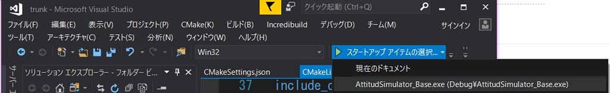

# How to compile with Visual Studio

## 1.  Overview
This document explains how to construct a build and execute environment for Visual Studio with CMake.  
We recommend using VS2019, but users can use VS2017 with small modifications.

- Related files
  - ./CmakeLists.txt
    - Base file for CMake
  - ./CMakeSettings.json
    - Setting file for VS to use CMake
  - Other CMakeLists.txt in subdirectories

## 2. The flow of build and execute in Visual Studio
1. Launch VS 2019

2. Select `CMakeLists.txt` you want to use
   - Files/Open/CMake

3. Build the CMake file
   - Select `CMakeLists.txt` with right-clicking, and 

4. Check errors

5. Run the program
   - Users can use a `breakpoint` similar with normal `sln` file based projects.
   

6. Check log files

## 3. Note
- For VS2017 users
  - Please edit compiler setting in `CMakeSetting.json` as `"generator": "Visual Studio 15 2017"`.

