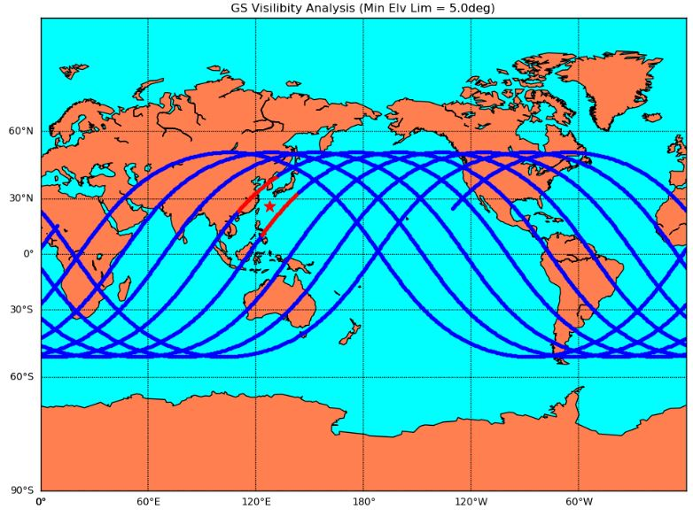
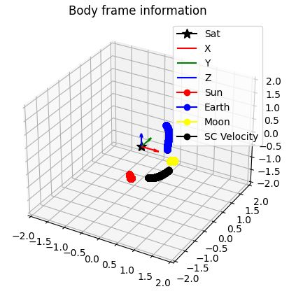

# How to Visualize Simulation Results

## 1.  Overview
The S2E generates the CSV format log file as the simulation results at the `data/log` directory. Users can use them to check the result of their simulation with the following methods.  
- Open the CSV file with a spreadsheet application like Excel, and make charts to analyze and/or visualize the results.
- Open the CSV file with user's handmade programs to analyze and/or visualize the results.
- Use the `Plot Scripts` provided by the `S2E-CORE` to visualize the results.

We are trying to increase the `Plot Scripts` to share the analysis method with many users and to improve the usability of S2E. We are welcome to add new `Plot Scripts` by users.


## 2. How to use `Plot Scripts`
- Overview
  - Users can find the scripts at the `s2e-core/scripts/Plot` directory.
  - They are written in [Python](https://www.python.org/).
- Environment to execute Python
  - We use [Pipenv](https://pypi.org/project/pipenv/) to manage the environment.  
  - In the `s2e-core/scripts/Plot` directory, you can also find the `Pipfile` which defines the version of Python and other libraries used in the scripts.
  - By using the `Pipenv`, users can easily construct the virtual environment to execute the scripts provided by the S2E
  - Users can create a virtual environment by running following commands after changing directory to ```scripts/Plot```
    ```
    # Windows
    pip install pipenv
    pipenv sync
    ```
  - Then users can run scripts by following commands.
    ```
    # Windows
    pipenv run python <path to scripts> --file-tag <log file tag>
    ```
    Example
    ```
    pipenv run python .\plot_orbit_eci.py --file-tag 230213_003054
    ``` 
- Example of the Visualization
  - Satellite trajectory on the earth map and ground station visibility analysis
    - The red star means the ground station.
    - The blue line shows the satellite trajectory and it turns red when the satellite is visible from the ground station.
    <div align="center">
      
    </div>
  - Direction information at the satellite body fixed frame
    - Users can see the direction vector of the sun, earth, moon, and the velocity of the satellite at the body fixed frame to check the attitude control works well.
    <div align="center">
      
    </div>

## 4. References
- NA
