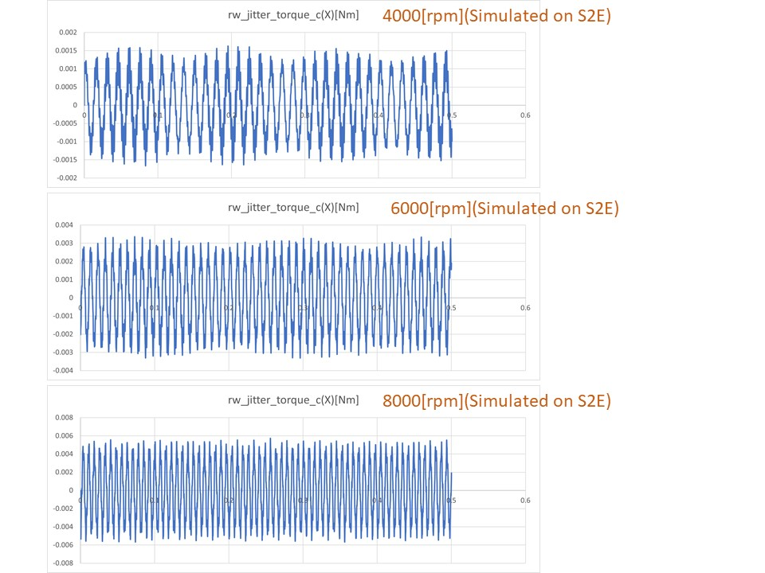
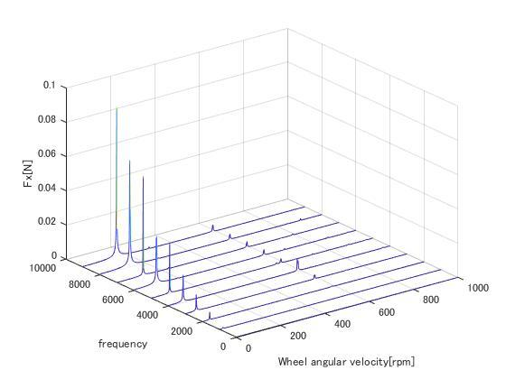

# Specification for ReactionWheelJitter class

## 1.  Overview
- `ReactionWheelJitter` class simulates the high-frequency jitter of Reaction Wheels.
- This class uses:
  + Angular velocity of the RW
  + Parameters of RW disturbance measured by experiments
- This class returns:
  + RW jitter forces and torques in the component frame
  + RW jitter forces and torques in the body frame

### 1. functions
- `CalcJitter` 
  + Simulates the reaction wheel jitter
  + (If Enabled) Calls `AddStructuralResonance()`. This function adds the effect of structural resonance to the high-frequency disturbance of RW. You can choose to consider the effect of structural resonance or not.

### 2. files
- `reaction_wheel_jitter.cpp`, `reaction_wheel_jitter.hpp`
- `reaction_wheel.ini`
- `radial_force_harmonics_coefficients.csv`,`radial_torque_harmonics_coefficients.csv` 
  + These files contain the harmonic coefficients from experiments.

### 3. how to use
- Set the harmonics coefficients in `radial_force_harmonics_coefficients.csv` and `radial_torque_harmonics_coefficients.csv`
- The first column is an array of the $h_i$( $i$-th harmonic number). The second column is an array of the $C_i$ (amplitude of the $i$-th harmonic).
- Set parameters in `reaction_wheel.ini`
- When only the static imbalance and dynamic imbalance(correspond to $C_i$ at $h_i\ne1$) is known according to the spec sheet, edit the files as follows.
  + `radial_force_harmonics_coefficients.csv`
    * Set $h_1$(the line 1 of the first column) as $1.0$.
    * Set $C_1$(the line 1 of the second column) as the static imbalance on the spec sheet.
  + `radial_torque_harmonics_coefficients.csv`
    * Set $h_1$(the line 1 of the first column) as $1.0$.
    * Set $C_1$(the line 1 of the second column) as the dynamic imbalance on the spec sheet.
  + `reaction_wheel.ini`
    * Set `harmonics_degree = 1`.
- Set the jitter update period to an appropriate value.
  + Jitter update period is equal to the product of `CompoUpdateIntervalSec` in `simulation_base.ini` and `fast_prescaler` in `reaction_wheel.ini`.
  + For correct calculation, the update period of the jitter should be set to approximately 0.1ms.
  + A larger update period is not a problem, but it will cause aliasing in the jitter waveform.

## 2. Explanation of Algorithm
### 1. `CalcJitter`
#### 1. overview
- Function to calculate jitter force and torque

#### 2. input and output
- input
  + angular velocity of the RW
- output
  + jitter force and torque in the component frame
  + jitter force and torque in the body frame

#### 3. algorithm
- The disturbances consist of discrete harmonics of reaction wheel speed with amplitudes proportional to the square of the wheel speed:

```math
u(t)=\sum_{i=1}^n C_i\Omega^2\sin(2\pi h_i\Omega t+\alpha_i)
```

- where $u(t)$ is the disturbance force and torque in Newton (N) or Newton-meters (Nm), $n$ is the number of harmonics included in the model, $C_i$ is the amplitude of the $i$ th harmonic in $\mathrm{N^2/Hz}$ (or $\mathrm{(Nm)^2/Hz}$), $\Omega$ is the wheel speed in Hz, $h_i$ is the $i$ th harmonic number and $\alpha_i$ is a random phase (assumed to be uniform over $[0, 2\pi]$) [1].
- $\alpha_i$ is generated as a uniform random number in the constructor.
- When users want to use a more precise model, set `considers_structural_resonance` to ENABLE in `RW.ini` and use a model that takes structural resonance inside the RW into account.
  + If structural resonances are not taken into account, the RW disturbance will be underestimated, but it is not a significant change in general.
  + See the description of `AddStructuralResonance()` for the algorithm to calculate the structural resonance.

### 2. `AddStructuralResonance()`
#### 1. overview
- Function to add structural resonance inside the RW on the disturbance by harmonics of RW

#### 2. input and output
- input:
  + N/A
- output:
  + jitter force and torque with structural resonance in component frame

#### 3. algorithm
- The transfer function from disturbance by harmonics of RW without resonance ( $u(t)$ ) to disturbance with resonance ( $y(t)$ ) is modeled as following equation: 
```math
G(s)=\frac{s^2+2\zeta\omega_ns+\omega_n^2}{s^2+2d\zeta\omega_ns+\omega_n^2}
```
```math
Y(s)=G(s)U(s)
```
- where $\omega_n$ is the angular frequency on the structural resonance. Other parameters such as $\zeta$, $d$ are determined by the result of experiments.
- To perform the simulation in discrete time, A bi-linear transformation $G(s)\rightarrow H(z)$ is applied. $T$ is the jitter update period. 

```math
\begin{aligned}
G(\frac{2}{T}\frac{z-1}{z+1})&=\dfrac{(\frac{2}{T}\frac{z-1}{z+1})^2+2\zeta\omega_n(\frac{2}{T}\frac{z-1}{z+1})+\omega_n^2}{(\frac{2}{T}\frac{z-1}{z+1})^2+2d\zeta\omega_n(\frac{2}{T}\frac{z-1}{z+1})+\omega_n^2}\\
&=\dfrac{(4+4\zeta T\omega_n+T^2\omega_n^2)+(-8+2T^2\omega_n^2)z^{-1}+(4-4\zeta T\omega_n+T^2\omega_n^2)z^{-2}}{(4+4d\zeta T\omega_n+T^2\omega_n^2)+(-8+2T^2\omega_n^2)z^{-1}+(4-4d\zeta T\omega_n+T^2\omega_n^2)z^{-2}}\\
&=\dfrac{c_3+c_4z^{-1}+c_5z^{-2}}{c_0+c_1z^{-1}+c_2z^{-2}}\\
&=H(z)
\end{aligned}
```

- The $\omega_n$ should be the fixed value by pre-warping because there is frequency distortion due to bilinear transformation. The formula for calculating $\omega_n$ for the true resonant frequency $\omega_d$ is as follows:

```math
\omega_n=\frac{2}{T}\tan(\frac{T\omega_d}{2})
```

- The bi-linear transformation transforms the relationship between input $u$ and output $y$ as follows:

```math
\begin{aligned}
Y(z)&=H(z)U(z)\\
(c_0+c_1z^{-1}+c_2z^{-2})Y(z)&=(c_3+c_4z^{-1}+c_5z^{-2})U(z)
\end{aligned}
```

- By applying the inverse z-transform, the continuous relationship between $y(t)$ and $u(t)$ can be expressed as a  discrete relationship of a difference equation between $y[n]$ and $u[n]$, where $[n]$ is the current simulation time step. The difference equation is as follows:
```math
c_0y[n]+c_1y[n-1]+c_2y[n-2]=c_3u[n]+c_4u[n-1]+c_5u[n-2]
```

- Therefore, $y[n]$ is calculated as follows.
```math
y[n]=\frac{(-c_1y[n-1]-c_2y[n-2]+c_3u[n]+c_4u[n-1]+c_5u[n-2])}{c_0}
```

## 3. Results of verifications
- In this section, jitter output when the RW is rotated at a constant speed is verified.
### 1. X-axis torque data in the time domain 
#### 1. overview
-   The RW model is rotated at 4000 rpm, 6000 rpm, and 8000 rpm, and the disturbance torque is compared with the actual experiment.
#### 2. initial condition
- input files
  - `sample_simulation_base.ini`
  - `reaction_wheel.ini`
- initial condition
  - `sample_simulation_base.ini`
    ```
    EndTimeSec = 0.5
    StepTimeSec = 0.0001
    CompoUpdateIntervalSec = 0.0001
    LogOutputIntervalSec = 0.0001
    ```
  - `reaction_wheel.ini`
    ```
    fast_prescaler = 1
    max_angular_velocity = 9000.0
    calculation = ENABLE
    logging = ENABLE
    harmonics_degree = 12
    considers_structural_resonance = ENABLE
    structural_resonance_freq = 585.0 //[Hz]
    damping_factor = 0.1 //[ ]
    bandwidth = 0.001 //[ ]
    ```
#### 3. result
- The simulation result is compared with the disturbance experiment result of Sinclair RW0.003.
<div align="center">

</div>

- At all speeds, the characteristics of the actual RW are well simulated.
               
### 2. X-axis torque waterfall
#### 1. overview
- The RW model is rotated at 1000, 2000, ..., 9000rpm, and the jitter torque time-domain data was extracted. Then, FFT was applied to the data by Matlab, and the waterfall plot was plotted.

#### 2. initial condition
- same as the initial condition of the verification about the time domain data

#### 3. result
- The simulation result is compared with the disturbance experiment result of Sinclair RW0.003.
<div align="center">

</div>

- Both the first-order mode and the structural resonance ($\omega_n=585\mathrm{Hz}$) are approximately simulated.

## 4. References
1. Masterson, R. A. (1999). Development and validation of empirical and analytical reaction wheel disturbance models (Doctoral dissertation, Massachusetts Institute of Technology).
2. Shields, et al., (2017). Characterization of CubeSat reaction wheel assemblies. Journal of Small Satellites, 6(1), 565-580.

