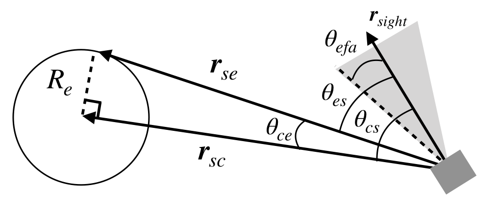

# Specification for Attitude Dynamics

## 1.  Overview

1. functions
   
   - A class that simulates a star tracker sensor
   - The class calculates and returns the observed quaternions and its error flags.

2. files
   
   - STT.cpp, STT.h : Definitions and declarations of the class
   - InitSTT.cpp : Interface functions for the initizalization of `STT` class
   - STT.ini : Initialization file

3. how to use
   
   - Set the parameters in `STT.ini`.
   - Create an instance by using the initialization function `InitSTT`
   - Use `Get*` function to get quaternion information
     

## 2. Explanation of Algorithm 

1. `Update`

2. `Judgement`

    1. `EarthJudgement`
      
      - Calculate the angle $`\theta_{ce}`$ between the earth's center direction $`\boldsymbol{r_{sc}}`$ and the earth's edge direction $`\boldsymbol{r_{se}}`$. `R_e` is the earth's radius.
      - Calculate the angle $`\theta_{es}`$ between the sight direction $`\boldsymbol{r_{sight}}`$ and the earth's edge direction $`\boldsymbol{r_{se}}`$.
      - Judge the STT error flag by comparing $`\theta_{es}`$ with the earth forbidden angle $`\theta_{efa}`$. If $`\theta_{es} > \theta_{efa}`, the earth is completely outside the earth forbidden angle.

      ```math
        \theta_{ce} = \arctan{|\boldsymbol{r_se}|/R_e}
        \\
        \theta_{cs} = \arccos{\boldsymbol{r_se}*\boldsymbol{r_{sight}}}
        \\
        \theta_{es} = \theta_{ce} - \theta_{cs}
        \tag{1}
      ```

      
      
        
## 3. Results of verifications
1. verification of Earth judgement
   1. overview
      - Check that Earth judgement is performed correctly

   2. conditions for the verification
      - PropStepSec: 0.001
      - StepTimeSec: 0.1
      - EndTimeSec: 200
      - Initial position [m] : [4.2164140100E+07,0,0]
      - Initial velocity [m/s] : [0,3.074661E+03,0]
      - ControlledAttitude
        - main mode = EARTH_CENTER_POINTING: the pointing direction is determined by each case
        - sub mode = SUN_POINTING: [0,0,1]
      - STT quaternion from body frame to component frame: [0,0,0,1]
      - Earth forbidden half angle: 10deg
      - The angle between the earth's center and edge direction: 8.6deg

   3. results
      - Angle between pointing direction and earth center = 15deg
        - STT flag is always 1, since the angle $`\theta_{es}`$ between the sight direction and the earth's edge direction is 15 - 8.6 = 6.4deg < 10deg. 
  
         

      - Angle between pointing direction and earth center = 20deg
        - STT flag is always 0, since the angle $`\theta_{es}`$ between the sight direction and the earth's edge direction is 20 - 8.6 = 11.4deg > 10deg.
      
         
      
      - Angle between pointing direction and earth center = 30deg
        - STT flag is always 0, since the angle $`\theta_{es}`$ between the sight direction and the earth's edge direction is 30 - 8.6 = 21.4deg > 10deg.
         
