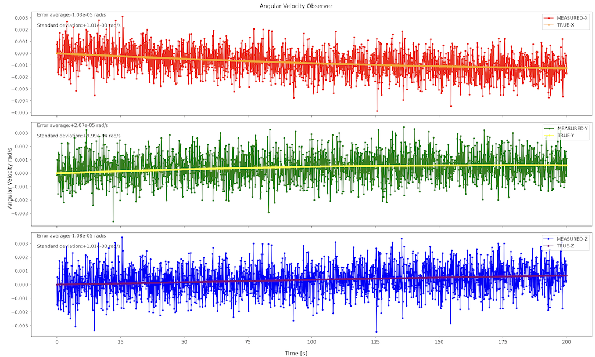

# Specification for AngularVelocityObserver class

## 1.  Overview
### 1. functions 
- The `AngularVelocityObserver` class simulates an ideal angular velocity observer.
- The `AngularVelocityObserver` class observes angular velocity with noise.

### 2. files
- `angular_velocity_observer.cpp, angular_velocity_observer.hpp`: Definitions and declarations of the class
- `angular_velocity_observer.ini`: Initialization file
- `plot_angular_velocity_observer.py`: An example of a Python script to plot angular velocity observer output

### 3. how to use
- Set the parameters in `angular_velocity_observer.ini`.
  - Other parameters
    - Parameters for the `Component` class
    - Parameters for the `Sensor` class
- Create an instance by using the initialization function `InitializeAngularVelocityObserver`
- Use the `GetAngularVelocity_b_rad_s` function to get magnetic field information.

## 2. Explanation of Algorithm 

### 1. MainRoutine
#### 1. Overview
- The `MainRoutine` function adds the noise to the true angular velocity.

#### 2. Inputs and Outputs
- NA

#### 3. Algorithm
- NA

## 3. Results of verifications
- The output result obtained by the default initial settings.
  - The figure is generated by the Python script.

