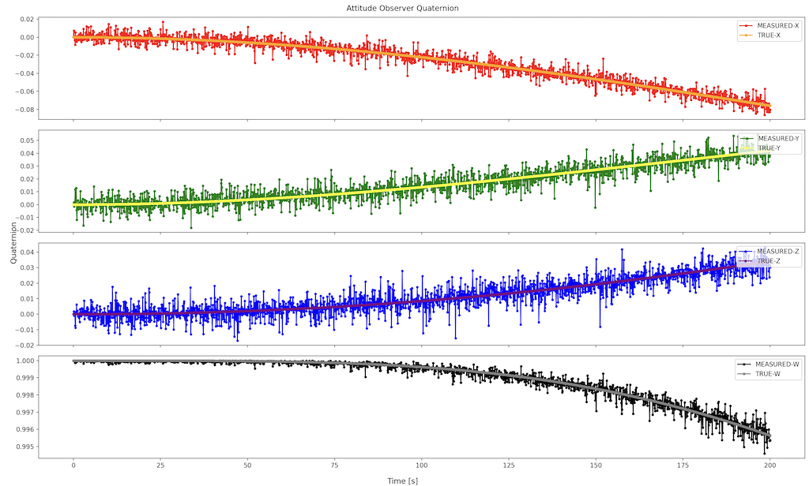

# Specification for AttitudeObserver class

## 1.  Overview
### 1. functions 
- The `AttitudeObserver` class simulates an ideal attitude observer.
- The `AttitudeObserver` class observes attitude quaternion with noise.

### 2. files
- `attitude_observer.cpp, attitude_observer.hpp`: Definitions and declarations of the class
- `attitude_observer.ini`: Initialization file
- `plot_attitude_observer.py`: An example of a Python script to plot attitude observer output

### 3. how to use
- Set the parameters in `attitude_observer.ini`.
  - `error_angle_standard_deviation_deg`: Standard deviation of error angle
  - Other parameters
    - Parameters for the `Component` class
- Create an instance by using the initialization function `InitializeAttitudeObserver`
- Use the `GetQuaternion_i2b` function to get magnetic field information.

## 2. Explanation of Algorithm 

### 1. MainRoutine
#### 1. Overview
- The `MainRoutine` function adds the noise to the true attitude quaternion.

#### 2. Inputs and Outputs
- NA

#### 3. Algorithm
- NA

## 3. Results of verifications
- The output result obtained by the default initial settings.
  - The figure is generated by the Python script.

