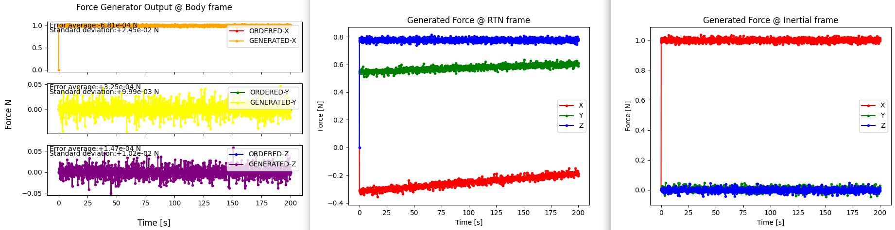

# Specification for ForceGenerator class

## 1.  Overview
### 1. functions 
- The `ForceGenerator` class simulates an ideal force generator.

### 2. files
- `force_generator.cpp, force_generator.hpp`: Definitions and declarations of the class
- `force_generator.ini`: Initialization file
- `plot_force_generator.py`: An example of a Python script to plot force_generator output

### 3. how to use
- Set the parameters in `force_generator.ini`.
  - `force_magnitude_standard_deviation_N`: Standard deviation of force magnitude
  - `force_direction_standard_deviation_deg`: Standard deviation of force direction
  - Other parameters
    - Parameters for the `Component` class
- Create an instance by using the initialization function `InitForceGenerator`
- Use the `SetForce*` function to set the ordered force.
  - Users can select the coordinate of the ordered force.

## 2. Explanation of Algorithm 

### 1. MainRoutine
#### 1. Overview
- The `MainRoutine` function adds output noise to the ordered magnetic moment and calculates generated force.

#### 2. Inputs and Outputs
- NA

#### 3. Algorithm
- NA

## 3. Results of verifications
- The output result obtained by the default initial settings.
  - The figure is generated by the Python script.

