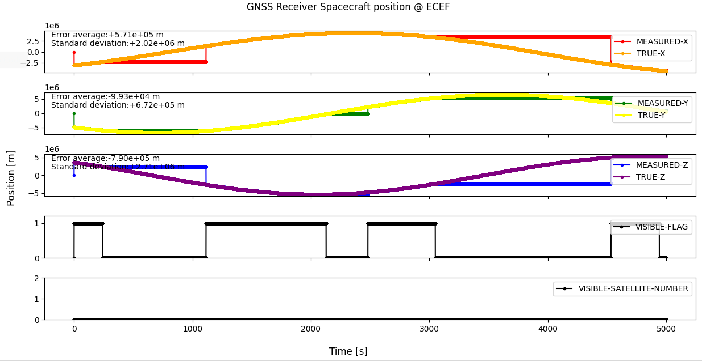
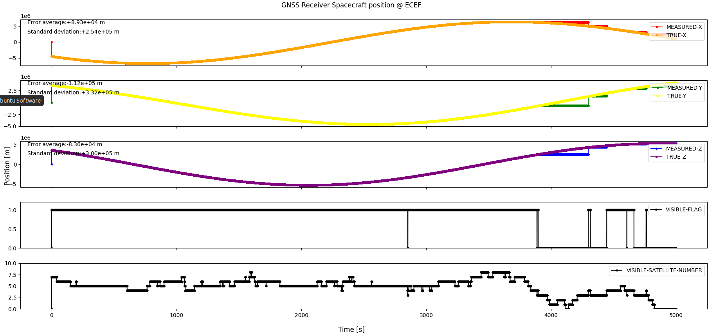

# Specification for GnssReceiver class

## 1. Overview

### 1. Functions

- The `GnssReceiver` class simulates a GNSS receiver.
- It determines whether GNSS navigation data is available from the antenna direction and the selected antenna model.
- When GNSS navigation data is available, it outputs the receiver position and velocity in the Earth-Centered Earth-Fixed (ECEF) frame with independent white noise on each axis. It also converts the measured position to geodetic latitude, longitude, and altitude.
- It maintains the current UTC and GPS time. In the cone antenna model, it also calculates information about each visible GNSS satellite.

### 2. Files

- [`gnss_receiver.cpp`](https://github.com/ut-issl/s2e-core/blob/v8.0.4/src/components/real/aocs/gnss_receiver.cpp), [`gnss_receiver.hpp`](https://github.com/ut-issl/s2e-core/blob/v8.0.4/src/components/real/aocs/gnss_receiver.hpp): Definitions and declarations of the class
- [`gnss_receiver.ini`](https://github.com/ut-issl/s2e-core/blob/v8.0.4/settings/sample_satellite/components/gnss_receiver.ini): Example initialization file

### 3. How to use

- Add a `[GNSS_RECEIVER_<component_id>]` section to `gnss_receiver.ini` and set the parameters described below.
- Create an instance with `InitGnssReceiver`. An overload accepting a `PowerPort` is available when the receiver power state is to be simulated.
- Pass valid references to `Dynamics`, `GnssSatellites`, and `SimulationTime` to the initialization function.
- Use the following getters to obtain observation results:
  - `GetMeasuredPosition_ecef_m`: measured ECEF position [m]
  - `GetMeasuredVelocity_ecef_m_s`: measured ECEF velocity [m/s]
  - `GetMeasuredGeodeticPosition`: measured geodetic position
  - `GetGnssInfo`: information for a visible satellite in the specified channel; this list is generated by the `CONE` model

### 4. Initialization parameters

The following example is based on the sample configuration for component ID 1.

```ini
[GNSS_RECEIVER_1]
prescaler = 10

antenna_position_b_m(0) =  0.0125
antenna_position_b_m(1) =  0.0000
antenna_position_b_m(2) =  0.1815

quaternion_b2c(0) = 0.0
quaternion_b2c(1) = 0.0
quaternion_b2c(2) = 0.0
quaternion_b2c(3) = 1.0

antenna_model = SIMPLE
antenna_half_width_deg = 60

white_noise_standard_deviation_position_ecef_m(0) = 2000.0
white_noise_standard_deviation_position_ecef_m(1) = 1000.0
white_noise_standard_deviation_position_ecef_m(2) = 1500.0

white_noise_standard_deviation_velocity_ecef_m_s(0) = 1.0
white_noise_standard_deviation_velocity_ecef_m_s(1) = 1.5
white_noise_standard_deviation_velocity_ecef_m_s(2) = 2.0
```

| Parameter | Unit | Description |
| --- | --- | --- |
| `prescaler` | - | Frequency scale factor for component updates. Values less than or equal to 1 are set to 1. |
| `antenna_position_b_m(0..2)` | m | GNSS antenna position in the spacecraft body-fixed frame. It is used to determine satellite visibility in the `CONE` model. |
| `quaternion_b2c(0..3)` | - | Frame conversion quaternion from the body-fixed frame to the component (antenna) frame. The antenna boresight is the +Z direction of the component frame. |
| `antenna_model` | - | Antenna visibility model. The available values are `SIMPLE` and `CONE`. An undefined value is replaced with `SIMPLE`. |
| `antenna_half_width_deg` | deg | Half width of the cone antenna pattern. It is used by the `CONE` model. |
| `white_noise_standard_deviation_position_ecef_m(0..2)` | m | Standard deviation of the zero-mean normal random noise added independently to each ECEF position component. |
| `white_noise_standard_deviation_velocity_ecef_m_s(0..2)` | m/s | Standard deviation of the zero-mean normal random noise added independently to each ECEF velocity component. |

When the overload with a `PowerPort` is used, also set the parameters in the `[POWER_PORT]` section. The `CONE` model requires GNSS satellite calculation to be enabled in the simulation settings. If it is disabled, the antenna model is automatically changed to `SIMPLE`.

## 2. Explanation of algorithm

### 1. `MainRoutine`

#### 1. Overview

1. Read the true spacecraft ECI position and the attitude quaternion from `Dynamics`.
2. Determine GNSS visibility with the selected antenna model.
3. If GNSS is visible, copy the true ECEF position and velocity, add white noise, and convert the measured ECEF position to a geodetic position.
4. Update UTC and GPS time from `SimulationTime`.

The measured position, velocity, and geodetic position are updated only while GNSS is visible. When GNSS becomes invisible, their most recently calculated values are retained. UTC and GPS time are updated regardless of visibility.

### 2. Antenna visibility models

#### 1. `SIMPLE` model

The antenna boresight is the +Z axis of the component frame. The boresight is converted to the inertial frame using `quaternion_b2c` and the spacecraft attitude. GNSS is regarded as visible when

```text
dot(spacecraft_position_eci, antenna_boresight_eci) > 0.
```

Therefore, the receiver is available when the antenna points toward the anti-Earth hemisphere. This model does not calculate individual satellite visibility.

#### 2. `CONE` model

The antenna position and boresight are converted to the inertial frame. Each GNSS satellite is visible only when both of the following conditions are satisfied:

- The line of sight between the receiver antenna and the satellite is not occulted by the Earth.
- The direction from the antenna to the satellite is inside the antenna cone:

```text
dot(antenna_boresight_eci, line_of_sight_unit_vector_eci)
    > cos(antenna_half_width_deg).
```

GNSS navigation data is available when at least four satellites are visible. For every visible satellite, the receiver stores:

- GNSS satellite ID
- latitude angle in the component frame [rad]
- longitude angle in the component frame [rad]
- distance from the antenna to the satellite [m]

### 3. Observation noise

For each ECEF axis, the measured position and velocity are calculated as

```text
measured_position[i] = true_position[i] + N(0, position_sigma[i])
measured_velocity[i] = true_velocity[i] + N(0, velocity_sigma[i])
```

where `N(0, sigma)` is a normally distributed random value with zero mean and standard deviation `sigma`. The noise sources for the three axes and for position and velocity are initialized independently.

### 4. Time conversion

UTC is copied from `SimulationTime`. GPS week and seconds of week are calculated from the current Julian day using Julian day `2444244.5` as the GPS time origin. The GPS week value is not truncated at the 1024-week rollover.

### 5. Log output

The component logs the following values with the prefix `gnss_receiver<component_id>_`:

- measured UTC (year, month, day, hour, minute, and second)
- measured ECEF position [m]
- measured ECEF velocity [m/s]
- measured geodetic latitude and longitude [rad]
- measured altitude [m]
- GNSS visibility flag
- number of visible GNSS satellites

In the `SIMPLE` model, individual satellites are not counted, so the number of visible satellites remains zero even when the GNSS visibility flag is true.

## 3. Results of verification

The following figures compare the true and measured receiver positions in the ECEF frame. They also show the GNSS visibility flag and the number of visible satellites.

### 1. `SIMPLE` antenna model



- The visibility flag changes according to whether the antenna boresight points toward the anti-Earth hemisphere.
- While the visibility flag is true, the measured ECEF position follows the true position with the configured observation noise.
- While the visibility flag is false, the measured position retains its last observed value.
- The number of visible satellites remains zero because the `SIMPLE` model does not calculate the visibility of individual satellites.

### 2. `CONE` antenna model



- The number of visible satellites changes according to Earth occultation and the antenna cone angle.
- The visibility flag is true when four or more satellites are visible and false when fewer than four satellites are visible.
- The measured ECEF position follows the true position with observation noise while the visibility flag is true. When the flag is false, the last observed position is retained until GNSS navigation data becomes available again.

These results confirm the visibility determination and position update behavior of both antenna models.
