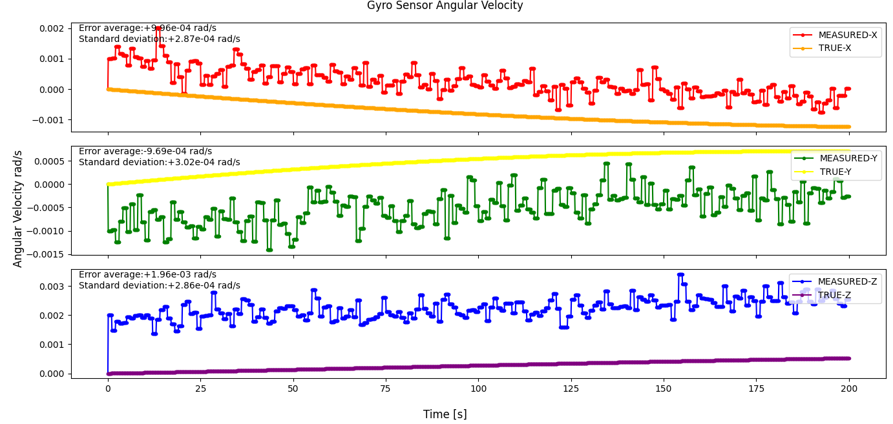

# Specification for GyroSensor class

## 1.  Overview
### 1. functions 
- The `GyroSensor` class simulates a gyro sensor.
- The `GyroSensor` class calculates and returns the observed angular velocity with noise.

### 2. files
- `gyro_sensor.cpp, gyro_sensor.hpp`: Definitions and declarations of the class
- `gyro_sensor.ini`: Initialization file

### 3. how to use
- Set the parameters in `gyro_sensor.ini`.
  - `quaternion_b2c`: Frame conversion quaternion from body to component frame.
  - Other parameters
    - Parameters for the `Component` class
    - Parameters for the `Sensor` class
    - Parameters for the `PowerPort` class
- Create an instance by using the initialization function `InitGyroSensor`
- Use the `Get*` function to get angular velocity information.

## 2. Explanation of Algorithm 

### 1. MainRoutine
#### 1. Overview
- The `MainRoutine` function converts the angular velocity coordinate from the body to the component and adds noises using the feature of the `Sensor` class.

#### 2. Inputs and Outputs
- NA

#### 3. Algorithm
- NA

## 3. Results of verifications
- The output result obtained by the default initial settings.

