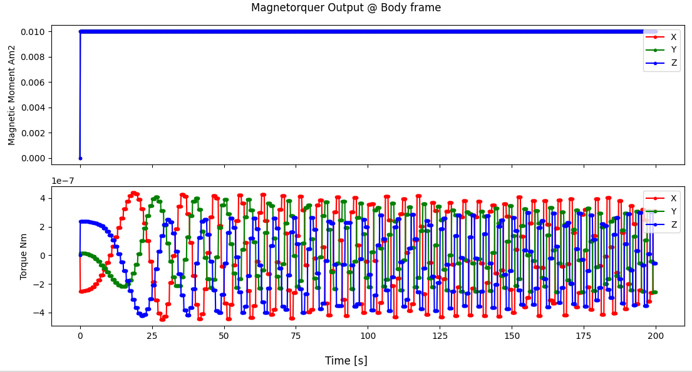

# Specification for Magnetorquer class

## 1.  Overview
### 1. functions 
- The `Magnetorquer` class simulates a magnetorquer.
- The `Magnetorquer` class generates torque caused by the magnetorquer.

### 2. files
- `magnetorquer.cpp, magnetorquer.hpp`: Definitions and declarations of the class
- `magnetorquer.ini`: Initialization file
- `plot_magnetorquer.py`: An example of a Python script to plot magnetorquer output

### 3. how to use
- Set the parameters in `magnetorquer.ini`.
  - `quaternion_b2c`: Frame conversion quaternion from body to component frame.
  - `scale_factor_c`: Scale factor from ordered value to generated value
  - `max_output_magnetic_moment_c_Am2`: Maximum output of magnetorquer
  - `min_output_magnetic_moment_c_Am2`: Minimum output of magnetorquer
  - `constant_bias_noise_c_Am2`: Constant bias noise
  - `random_walk_standard_deviation_c_Am2`: Standard deviation of random walk noise for MTQ output
  - `random_walk_limit_c_Am2`: Limit of random walk noise for MTQ output
  - `white_noise_standard_deviation_c_Am2`: Standard deviation of white noise for MTQ output
  - Other parameters
    - Parameters for the `Component` class
    - Parameters for the `PowerPort` class
- Create an instance by using the initialization function `InitMagnetorquer`
- Use the `SetOutputMagneticMoment*` function to set the ordered magnetic moment.

## 2. Explanation of Algorithm 

### 1. MainRoutine
#### 1. Overview
- The `MainRoutine` function adds output noise to the ordered magnetic moment and calculates generated torque by the interaction between the output magnetic moment and the magnetic field.

#### 2. Inputs and Outputs
- NA

#### 3. Algorithm
- NA

## 3. Results of verifications
- The output result obtained by the default initial settings.
  - The figure is generated by the Python script.

