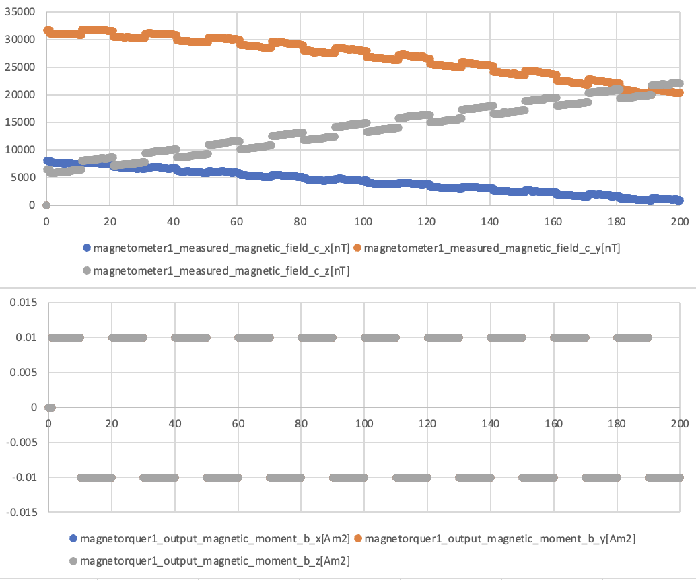

# Specification for MtqMagnetometerInterference class

## 1.  Overview
### 1. functions 
- The `MtqMagnetometerInterference` class simulates an interference phenomenon between magnetorquers (MTQs) and magnetometers.
- The `MtqMagnetometerInterference` class adds bias noise to magnetometers when MTQs are turned on.

### 2. files
- `mtq_magnetometer_interference.cpp, mtq_magnetometer_interference.hpp`: Definitions and declarations of the class
- `component_interference.ini`: Initialization file

### 3. how to use
- Set the parameters in `magnetometer.ini`.
  - `polynomial_degree`: Degree of polynomial
  - `additional_bias_by_mtq_coefficients_*`: Coefficients of the polynomial
- Create an instance of the `MtqMagnetometerInterference` class.
- Execute the `UpdateInterference` function in the `ComponentInterference` function of the `InstalledComponents` class.

## 2. Explanation of Algorithm 

### 1. MainRoutine
#### 1. Overview
- TBW

#### 2. Inputs and Outputs
- TBW

#### 3. Algorithm
- TBW

## 3. Results of verifications
- A result of the interference between MTQ and magnetometer.

