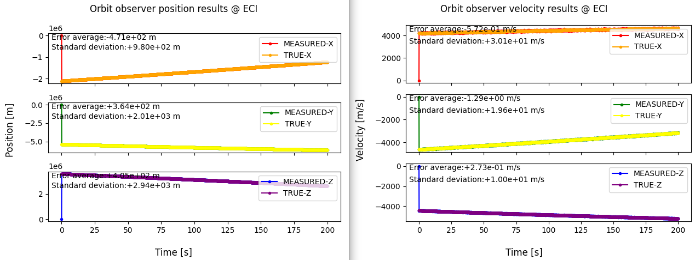
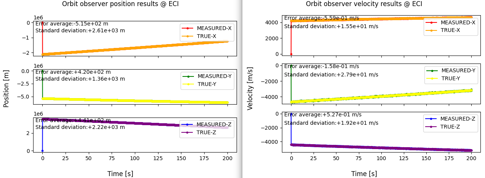

# Specification for OrbitObserver class

## 1. Overview

### 1. Functions

- The `OrbitObserver` class simulates an ideal orbit observer.
- It observes the spacecraft position and velocity in the inertial frame with zero-mean white noise whose components are independent in the selected noise frame.
- The frame in which the observation noise is defined can be selected from the inertial frame and the radial-transverse-normal (RTN) frame.

### 2. Files

- [`orbit_observer.cpp`](https://github.com/ut-issl/s2e-core/blob/v8.0.4/src/components/ideal/orbit_observer.cpp), [`orbit_observer.hpp`](https://github.com/ut-issl/s2e-core/blob/v8.0.4/src/components/ideal/orbit_observer.hpp): Definitions and declarations of the class
- [`orbit_observer.ini`](https://github.com/ut-issl/s2e-core/blob/v8.0.4/settings/sample_satellite/components/orbit_observer.ini): Example initialization file
- [`plot_orbit_observer.py`](https://github.com/ut-issl/s2e-core/blob/e9dcc23fc192d9a794043216eb435d117b2c4912/scripts/Plot/plot_orbit_observer.py): Script used for the verification in [PR #595](https://github.com/ut-issl/s2e-core/pull/595)

### 3. How to use

- Set the parameters in `orbit_observer.ini`.
- Create an instance with `InitializeOrbitObserver`, passing the clock generator, initialization file path, and an `Orbit` reference.
- Use the following getters to obtain the observation results:
  - `GetPosition_i_m`: observed position in the inertial frame [m]
  - `GetVelocity_i_m_s`: observed velocity in the inertial frame [m/s]

### 4. Initialization parameters

The following example is based on the sample configuration.

```ini
[ORBIT_OBSERVER]
noise_frame = INERTIAL

noise_standard_deviation(0) = 1000 // Position-X
noise_standard_deviation(1) = 2000 // Position-Y
noise_standard_deviation(2) = 3000 // Position-Z
noise_standard_deviation(3) = 30   // Velocity-X
noise_standard_deviation(4) = 20   // Velocity-Y
noise_standard_deviation(5) = 10   // Velocity-Z

[COMPONENT_BASE]
prescaler = 1
```

| Parameter | Unit | Description |
| --- | --- | --- |
| `noise_frame` | - | Frame in which the observation noise is defined. The available values are `INERTIAL` and `RTN`. An undefined value is replaced with `INERTIAL`. |
| `noise_standard_deviation(0..2)` | m | Standard deviations of the zero-mean normal random noise for the three position components in the selected noise frame. |
| `noise_standard_deviation(3..5)` | m/s | Standard deviations of the zero-mean normal random noise for the three velocity components in the selected noise frame. |
| `prescaler` | - | Frequency scale factor for component updates. Values less than or equal to 1 are set to 1. |

For `INERTIAL`, the first three elements correspond to the inertial X, Y, and Z position components, and the last three correspond to the inertial X, Y, and Z velocity components. For `RTN`, they correspond to the radial, transverse, and normal components, respectively.

## 2. Explanation of algorithm

### 1. `MainRoutine`

#### 1. Overview

1. Generate independent zero-mean normal random values for the three position-error and three velocity-error components.
2. Express the generated errors in the inertial frame according to `noise_frame`.
3. Add the errors to the true inertial position and velocity obtained from `Orbit`.
4. Store the resulting observed position and velocity.

### 2. `INERTIAL` noise frame

The generated noise is used directly as the inertial-frame error. For each inertial axis, the observed values are calculated as

```text
observed_position_i[axis] = true_position_i[axis]
                          + N(0, position_sigma_i[axis])

observed_velocity_i[axis] = true_velocity_i[axis]
                           + N(0, velocity_sigma_i[axis])
```

where `N(0, sigma)` is a normally distributed random value with zero mean and standard deviation `sigma`.

### 3. `RTN` noise frame

The position and velocity errors are first generated in the RTN frame. The component obtains the inertial-to-RTN quaternion from `Orbit`, converts both error vectors back to the inertial frame, and then adds them to the true inertial position and velocity:

```text
position_error_i = quaternion_i2rtn.inverse(position_error_rtn)
velocity_error_i = quaternion_i2rtn.inverse(velocity_error_rtn)

observed_position_i = true_position_i + position_error_i
observed_velocity_i = true_velocity_i + velocity_error_i
```

Since the noise has zero bias, the implementation applies only the frame conversion to the velocity error and does not include an additional effect from the rotation of the RTN frame.

### 4. Log output

The component logs the following values:

- `orbit_observer_position_i_m`: observed inertial position [m]
- `orbit_observer_velocity_i_m_s`: observed inertial velocity [m/s]

## 3. Results of verification

The following figures are the verification results reported in [PR #595](https://github.com/ut-issl/s2e-core/pull/595). They compare the true and observed position and velocity in the inertial frame over 200 seconds. The configuration sets the standard deviations to `(1000, 2000, 3000) m` for position and `(30, 20, 10) m/s` for velocity.

### 1. `INERTIAL` noise frame



- The error averages of all position and velocity components are sufficiently small compared with the scale of the corresponding standard deviations.
- The measured position-error standard deviations are approximately `(980, 1960, 2940) m`, corresponding to the configured `(1000, 2000, 3000) m`.
- The measured velocity-error standard deviations are approximately `(30.1, 19.6, 10.0) m/s`, corresponding to the configured `(30, 20, 10) m/s`.

### 2. `RTN` noise frame



- The observed values follow the true inertial position and velocity with the RTN-defined noise converted into the inertial frame.
- The inertial-axis standard deviations vary as the RTN frame rotates along the orbit. Therefore, each inertial-axis standard deviation does not directly match one configured RTN-axis value.
- The errors remain centered around zero, and their distribution among the inertial axes confirms that the RTN noise is converted into the inertial frame.

These results confirm the observation-noise generation and frame-conversion behavior for both selectable noise frames.
