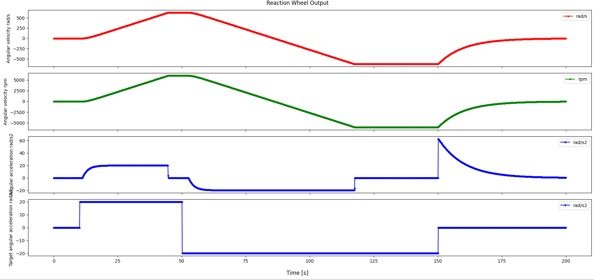
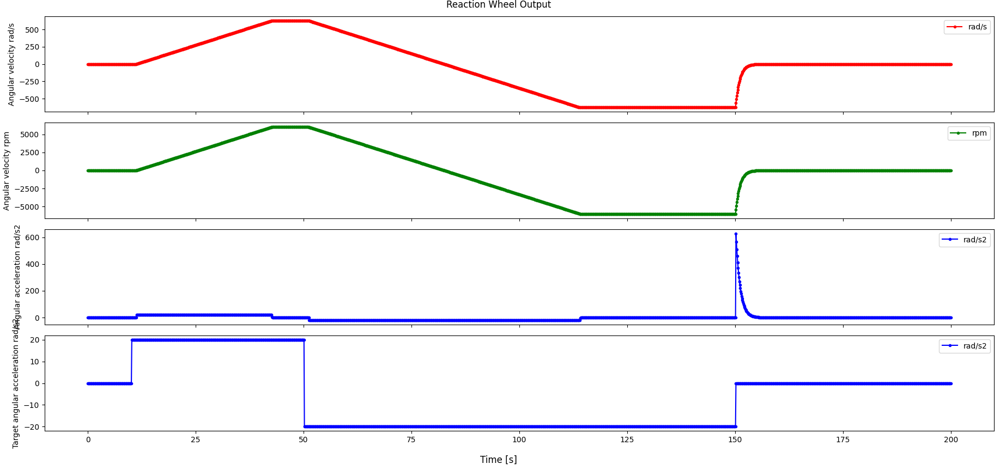

# Specification for ReactionWheel class

## 1.  Overview
### 1. functions 
- The `ReactionWheel` class simulates a reaction wheel.
- The `ReactionWheel` class generates torque caused by the reaction wheel.

### 2. files
- `reaction_wheel.cpp, reaction_wheel.hpp`: Definitions and declarations of the class
- `reaction_wheel_ode.cpp, reaction_wheel_ode.hpp`: Ordinary differential equation for RW emulation
- `reaction_wheel.ini`: Initialization file
- `plot_reaction_wheel.py`: An example of a Python script to plot reaction_wheel output

### 3. how to use
- Set the parameters in `reaction_wheel.ini`.
  - `moment_of_inertia_kgm2`: Moment of inertia of the rotor
  - `max_output_torque_Nm`: Maximum output torque
  - `max_angular_velocity_rpm`: Maximum angular velocity
  - Direction parameters
    - `direction_determination_mode`: Mode of direction definition
    - `quaternion_b2c`: Quaternion body to component (used in RW jitter)
    - `direction_b`: Rotation direction
  - `position_b_m`: Position of the wheel
  - `dead_time_s`: Dead time
  - `time_constant_s`: Time constant of the first-order control lag
  - Friction parameters
    - `friction_order`: Order of friction acceleration
    - `friction_coefficients`: Coefficients of friction acceleration
  - `stop_limit_angular_velocity_rad_s`: Stop limit angular velocity
  - `initial_motor_drive_flag`: Initial motor drive flag
  - `initial_angular_velocity_rad_s`: Initial angular velocity
  - Other parameters
    - Parameters for the `Component` class
    - Parameters for the `PowerPort` class
    - Parameters for the `RwJitter` class
- Create an instance by using the initialization function `InitReactionWheel`
- Use the `SetDriveFlag`, `SetVelocityLimit_rpm`, and `SetTargetTorque_*` to drive the reaction wheel.
- Use the `GetAngularVelocity_*` to get angular velocity information.

## 2. Explanation of Algorithm 

### 1. MainRoutine
#### 1. Overview
- The `MainRoutine` function calculates the generating torque including control lag and friction.

#### 2. Inputs and Outputs
- TBW

#### 3. Algorithm
- TBW

## 3. Results of verifications
- Case 1
  - Parameters: Default
  - Command: +20 rad/s2 -> -20 rad/s2 -> drive_flag = false.

- Case 2
  - Parameters: time_constant = 0, friction_coefficients = 1.0
  - Command: +20 rad/s2 -> -20 rad/s2 -> drive_flag = false.

