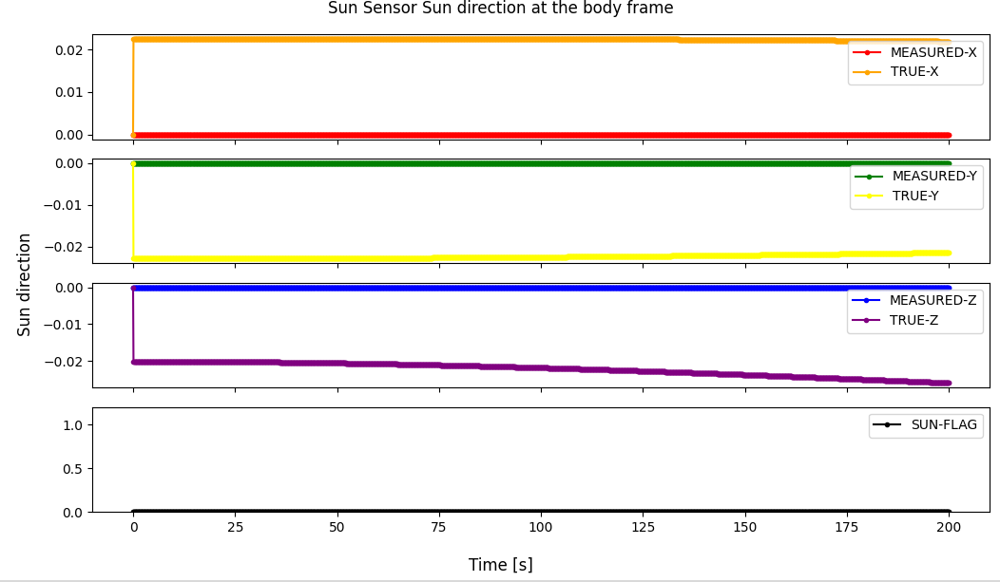

# Specification for SunSensor class

## 1.  Overview
### 1. functions 
- The `SunSensor` class simulates a sun sensor.
- The `SunSensor` class calculates and returns the observed sun vector with noise.

### 2. files
- `sun_sensor.cpp, sun_sensor.hpp`: Definitions and declarations of the class
- `sun_sensor.ini`: Initialization file
- `plot_sun_sensor.py`: An example of a Python script to plot sun sensor output

### 3. how to use
- Set the parameters in `sun_sensor.ini`.
  - `quaternion_b2c`: Frame conversion quaternion from body to component frame.
  - `field_of_view_deg`: Field of view of the sun sensor
  - `white_noise_standard_deviation_deg`: White noise standard deviation
  - `bias_standard_deviation_deg`: Bias noise standard deviation
  - `intensity_lower_threshold_percent`: Lower threshold of intensity to generate observation result

  - Other parameters
    - Parameters for the `Component` class
    - Parameters for the `PowerPort` class
- Create an instance by using the initialization function `InitSunSensor`
- Use the `Get*` function to get angular velocity information.

## 2. Explanation of Algorithm 

### 1. MainRoutine
#### 1. Overview
- The sun direction vector is converted to the component frame.
- Judge the sun is inside the field of view of the sun sensor.
- Add observation noises.

#### 2. Inputs and Outputs
- NA

#### 3. Algorithm
- NA

## 3. Results of verifications
- The output result obtained by the default initial settings.
  - The figure is generated by the Python script.

