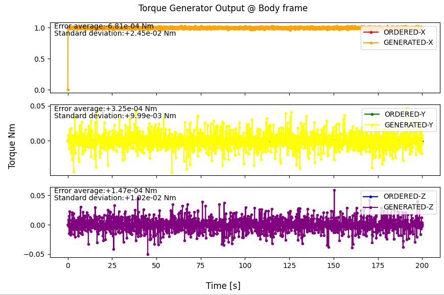

# Specification for TorqueGenerator class

## 1.  Overview
### 1. functions 
- The `TorqueGenerator` class simulates an ideal torque generator.

### 2. files
- `torque_generator.cpp, torque_generator.hpp`: Definitions and declarations of the class
- `torque_generator.ini`: Initialization file
- `plot_torque_generator.py`: An example of a Python script to plot torque_generator output

### 3. how to use
- Set the parameters in `torque_generator.ini`.
  - `torque_magnitude_standard_deviation_Nm`: Standard deviation of torque magnitude
  - `torque_direction_standard_deviation_deg`: Standard deviation of torque direction
  - Other parameters
    - Parameters for the `Component` class
- Create an instance by using the initialization function `InitTorqueGenerator`
- Use the `SetTorque*` function to set the ordered torque.

## 2. Explanation of Algorithm 

### 1. MainRoutine
#### 1. Overview
- The `MainRoutine` function adds output noise to the ordered torque and calculates generated torque.

#### 2. Inputs and Outputs
- NA

#### 3. Algorithm
- NA

## 3. Results of verifications
- The output result obtained by the default initial settings.
  - The figure is generated by the Python script.

