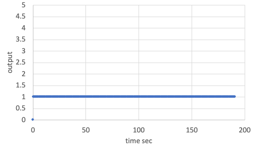
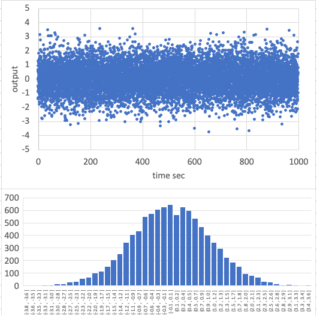
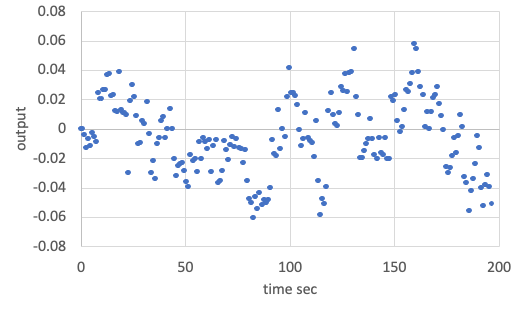

# Specification of Sensor class

## 1.  Overview
1. Functions
   - The `Sensor` class is a base class to provide common features for sensors.
   - This class adds the following noises and output limits.
     - Constant offset noise
     - Normal random noise
     - Random Walk noise
     - Scale factor noise and cross-talk between axes

2. Related files
   - Main file: `sensor_base.cpp, .hpp`
   - Used Libraries: `vector.hpp`, `matrix.hpp`, `normal_randomization.hpp`, `random_walk.hpp`

3. How to use
   - Inherit this class by your sensor class.
   - The `GyroSensor` and `Magnetometer` in `S2E_CORE` are useful as usage examples.

## 2. Explanation of Algorithm
1. Constructor
   1. overview
      - Users can set sensor noise parameters by using the Constructor.
   2. inputs
      - `scale_factor`: Scale factor matrix to express scale factor noise and cross-talk      
      - Range related parameters
        - `range_to_const_c`: The output value cannot over this value
        - `range_to_zero_c`: The output is set as zero when the true value is larger than this value.
        - This feature is optional. If you don't want to use the value, please set this huge value.
        - `range_to_zero_c` should be larger than `range_to_const_c`.
      - `bias_noise_c`: Constant offset noise
      - `normal_random_standard_deviation_c`: Standard deviation for normal random noise
      - Random Walk noise parameters
        - `random_walk_step_width_s`: Step width for Random Walk propagation (unit: sec)
          - It should be the same as the update frequency of the sensor.
        - `random_walk_standard_deviation_c`: Standard deviation for Random Walk
        - `random_walk_limit_c`: Soft limit of Random Walk
      - **Note**: The number of elements for all parameters can be set by using the `template` feature.
      - **Note**: All parameters are defined in the component frame.
      - **Note**: Normally, the unit of the parameters is the same as the unit of true value. Users also can change the unit by using the scale factor matrix.
   3. algorithm
      - The values of the `range_to_const_c` and `range_to_zero_c` are checked here with the `RangeCheck` function.
   4. note
      - N/A
2. Measure
   1. overview
      - This function adds all noises, and the output is clipped by the `Clip` function not to over the ranges.
   2. inputs and outputs
      - input: True value on the component frame
      - output: Measured value on the component frame
   3. algorithm
      - N/A 
   4. note
      - N/A
## 3. Results of verifications
- We verified the `Sensor` class with the following parameters.
- Default parameters
  - `scale_factor` = Unit matrix
  - `range_to_const_c` = 5
  - `range_to_zero_c` = 10
  - `bias_noise_c` = 0.0
  - `normal_random_standard_deviation_c` = 0.0
  - `random_walk_step_width_s`= 0.1 sec
  - `random_walk_standard_deviation_c` = 0.0
  - `random_walk_limit_c` = 0.0
  - input value: 0.0
- Case 1: `bias_noise_c` = 1.0, others = default
  - The bottom figure shows the result of the output data.
  - We verified the constant offset noise calculation is correct according to the data.
  

  <figure id="bias_1">
  
  <figcaption>Result of constant offset noise (bias_noise_c = 1.0).</figcaption>
  </figure>
  

- Case 2: `normal_random_standard_deviation_c` = 1.0, others = default
  - The simulation time is 1000sec, and the log output period is 0.1sec.
  - The bottom figure shows the result of the output data.
  - The calculated average and standard deviation from the output data are shown as follows.
    - `Average = 0.012`
    - `Standard Deviation = 1.000`
  - We verified the normal random noise calculation is correct according to the data.
  

  <figure id="normal_random_noise_1">
  
  <figcaption>Result of normal random noise (normal_random_standard_deviation_c = 1.0).</figcaption>
  </figure>
  

- Case 3: `random_walk_standard_deviation_c` = 0.3, `random_walk_limit_c` = 0.05, others = default
  - The simulation time is 200sec, and the log output period is 0.5sec.
  - The bottom figure shows the result of the output data.
  - The output data randomly varies inside the limit value.
    - **Note**: The limit is not hard.
  - We verified the normal random noise calculation is correct according to the data.
  

  <figure id="random_walk_03_005">
  
  <figcaption>Result of Random Walk noise (random_walk_standard_deviation_c = 0.3, random_walk_limit_c = 0.05).</figcaption>
  </figure>
  

## 4. References
- N/A
