# Specification for Telescope

## 1.  Overview
- A class for simulation of a telescope.
- This class uses the position information of celestial bodies, and returns the following data:
    + Flags that show whether the celestial bodies(especially, the Earth, the Moon, and the Sun) are in the forbidden angle of the telescope
    + Positions of the celestial bodies on the image sensor
    + Positions of stars on the image sensor

1. functions
   - `MainRoutine` runs the following three functions:
        + `JudgeForbiddenAngle`
            * Function to judge whether the celestial body is in the forbidden angle 
        + `Observe`
            * Function to 
                - judge whether the celestial body(provided by `CelesInfo`) is in the field of view 
                - output position of its image on the image sensor, if it is in the field of view
        + `ObserveStars`
            * Function to output some HIP IDs of the brightest stars in the field of view, using `HipparcosCatalogue`
            * Specify how many stars this function outputs in `Telescope.ini`.


2. files
    - `Telescope.cpp` , `Telescope.h`
        + Definitions and declarations of the class
    - `InitTelescope.cpp`
        + Interface functions for the initialization
    - `HipparcosCatalogue.cpp` , `HipparcosCatalogue.h`
        + Definitions and declarations of the class to read Hipparcos catalogue.
    - `InitHipparcosCatalogue.cpp`
        + Interface functions for the initialization of the `HipparcosCatalogue`

3. how to use
    - Set the parameters in `Telescope.ini`
    - Create instance by using initialization function `InitTelescope`
        + Each telescope is numbered as "Telescope1,…"
    - To use `HipparcosCatalogue` data, `hip_main.csv` is necessary. `s2e_core_oss/scripts/download_HIPcatalogue.sh` is the script to download it. Run the following code using Git bash in `s2e_core_oss/scripts/`:
    ```
    bash download_HIPcatalogue.sh 
    ```
    

## 2. Explanation of Algorithm
1. `JudgeForbiddenAngle`

   1. overview
        - Function to judge whether a celestial body is in the forbidden angle

   2. input and output
        - input
            + The position vector of the celestial body in body fixed coordinate
                * This position vector is provided by `CelesInfo`.
            + The forbidden angle about the celestial body
                + Specify the forbidden angle in `Telescope.ini`.
        - output
            + true: The celestial body is in forbidden angle
            + false: The celestial body is  not in forbidden angle

   3. process to judge
        The judging process is calculated in the telescope's component coordinate. $`q_{b2c}`$ is the quaternion to convert from the body coordinate(B) to the component coordinate(C). Specify $`q_{b2c}`$ in `Telescope.ini`. The x axis of the component coordinate is defined as the line of sight of the telescope.

2. `Observe`

   1. overview
        - Function to
            + judge whether the celestial body(provided by `CelesInfo`) is in the field of view 
            + output position of its image on the image sensor, if it is in the field of view
                * if it is not in the field of view, this function outputs $`(-1,-1)`$.

   2. input and output
        - input
            + The reference to the position of the celestial body on the image sensor
            + The position vector of the celestial body in body fixed coordinate
                * This position vector is provided by `CelesInfo`.
        - output
            + (void)
                * This function rewrite the "reference to the position of the celestial body on the image sensor" given as the input
        
   3. algorithm
        1. process to judge whether the celestial body is in the field of view
        A new 2D coordinate on the image sensor is defined to handle the position on the image sensor. The definition is as follows:
            - The x axis of the image sensor coordinate corresponds with the z axis of the component coordinate.
            - The y axis of the image sensor coordinate corresponds with the y axis of the component coordinate.
        
        <figure id="coordinate">
        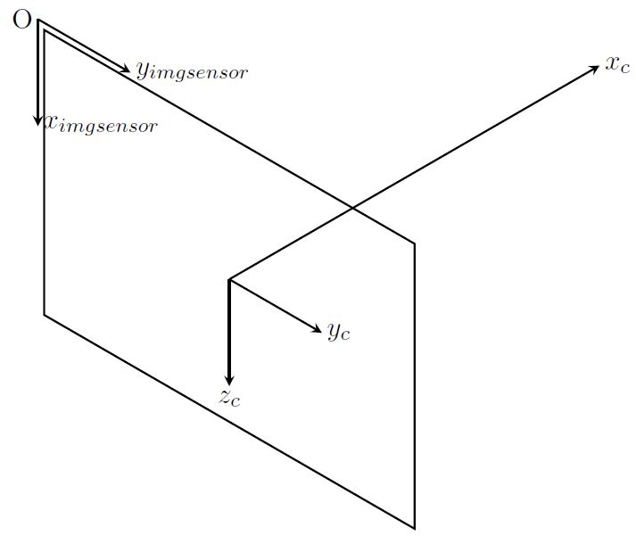
        <figcaption>Fig. 1. The relationship between the component coodinate(C) and the sensor coodinate(imgsensor)</figcaption>
        </figure>

        
   Then, the inclination angle from x axis of the celestial body's direction in xz plane of the component coordinate is calculated using $`(x_c,y_c,z_c)`$ as follows:
        
        ```math
        tan^{-1}⁡\frac{z_c}{x_c}
   ```
        
   In the same way, the inclination angle from x axis of the celestial body's direction in xy plane of the component coordinate is calculate as follows:
        
        ```math
        tan^{-1}⁡\frac{y_c}{x_c}
   ```
        
   They are written as `arg_x` and `arg_y` in the code. In this manual, $`\theta_x`$ and $`\theta_y`$ are used for them. If $`\theta_x`$ is within FOV_x and $`\theta_y`$ is within FOV_y, the celestial body is judged to be in the field of view.  
        
    4. process for calculating the position of image
        The origin of the sensor coordinate is the corner of the image sensor, so $`x_{imgsensor}`$ and $`y_{imgsensor}`$ have positive values. The unit of them is pixel(pix). In this manual, $`N_x`$ and $`N_y`$ are used for the total number of pixels along x, y axes of the sensor coordinate (They are `x_num_of_pix` and `y_num_of_pix` in the code). In the same way, `X` and `Y` are used for the position of the celestial body on the image sensor (They are `pos_imgsensor[0]` and `pos_imgsensor[1]`). Then, `X` and `Y` are calculated as follows:
        
        ```math
        X=\frac{N_x}{2}\times\frac{\tan(\theta_x)}{\tan(FOV_x)}+\frac{N_x}{2}
        ```
        ```math
        Y=\frac{N_y}{2}\times\frac{\tan(\theta_y)}{\tan(FOV_y)}+\frac{N_y}{2}
        ```

        If the celestial body is not in the field of view, the output is $`X=Y=-1`$.

3. `ObserveStars`
    1. overview
        - Function to output some HIP IDs of the brightest stars in the field of view, using `HipparcosCatalogue`

    2. input and output
        - input
            + (void)
        - output
            + (void)

    3. main process
    When `ObserveStars` is called in `MainRoutine`, this function works as follows:
        1. clear `star_in_sight`
        2. judge the brightest star (provided by `HipparcosCatalogue`) is in the field of view
        3. if the star is in the field of view, push the information (such as the HIP ID and its position on the image sensor) to `star_in_sight`
        4. go to step 2. to judge the next brightest star
        5. exit the loop when the number of element of `star_in_sight` reaches the specified number
    
    4. error handling
    if all the data in `HipparcosCatalogue` are checked before the number of element of `star_in_sight` reaches the specified number, the data of lacking element is filled with -1.
    
## 3. Results of verifications
In this section, the output of the functions when some angular velocity is input is verified.

1. input of angular velocity around x axis of the body coordinate
   1. overview
      
   - input $`ω_b=[0.1~0~0]^T`$ ． 
      
   2. conditions for the verification
      1. input files
        - `SampleSimBase.ini`
        - `Telescope.ini`
        - `SampleEnvironment.ini`
      2. initial condition
        - `SampleSimBase.ini`
        ```
	     Simulation start date[UTC] : 2017/12/01 11:00:00.0
	    Simulation finish time[sec] : 1500
       姿勢Quaternion : q_i2b=[0 0 0 1]^T
        ```
        - `Telescope.ini`
        ```
	     q_b2c=[0 0 0 1]^T
	    sun_forbidden_angle = 60
       earth_forbidden_angle = 60
	     moon_forbidden_angle = 60
	    x_num_of_pix = 2048
	    y_num_of_pix = 2048
	    x_fov_par_pix = 0.02
       y_fov_par_pix = 0.02
        ```
        - `SampleEnvironment.ini`
        ```
        [HIPPARCOS_CATALOGUE]
        max_magnitude = 5.0
        calculation = ENABLE
        logging = DISABLE
     ```
   
        The disturbance torque in main function of `SampleCase.cpp` is commented out.
      
   3. result
        1. judge for forbidden angle
        The angle from the line of sight about the direction of the Sun, the Earth, the Moon is as follows:
        <figure id="angle_celes1">
        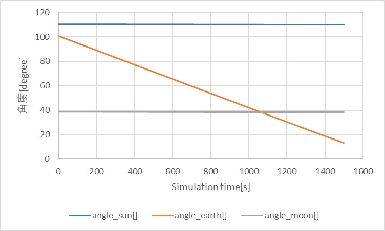
        <figcaption>The angle from the line of sight about the direction of the Sun, the Earth, the Moon</figcaption>
        </figure>
        Then, the result of the judge for the forbidden angles is as follows:
        <figure id="forbidden_angle1">
        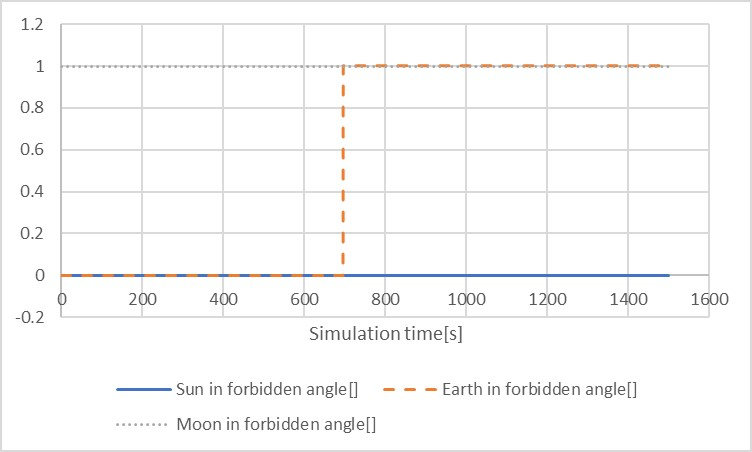
        <figcaption>result of the judge for the forbidden angles about the Sun, the Earth, the Moon</figcaption>
        </figure>
     These above figures show that the judge correctly detects when a celestial body in its forbidden angle.
   
        2. `Observe` function
        Only the Moon and the Earth are in the field of view (See the figure "The angle from the line of sight about the direction of the Sun, the Earth, the Moon"). The track of the image of the Moon on the image sensor is as follows: 
        <figure id="track_moon1">
        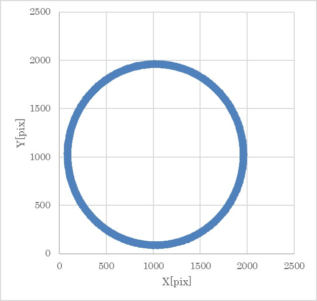
        <figcaption>The track of the image of the Moon on the image senser</figcaption>
        </figure>
     This figure shows the track makes a circle. This result seems to be reasonable, because the angular velocity around x axis of the body coordinate correspond with that of the component coordinate, for $`q_{b2c}=[0~0~0~1]^T`$ . The 3D plot of MOON_POS_B for further verification is as follows:
   
        <figure id="moon_pos_b1">
        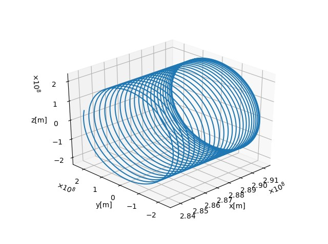
        <figcaption>3D plot of MOON_POS_B</figcaption>
        </figure>
     Considering that the projection of the track of MOON_POS_B to yz plane corresponds the track of the image on the image sensor because the line of sight is x axis, the result also seems to be reasonable. Next, the track of the image of the Moon on the image sensor is as follows:
   
        <figure id="track_earth1">
        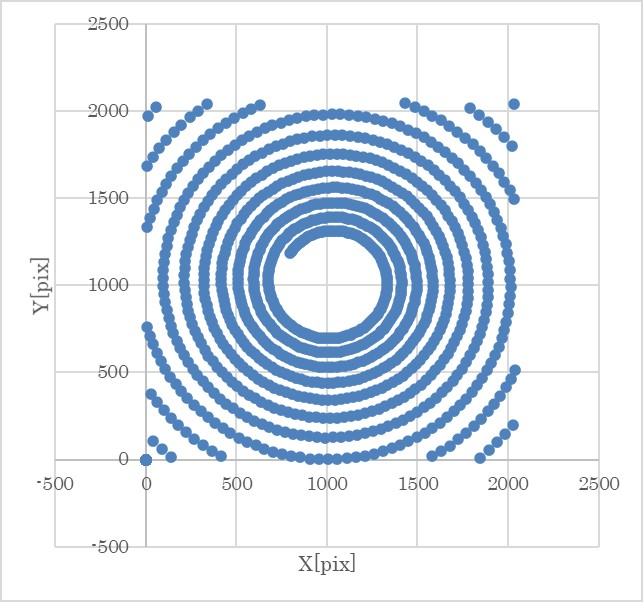
        <figcaption>The track of the image of the Earth on the image senser</figcaption>
     </figure>
   
        In addition, the 3D plot of EARTH_POS_B is as follows:
        <figure id="earth_pos_b1">
        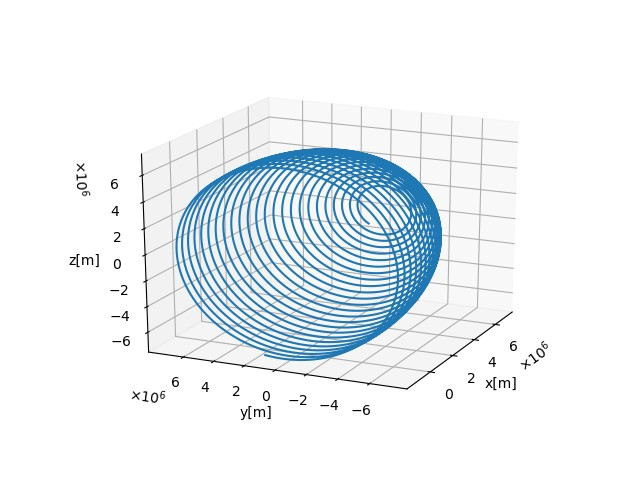
        <figcaption>3D plot of EARTH_POS_B</figcaption>
        </figure>
     As well as the Moon case, this result seems to be reasonable because the projection of the track of the Earth to the yz plane corresponds with the track of the image.
   
        3. `ObserveStars`function
        The first, second, and third HIP ID outputs were 113368, 9884, and 3419. Their track on the image sensor are as follows:
        <figure id="observe_stars1">
        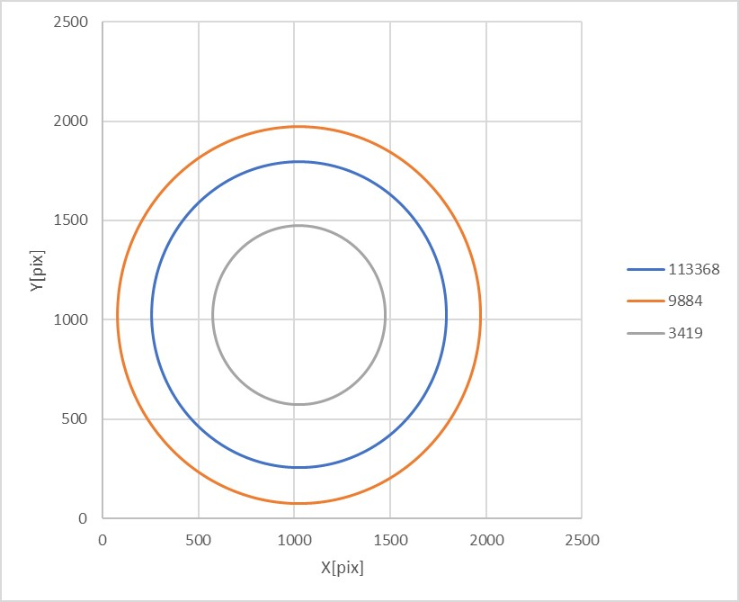
        <figcaption>The stars' track on the image sensor</figcaption>
        </figure>
        
        The tracks make circles, which are the reasonable outputs because of the same reason stated in the verification of `Observe` function. In addition, the each Vmag of HIP ID=113368，9884，and 3419 is 1.17，2.01，and 2.04, so it is verified that the outputs are in order of brightness.
     
   
2. input of angular velocity around y axis of the body coordinate
The angular velocity input is $`ω_b=[0.1~0~0]^T`$ ．The other condition is the same as the case of 1. Note that the verification of the case around z axis is omitted because y and z are equivalent under this condition.
   
    1. result
        1. judge for forbidden angle
        The angle from the line of sight about the direction of the Sun, the Earth, the Moon is as follows:
        <figure id="angle_celes2">
        
        <figcaption>The angle from the line of sight about the direction of the Sun, the Earth, the Moon</figcaption>
        </figure>
        Then, the result of the judge for the forbidden angles is as follows:
        <figure id="forbidden_angle2">
        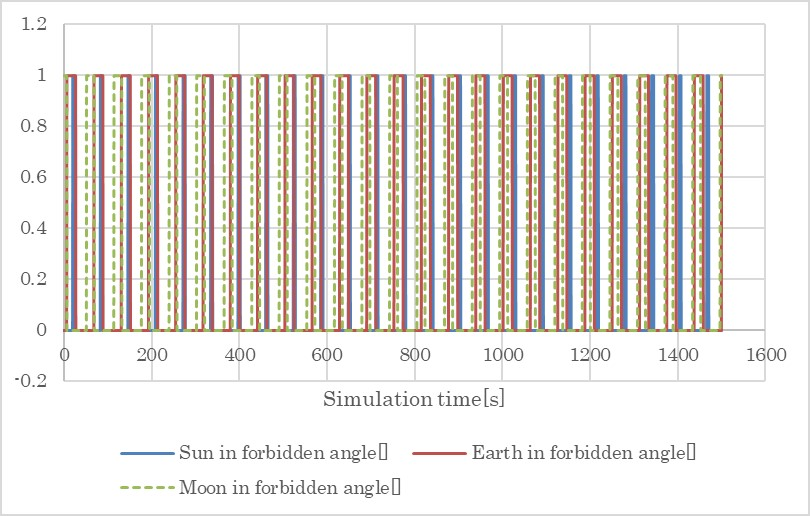
        <figcaption>The result of the judge for the forbidden angles</figcaption>
        </figure>
     These above figures show that the judge is correctly conducted when a celestial body in its forbidden angle.
   
        2. `Observe` function
        The figure "The angle from the line of sight about the direction of the Sun, the Earth, the Moon" shows that the earth is mainly in the field of view, so this section discusses only about the Earth. The track of the image of the Earth is as follows (For the sake of ease, only 4 tracks in the field of view are displayed):
        <figure id="track_earth2">
        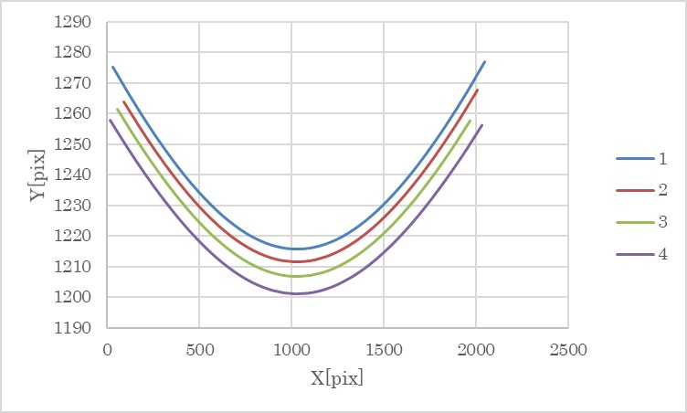
        <figcaption>The track of the image of the Earth on the image sensor</figcaption>
        </figure>
        In addition, the 3D plot of EARTH_POS_B is as follows:
        <figure id="earth_pos_b2">
        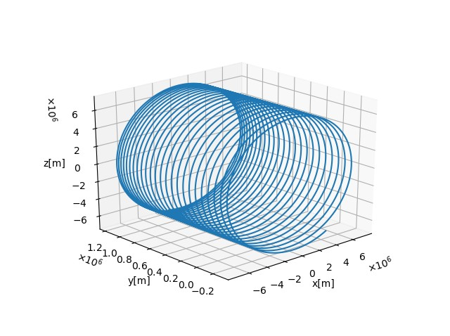
        <figcaption>3D plot of EARTH_POS_B</figcaption>
        </figure>
        The 3D plot of EARTH_POS_B shows that the track of EARTH_POS_B is a spiral which axis is at right angle to the line of sight. In this case, it can be showed that the track on image sensor forms a hyperbola(The proof for this is omitted). Considering this fact, the result seems to be reasonable.
        
        3. `ObserveStars` function
        The tracks of the stars are partially as follows:
        <figure id="observe_stars2">
        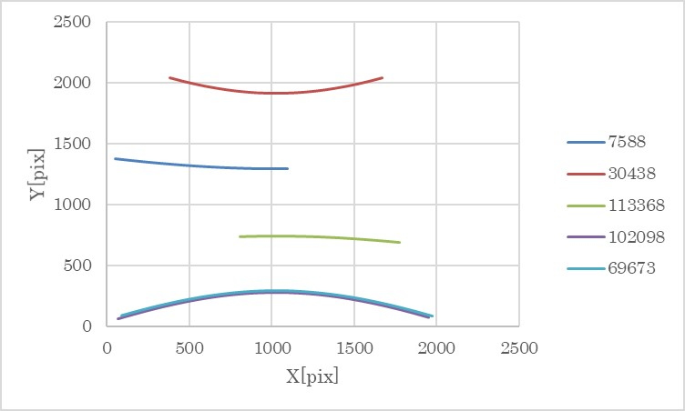
        <figcaption>The stars' track on the image sensor</figcaption>
        </figure>
        As mentioned in `Observe` function section, they form hyperbolas which axis of symmetry is Y=1024. In addition, it was confirmed that the data was output in order of the brightness on each time (The result is complicated, so it is not list in this manual).
        
## 4. References
