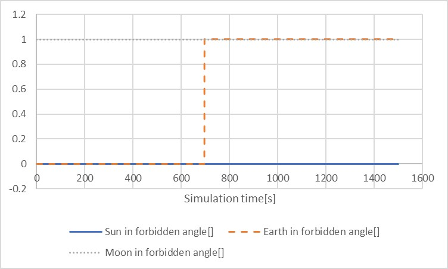
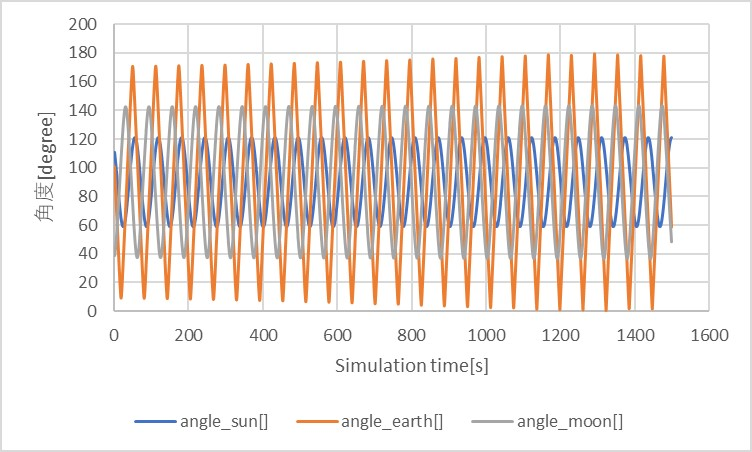
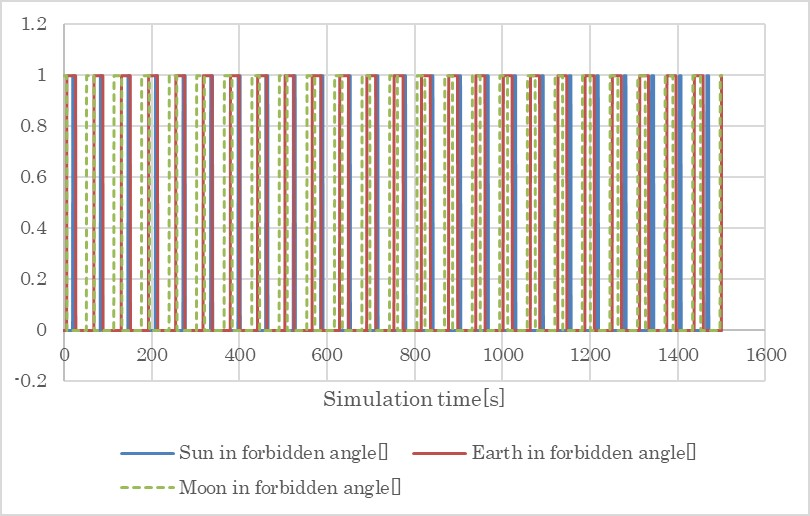
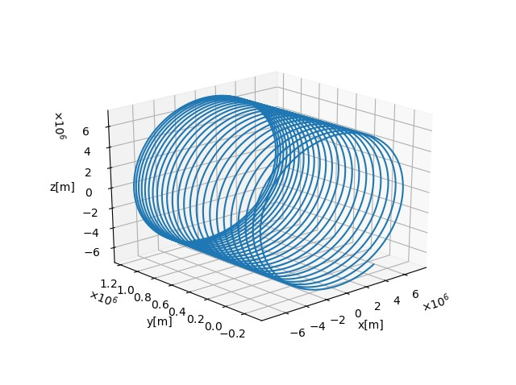

# 姿勢シミュレータ仕様書～望遠鏡～

## 1.  概要
- 望遠鏡を模擬したクラス．
- 太陽系内の天体および恒星の位置データより，禁止角判定，および天体のイメージセンサ上の位置を返す．

1. 関数
   - `MainRoutine`内では以下の3つの関数を動作させている．
        + `JudgeForbiddenAngle`
            * 太陽・月・地球の禁止角判定を行う関数． 
        + `Observe`
            * CelesInfoが提供する天体が画角内に入っているかどうかを判定し，入っているならばイメージセンサ上の位置を出力する関数．
        + `ObserveStars`
            * HipparcosCatalogueを調べ，画角内に入っている恒星のうち視等級の小さい（すなわち，明るい）ものから数個のHIP IDを出力する関数．

  
2. 関連ソースコード，ファイル
    - `Telescope.cpp` , `Telescope.h`
        + クラスの定義が行われている．
    - `InitTelescope.cpp`
        + 初期化のためのインターフェース関数が記述されている．
    - `HipparcosCatalogue.cpp` , `HipparcosCatalogue.h`
        + 天球上の恒星の位置データ（ヒッパルコス星表）を読み出すためのクラスを定義している．
    - `InitHipparcosCatalogue.cpp`
        + ヒッパルコス星表のクラスを初期化するためのインターフェース関数が記述されている．

3. 使い方
    - Telescope.iniで定数を入力する．
    - 初期化関数 `InitTelescope` を利用し，インスタンスを生成．
        + Telescope1,…のように，個々の望遠鏡に番号が振ってある．
    - `HipparcosCatalogue` のデータを利用するために，`hip_main.csv` のダウンロードを済ませる必要がある．このためのスクリプトとして `s2e_core_oss/scripts/download_HIPcatalogue.sh`を用意した．Git Bashなどを利用して，このスクリプトがあるディレクトリで以下を実行することで，必要なcsvファイルをダウンロードすることができる．
    ```
    bash download_HIPcatalogue.sh 
    ``` 
     

## 2. アルゴリズム説明

1. `JudgeForbiddenAngle`

   1. 概要
        - 太陽・月・地球の禁止角判定を行う関数． 

   2. 入力と出力
        - 入力
            + 判定対象の天体の，body座標系から見た位置
                * この位置は，CelesInfoから提供される
            + その判定対象の天体に関する禁止角
                * 禁止角の値は，`Telescope.ini`で指定する
        - 出力
            + 禁止角に入っているならばtrue，そうでないならばfalse

   3. 判定処理

      - 処理はコンポ座標系で行っている．$`q_{b2c}`$はTelescope.iniで指定する機体座標系(B)→コンポ座標系(C)変換Quaternionである．コンポ座標系は，望遠鏡視線方向をx方向としている．
   

2. `Observe`

   1. 概要
        - CelesInfoが提供する天体が画角内に入っているかどうかを判定し，入っているならばイメージセンサ上の位置を出力する関数．
        - 画角内に入っていない場合は，(-1, -1)を出力する．

   2. 入力と出力
        - 入力
            + 対象天体の像の，望遠鏡センサ面上における位置への参照
            + 判定対象の天体の，body座標系から見た位置
                * この位置は，CelesInfoから提供される
        - 出力
            + なし
                * 入力として与えた「対象天体の像の，望遠鏡センサ面上における位置」を書き換えている

   3. 判定処理
        1. 画角内判定処理
        イメージセンサ上での位置を取り扱うため，センサ上に改めて2次元座標系を定義しなおしている．具体的には，コンポ座標系z軸方向がセンサ座標系x軸方向，コンポ座標系y軸方向がセンサ座標系y軸方向に一致するように定義している．
        <div align="center">
        <figure id="coordinate">
        
        <figcaption>コンポ座標系(C)とセンサ座標系(imgsensor)の関係</figcaption>
        </figure>
        </div>

        このとき，コンポ座標系からみた天体の位置 $`(x_c,y_c,z_c)`$ より，コンポ座標系xz平面でみた天体の方向のx軸からの偏角は

        ```math
        tan^{-1}⁡\frac{z_c}{x_c}
        ```

        であり，コンポ座標系xy平面でみた天体の方向のx軸からの偏角は

        ```math
        tan^{-1}⁡\frac{y_c}{x_c}
        ```

        で計算される．これらの値はそれぞれソースコード上でarg_x，およびarg_yである（説明上，それぞれ $`\theta_x`$，$`\theta_y`$と表記する）． $`\theta_x`$ がセンサ座標系x方向の視野角（FOV_x）以下であり，かつ $`\theta_y`$ がセンサ座標系y方向の視野角（FOV_y）以下であれば対象の天体が画角内に入っていると判定する．

    4. イメージセンサ上における位置計算処理
        センサ座標系の原点はイメージセンサの角に位置しており， $`x_{imgsensor}`$ および $`y_{imgsensor}`$ は原点を基準とした正の値で表現される．単位はピクセル（pix）である．ここでは説明のためイメージセンサのx方向全ピクセル数（ソースコード上ではx_num_of_pix），y方向全ピクセル数（ソースコード上ではy_num_of_pix）をそれぞれ $`N_x`$ および $`N_y`$ と表記する．同様に，天体のイメージセンサ上の位置（ソースコード上ではpos_imgsensor）をX，Yと表記することにすれば，これらは
        
        ```math
        X=\frac{N_x}{2}\times\frac{\tan(\theta_x)}{\tan(FOV_x)}+\frac{N_x}{2}
        ```
        ```math
        Y=\frac{N_y}{2}\times\frac{\tan(\theta_y)}{\tan(FOV_y)}+\frac{N_y}{2}
        ```

        として計算される．なお，天体が画角内に入っていないときは， $`X=Y=-1`$ なる出力を与える．

3. `ObserveStars`
    1. 概要
        - `HipparcosCatalogue` を調べ，画角内に入っている恒星のうち視等級の小さい（すなわち，明るい）ものから数個のHIP IDを出力する関数．
        - 出力するHIP IDの個数はTelescope.iniで指定する．

    2. 入力と出力
        - 入力
            + なし
        - 出力
            + なし

    3. メイン処理
    `MainRoutine` で `ObserveStars` が呼び出されると，はじめに `star_in_sight` をクリアする．続いて，視等級の小さい順に `HipparcosCatalogue` が提供する恒星が画角内に入っているかどうかを判定してゆき，入っている場合はHIP IDやセンサ上の位置などを含む情報を `star_in_sight` にプッシュする．これを `star_in_sight` の要素数が指定の個数に達するまで繰り返す．なお， `HipparcosCatalogue` はあらかじめ視等級の小さい順にソートされている．

    4. エラー処理
    指定の個数に達する前に，カタログの終端に達した場合は，出力するはずであった残りのデータはすべてのパラメータを-1とする．


## 3. 動作確認結果
禁止角判定， `Observe` 関数の動作， `ObserveStars` 関数の動作が正しく行えているかどうかを判定する．ここでは，body座標系において各軸まわりの角速度入力があったときに，どのような出力を得るかを確認し，その妥当性を検証することにする．
1. x軸周りの角速度を与えた場合
   1. 概要
      - 角速度入力　$`ω_b=[0.1~0~0]^T`$を与える．
    
   2. シミュレーション条件
      1. 入力ファイル
        - `SampleSimBase.ini`
        - `Telescope.ini`
        - `SampleEnvironment.ini`
      2. 初期値
        - `SampleSimBase.ini`
        ```
        Simulation start date[UTC] : 2017/12/01 11:00:00.0
	    Simulation finish time[sec] : 1500
	    姿勢Quaternion : q_i2b=[0 0 0 1]^T
        ```
        - `Telescope.ini`
        ```
        姿勢Quaternion : q_b2c=[0 0 0 1]^T
	    太陽禁止角[deg] : 60
	    地球禁止角[deg] : 60
	    月禁止角[deg] : 60
	    X方向総画素数 : 2048
	    Y方向総画素数 : 2048
	    X方向1ピクセル当たり視野角[deg] : 0.02
	    Y方向1ピクセル当たり視野角[deg] : 0.02
        ```
        - `SampleEnvironment.ini`
        ```
        [HIPPARCOS_CATALOGUE]
        max_magnitude = 5.0
        calculation = ENABLE
        logging = DISABLE
        ```
        なお，SampleCase.cppのメイン関数内において，外乱トルクはコメントアウトしている．

   3. 結果
        1. 禁止角判定
        上記の条件下で，太陽・地球・月の視線方向からの角度は，以下のようである．
        <div align="center">
        <figure id="angle_celes1">
        
        <figcaption>太陽・月・地球の視線方向からの角度</figcaption>
        </figure>
        </div>
        このとき，各禁止角判定結果は以下の通りであった．
        <div align="center">
        <figure id="forbidden_angle1">
        
        <figcaption>太陽・月・地球の禁止角判定</figcaption>
        </figure>
        </div>
        以上2つの図より、禁止角60度以内に入った場合に正しく禁止角判定されていることがわかる．

        2. `Observe`関数の動作
        禁止角判定の結果より，画角内に入っているのは地球および月のみであるから，それらに関して検討する．月のイメージセンサ上の位置の軌跡は，以下の図のようになった．
        <div align="center">
        <figure id="track_moon1">
        
        <figcaption>イメージセンサ上における月の位置の軌跡</figcaption>
        </figure>
        </div>
        この図より，軌跡が円を描いていることがわかる．本シミュレーション条件では，慣性座標系（I），Body座標系（B），コンポ座標系（C）の方向が一致しているため，Body座標系x軸周りの角速度は，コンポ座標系における視線方向周りの角速度を意味するから，軌跡が真円になるはずであり，正しい．確認のためMOON_POS_Bを3次元プロットした結果は以下のようである．
        <div align="center">
        <figure id="moon_pos_b1">
        
        <figcaption>MOON_POS_Bの3次元プロット</figcaption>
        </figure>
        </div>
        望遠鏡の視線はx方向であったから，MOON_POS_Bの軌跡のyz平面への射影がイメージセンサ上における月の位置の軌跡になっており，やはり正しい観測ができていることがわかる．地球に関しても，同様にイメージセンサ上の位置の軌跡を下図に示す．
        <div align="center">
        <figure id="track_earth1">
        
        <figcaption>イメージセンサ上における地球の位置の軌跡</figcaption>
        </figure>
        </div>
        また，EARTH_POS_Bの3次元プロットは以下の通りであった．
        <div align="center">
        <figure id="earth_pos_b1">
        
        <figcaption>EARTH_POS_Bの3次元プロット</figcaption>
        </figure>
        </div>
        月の場合と同様に，EARTH_POS_Bの3次元プロットにおける地球の軌跡のyz平面への射影としてイメージセンサ上における地球の位置の軌跡が得られていることがわかり，正しい．

        3. `ObserveStars`関数の動作
        出力結果は，1番目，2番目，3番目のHIP IDがそれぞれ113368，9884，3419であった．これらのイメージセンサ上での軌跡は以下の通りであった．
        <div align="center">
        <figure id="observe_stars1">
        
        <figcaption>ObserveStars関数の出力で得られた各恒星の軌跡</figcaption>
        </figure>
        </div>
        
        `ObserveStars`　関数の動作確認で述べたのと同様の理由により，軌跡が円を描いており正しい結果が得られていると考えられる．なお，HIP IDが113368，9884，3419に対応する恒星の視等級はそれぞれ1.17，2.01，2.04であることから，視等級の高いものから順番に出力されていることが確認できる．

2. y軸周りの角速度を与えた場合
    角速度入力 $`ω_b=[0 ~0.1~0]^T`$ を与える．その他のシミュレーション条件はx軸周りの場合と同様である．なお，本シミュレーションでは望遠鏡に関してはy軸とz軸が等価であるから，z軸周りの回転を与えた場合の検証は割愛する．
    1. 結果
        1. 禁止角判定
        太陽・地球・月の視線方向からの角度は，以下のようである．
        <div align="center">
        <figure id="angle_celes2">
        
        <figcaption>太陽・月・地球の視線方向からの角度</figcaption>
        </figure>
        </div>
        このとき，各禁止角判定は以下の通りであった．
        <div align="center">
        <figure id="forbidden_angle2">
        
        <figcaption>太陽・月・地球の禁止角判定</figcaption>
        </figure>
        </div>
        以上2つの図より、禁止角60度以内に入った場合に正しく禁止角判定されていることがわかる．
        2. `Observe` 関数の動作
        太陽・地球・月の視線方向からの角度をみると，画角内に入っているのは主に地球であるから，これに関して `Observe` 関数の動作を確認する（月や太陽も画角内に入るが，地球の場合と同様の議論で済むため割愛する）．視線方向に直交する軸周りの回転であるから，地球の像が画角内に何度も出入りするが，ここでは簡単のため画角内に入った軌跡のうち4本のみを取り出して表示している．
        <div align="center">
        <figure id="track_earth2">
        
        <figcaption>イメージセンサ上における地球の位置の軌跡</figcaption>
        </figure>
        </div>
        このときのEARTH_POS_Bの3次元プロットも同時に示しておく．
        <div align="center">
        <figure id="earth_pos_b2">
        
        <figcaption>EARTH_POS_Bの3次元プロット</figcaption>
        </figure>
        </div>
        EARTH_POS_Bは望遠鏡視線方向と直交する軸を中心とした螺旋を描いていることがわかる．このときイメージセンサ上に投影される軌跡は双曲線であることを示すことができる（証明は割愛）．イメージセンサ上における地球の位置の軌跡は二次曲線の形状をしており，X=1024（イメージセンサの中心軸）を対称軸とした双曲線であり，正しく動作していると考えられる．
        3. `ObserveStars`関数の動作
        x軸を中心軸とした回転の場合とは異なり，恒星の視野内の出入りが多いため，それらの一部についてイメージセンサ上の軌跡を示す．
        <div align="center">
        <figure id="observe_stars2">
        
        <figcaption>ObserveStars関数の出力で得られた各恒星の軌跡</figcaption>
        </figure>
        </div>
        データ処理の都合上，途切れ途切れになっているが， `Observe` 関数の挙動で述べた通り，Y=1024を対称軸とした双曲線を描いていることがわかる．また，煩雑になるため本ファイルには載せないが，各時刻で視等級の高い順番にデータが出力されていることも確認された．

## 4. References
