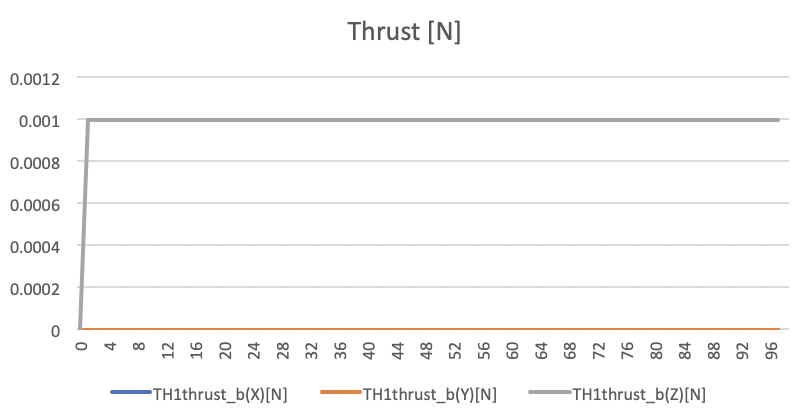
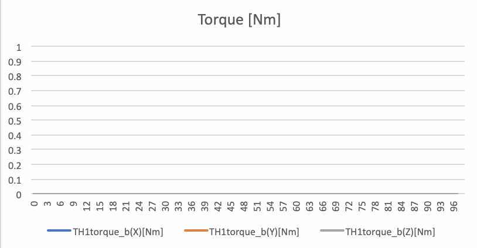
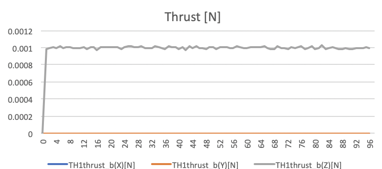
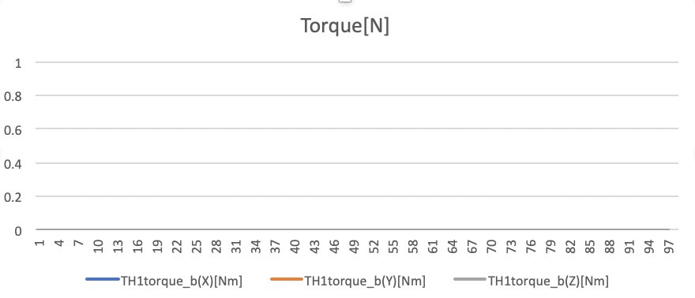
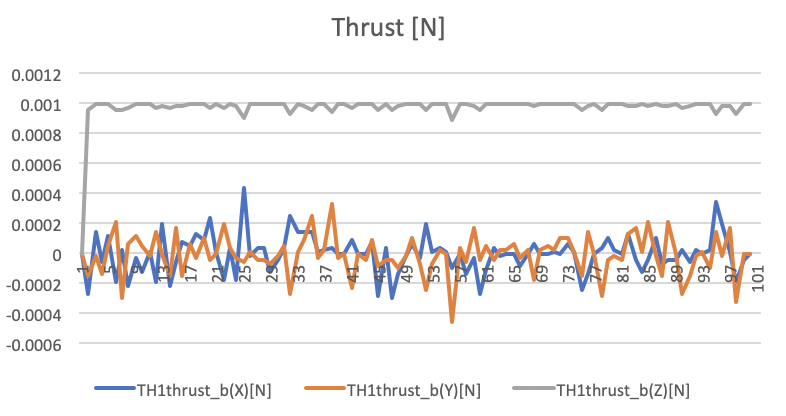
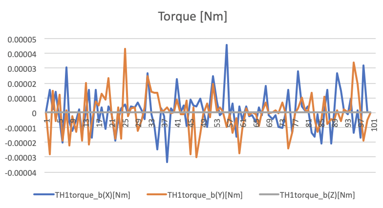
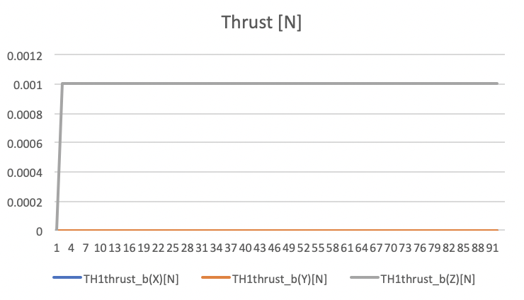
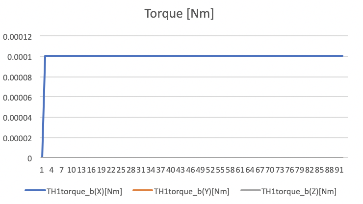

# Specification for Thruster

## 1.  Overview
- This class simulates a thruster and contains functions for it.

1. functions
   - By setting the thruster valve open and close, thruster torque and force are generated.
   - The thruster model includes the magnitude and directional errors in the ini file.
   - According to the thruster output, users can set the thrust duty to the value between 0 and 1.

2. files
    - `simple_thruster.cpp` , `simple_thruster.hpp`
      + Definitions and declarations of the class
    - `thruster.ini`
      +  Parameters for a/multiple thruster(s)

3. how to use
    - Set the parameters written in `thruster.ini`.
      + Users can set multiple thrusters.
    - Create an instance by `SimpleThruster` function.
    - Add `calc_thrust` function to `GenerateForce_b()` in `SatComponents` class and `calc_torque` function to `GenerateTorque_b()` in `SatComponents` class
      + `calc_torque` function requires a position of the spacecraft's mass center as an argument.
    - When a thruster is open, set the duty to 1 by `set_duty(1)` function.
      + Users can set duty to the value between 0 and 1.

## 2. Explanation of Algorithm
1. Thrust
    1. overview
        - Thrust magnitude is a scalar value of thrust.
        - Thrust contains the magnitude and direction errors according to the ini file setting.
        - Thrust magnitude calculation considers the duty of thruster. If the thruster valve is closed, the thrust magnitude is 0. 
    2. input and output
        - input
          + Thruster duty ratio
          + Maximum thrust magnitude `thrust_magnitude_N`
          + Thrust direction `thruster_direction_b`
          + Thrust magnitude error `thrust_error_standard_deviation_N`
          + Thrust direction error `direction_error_standard_deviation_deg`
        - output
          + Thrust magnitude and direction
    3. algorithms
        Thrust magnitude can be calculated as follows:

        ```math
        F_{thrust}  = \epsilon * F_{max} + n_{f}
        ```

        where $F_{thrust}$ is thrust magnitude, $\epsilon$ is the duty of thruster, $F_{max}$ is the maximum thrust magnitude, and $n_{f}$ is the error of thrust magnitude.

        Thrust direction can be calculated as follows:

        ```math
        \boldsymbol{d}_{err} = \boldsymbol{q}(\boldsymbol{d}_{true},n) * \boldsymbol{d}_x
        ```
        ```math
        \boldsymbol{d}_{thrust} = \boldsymbol{q}(\boldsymbol{d}_{err},n_{d}) * \boldsymbol{d}_{true}
        ```

        where
        - $\boldsymbol{d}_{true}$ is the thrust vector without errors
        - $n$ is the random angles to rotate the direction of error $\boldsymbol{d}_{err}$
        - $\boldsymbol{d}_{x}$ is the vector which is not equal to $\boldsymbol{d}_{true}$
        - $n_d$ is the directional error
        - $\boldsymbol{d}_{thrust}$ is the thrust vector with errors
        - $\boldsymbol{q}(\boldsymbol{d},n)$ is the quaternion which has the rotation axis $\boldsymbol{d}$ and the rotation angle $n$ .

        Thrust can be calculated as follows:

        ```math
        \boldsymbol{F}_{thrust} = F_{thrust} * \boldsymbol{d}_{thrust}
        ```

        where $\boldsymbol{F}_{thrust}$ is thrust.
 
2. Torque
    1. overview
        - Torque by thruster is calculated from the thrust vector and the vector between the center of mass of the spacecraft and thruster.
    2. input and output
        - input
          + Thruster position `thruster_position_b_m`
          + Mass center of spacecraft
          + Thrust magnitude and direction
        - output
          + Torque
    3. algorithms
        Torque by the thruster can be calculated as follows:

        ```math
        \boldsymbol{T}_{thrust} = (\boldsymbol{v}_{thruster}-\boldsymbol{v}_{SC}) \times \boldsymbol{F}_{thrust}
        ```

        where
        - $\boldsymbol{T}_{thrust}$ is torque by the thruster
        - $\boldsymbol{v}_{thruster}$ is thruster position
        - $\boldsymbol{v}_{SC}$ is the mass center of spacecraft.

## 3. Results of verifications
1. Case1
  - input
    + Position `thruster_position_b_m` : [0m, 0m, 0.1m]
    + Direction `thruster_direction_b` : [0, 0, 1]
    + Thrust magnitude `thrust_magnitude_N` : 0.001N 
    + Thrust magnitude error `thrust_error_standard_deviation_N` : 0.0N
    + Thrust direction error `direction_error_standard_deviation_deg` : 0.0deg
    + Simulation time: 100sec
        
  - result
    + Force Mean: [0,0,0.001] N
    + Force Std Dev: [0,0,0] N

      <div align="center">
      <figure id="thrust_force1">
      
      <figcaption>Thrust force values in N unit.</figcaption>
      </figure>
      </div>

    + Torque Mean: [0,0,0] Nm
    + Torque Std Dev: [0,0,0] Nm

      <div align="center">
      <figure id="thrust_torque1">
      
      <figcaption>Thrust torque values in Nm unit.</figcaption>
      </figure>
      </div>

        
2. Case2
  - input
    + Position `thruster_position_b_m` : [0, 0, 0.1] m
    + Direction `thruster_direction_b` : [0, 0, 1]
    + Thrust magnitude `thrust_magnitude_N` : 0.001N 
    + Thrust magnitude error `thrust_error_standard_deviation_N` : 0.00001N
    + Thrust direction error `direction_error_standard_deviation_deg` : 0.0deg
    + Simulation time: 100sec 
  - result
    + Force Mean: [0,0,0.999611e-3] N
    + Force Std Dev: [0,0,1.09804e-5] N

      <div align="center">
      <figure id="thrust_force2">
      
      <figcaption>Thrust force values in N unit.</figcaption>
      </figure>
      </div>

    + Torque Mean: [0,0,0] Nm
    + Torque Std Dev: [0,0,0] Nm

      <div align="center">
      <figure id="thrust_torque2">
      
      <figcaption>Thrust torque values in Nm unit.</figcaption>
      </figure>
      </div>

3. Case3
  - input
    + Position `thruster_position_b_m` : [0, 0, 0.1] m
    + Direction `thruster_direction_b` : [0, 0, 1]
    + Thrust magnitude `thrust_magnitude_N` : 0.001N 
    + Thrust magnitude error `thrust_error_standard_deviation_N` : 0.0N
    + Thrust direction error `direction_error_standard_deviation_deg` : 10.0deg
    + Simulation time: 100sec
  - result
    + Force Mean: [-4.93e-6, -1.04e-5, 0.9834e-3] N
    + Force Std Dev: [1.0e-4, 9.79e-5, 1.216e-5] N

      <div align="center">
      <figure id="thrust_force3">
      
      <figcaption>Thrust force values in N unit.</figcaption>
      </figure>
      </div>

    + Torque Mean: [1.04e-6,-4.94e-7,0] Nm
    + Torque Std Dev: [1.29e-5, 1.26e-5, 0] Nm

      <div align="center">
      <figure id="thrust_torque3">
      
      <figcaption>Thrust torque values in Nm unit.</figcaption>
      </figure>
      </div>

4. Case4
  - input
    + Position `thruster_position_b_m` : [0, 0.1, 0] m
    + Direction `thruster_direction_b` : [0, 0, 1]
    + Thrust magnitude `thrust_magnitude_N` : 0.001N 
    + Thrust magnitude error `thrust_error_standard_deviation_N` : 0.0N
    + Thrust direction error `direction_error_standard_deviation_deg` : 0.0deg
    + Simulation time: 100sec
  - result
    + Force Mean: [0,0,0.001] N
    + Force Std Dev: [0,0,0] N

      <div align="center">
      <figure id="thrust_force4">
      
      <figcaption>Thrust force values in N unit.</figcaption>
      </figure>
      </div>

    + Torque Mean: [0.0001,0,0] Nm
    + Torque Std Dev: [0,0,0] Nm

      <div align="center">
      <figure id="thrust_torque4">
      
      <figcaption>Thrust torque values in Nm unit.</figcaption>
      </figure>
      </div>
