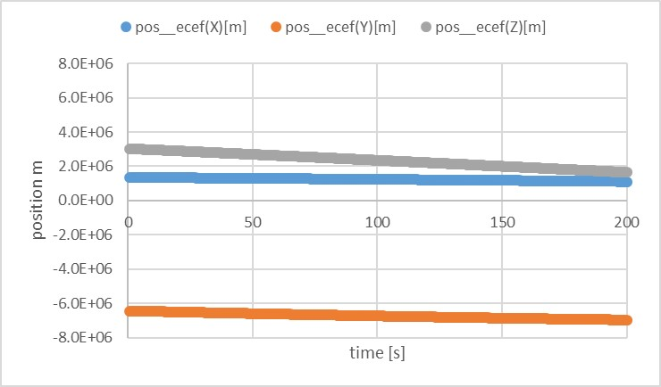

# Specification of Geo Potential Calculation

## 1.  Overview

1. Functions
   - The `GeoPotential` class calculates the gravity acceleration of the earth with the [EGM96](https://cddis.nasa.gov/926/egm96/) geo-potential model.

2. Related files
   - `src/Disturbance/GeoPotential.cpp`
   - `src/Disturbance/GeoPotential.h`
   - `ExtLibraries/GeoPotential/egm96_to360.ascii`
     - The EGM96 geopotential coefficients file can be downloaded from [NASA's EMG96 website](https://cddis.nasa.gov/926/egm96/getit.html)
     - Users can use `scripts/download_EGM96coefficients.sh` to download the file.

3. How to use   
   - Make an instance of the geopotential class in `InitializeInstances` function in `Disturbances.cpp`
   - Chose RK4 orbit propagator
   - Select `ENABLE` and `degree` of calculation
     - When the `degree` is smaller than 1, it is overwritten as 0.
     - When the `degree` is larger than 360, it is overwritten as 360.
     - **NOTE**: The calculation time is related to the selected degree.
     

## 2. Explanation of Algorithm
  The base algorithm is referred to [Satellite Orbits](https://www.springer.com/jp/book/9783540672807) chapter 3.2.

1. Read coefficients
   1. overview
      - This function reads the geopotential coefficients from the EGM96 file `egm96_to360.ascii`.
      - The file doesn't have coefficients for `n=0,m=0`, `n=1,m=0`, and `n=1,m=1`. 
      - All coefficients are completely normalized by following normalization function $N_{n,m}$
        ```math
        N_{n,m}=\sqrt{\frac{(n+m)!}{(2-\delta_{0m})(2n+1)(n-m)!}}\\
        ```
        - where $\delta_{0m}$ is the Kronecker delta.

   2. inputs and outputs
      - Input
        - file path of `egm96_to360.ascii`
        - maximum degree for geopotential calculation
      - Output
        - **Return**: reading is succeeded or not.
        - Normalized coefficient  $C_{n,m}$ and $S_{n,m}$ 

   3. algorithm
      - The file format of `egm96_to360.ascii` is `n,m,Cnm,Snm,sigmaCnm,sigmaSnm` in line with space  delimiter. In this calculation, the `sigmaCnm` and `sigmaSnm` are not used.

      - The total number of reading lines is defined as the following equation
        ```math
        N_{line}=\frac{1}{2}(n+1)(n+2)-3
        ```
        where $n$ is maximum degree, and -3 is for the coefficients of `n=0,m=0`, `n=1,m=0`, and `n=1,m=1`, which are not in the file. 

   4. note

      - **When the reading file process is failed**, the maximum degree is set to zero, and a simple Kepler calculation will be executed.

2. Calculate Legendre polynomials with recursion algorithm

   1. overview
      - We chose to use the recursion algorithm written in chapter 3.2.4 of [Satellite Orbits](https://www.springer.com/jp/book/9783540672807) since the calculation of the Legendre polynomials for spherical harmonics is time-consuming.
        - However, the original equation in the book is unnormalized form, and it is not suitable with the normalized coefficients. 
        - For a small degree, users can directly use the normalized function $N_{n,m}$  to unnormalize the coefficients or to normalize the functions $V_{n,m}$ and $V_{n,m}$ . But for a large degree, the factorial calculation in the $N_{n,m}$ reaches a huge value, which standard `double` variables cannot handle.
        - To avoid that, the normalized recursion algorithm was derived as described in Section 3.
      - There are the following two functions:
        - `v_w_nn_update`
        - `v_w_nm_update`
      
   2. inputs and outputs
      - Inputs
        - Both functions
          - Satellite position in ECEF frame $x, y, z$
          - degree and order as $n$ and $m$
        - `v_w_nn_update`: $V_{n-1,n-1}$ and $W_{n-1,n-1}$
        - `v_w_nm_update`: $V_{n-1,m}, W_{n-1,m}, V_{n-2,m}$, and $W_{n-2,m}$
      - Outputs
        - `v_w_nn_update`: $V_{n,n}$ and $W_{n,n}$
        - `v_w_nm_update`: $V_{n,m}$ and $W_{n,m}$
      
   3. algorithm

For unnormalized algorithms, see chapter 3.2.4 of [Satellite Orbits](https://www.springer.com/jp/book/9783540672807).

For normalized algorithm, we use following normalizing relation for Legendre polynomials,

```math
\begin{align*}
  \bar{P}_{n,m}=\frac{1}{N_{n,m}}P_{n,m}\\
  \bar{V}_{n,m}=\frac{1}{N_{n,m}}V_{n,m}\\
  \bar{W}_{n,m}=\frac{1}{N_{n,m}}W_{n,m}\\
\end{align*}
```

The recursion calculation of V and W can be changed to a normalized version as follows

```math
N_{m,m}\bar{V}_{m,m}=(2m-1)(\frac{xR_{e}}{r^2}N_{m-1,m-1}\bar{V}_{m-1,m-1}-\frac{yR_e}{r^2}N_{m-1,m-1}\bar{W}_{m-1,m-1})\\
\bar{V}_{m,m}=\frac{N_{m-1,m-1}}{N_{m,m}}(2m-1)(\frac{xR_{e}}{r^2}\bar{V}_{m-1,m-1}-\frac{yR_e}{r^2}\bar{W}_{m-1,m-1})\\
\bar{W}_{m,m}=\frac{N_{m-1,m-1}}{N_{m,m}}(2m-1)(\frac{xR_{e}}{r^2}\bar{W}_{m-1,m-1}+\frac{yR_e}{r^2}\bar{V}_{m-1,m-1})\\
```

```math
N_{n,m}\bar{V}_{n,m}=\frac{2n-1}{n-m}(\frac{zR_{e}}{r^2}N_{n-1,m}\bar{V}_{n-1,m}-\frac{n+m-1}{n-m}\frac{R_e^2}{r^2}N_{n-2,m}\bar{V}_{n-2,m})\\
\bar{V}_{n,m}=\frac{2n-1}{n-m}\frac{zR_{e}}{r^2}\frac{N_{n-1,m}}{N_{n,m}}\bar{V}_{n-1,m}-\frac{n+m-1}{n-m}\frac{R_e^2}{r^2}\frac{N_{n-2,m}}{N_{n,m}}\bar{V}_{n-2,m}\\
\bar{W}_{n,m}=\frac{2n-1}{n-m}\frac{zR_{e}}{r^2}\frac{N_{n-1,m}}{N_{n,m}}\bar{W}_{n-1,m}-\frac{n+m-1}{n-m}\frac{R_e^2}{r^2}\frac{N_{n-2,m}}{N_{n,m}}\bar{W}_{n-2,m}\\
```

The recurrence relation of normalize function can be expressed as follows

```math
N_{0,0}=1\\
N_{m,m}=(2m-1)\sqrt{\frac{2m}{2m+1}}N_{m-1,m-1}\quad(m\geq1)
```

```math
N_{n,m}=\sqrt{\frac{2n-1}{2n+1}}\sqrt{\frac{n+m}{n-m}}N_{n-1,m}\quad(n\geq1,0\leq m \leq n)
```

So, the divisions of the normalized functions are described as follows
```math
\frac{N_{0,0}}{N_{1,1}}=\sqrt{2m+1}=\sqrt{3}\\
\frac{N_{m-1,m-1}}{N_{m,m}}=\frac{1}{2m-1}\sqrt{\frac{2m+1}{2m}}\quad(m\geq2)\\
\frac{N_{n-1,m}}{N_{n,m}}=\sqrt{\frac{2n+1}{2n-1}}\sqrt{\frac{n-m}{n+m}}\quad(n\geq1,0\leq m \leq n)\\
\frac{N_{n-2,m}}{N_{n,m}}=\frac{N_{n-2,m}}{N_{n-1,m}}\frac{N_{n-1,m}}{N_{n,m}}\\
\frac{N_{n-2,m}}{N_{n,m}}=\sqrt{\frac{2n-1}{2n-3}}\sqrt{\frac{n-m-1}{n+m-1}}\frac{N_{n-1,m}}{N_{n,m}}\quad(n\geq2,0\leq m \leq n)
```
The recurrence relations for normalized V and W are derived as  follows
```math
\bar{V}_{0,0}=\frac{Re}{r}\\
\bar{W}_{0,0}=0\\
\bar{V}_{1,1}=\sqrt{3}(2m-1)(\frac{xR_{e}}{r^2}\bar{V}_{0,0}-\frac{yR_e}{r^2}\bar{W}_{0,0})\\
```
```math
\bar{V}_{m,m}=\sqrt{\frac{2m+1}{2m}}(\frac{xR_{e}}{r^2}\bar{V}_{m-1,m-1}-\frac{yR_e}{r^2}\bar{W}_{m-1,m-1})\quad(m\geq2)\\
\bar{W}_{m,m}=\sqrt{\frac{2m+1}{2m}}(\frac{xR_{e}}{r^2}\bar{W}_{m-1,m-1}+\frac{yR_e}{r^2}\bar{V}_{m-1,m-1})\quad(m\geq2)\\
```
```math
\bar{V}_{n,m}=\sqrt{\frac{2n+1}{2n-1}}\sqrt{\frac{n-m}{n+m}}(\frac{2n-1}{n-m}\frac{zR_{e}}{r^2}\bar{V}_{n-1,m})\quad(n=1,0\leq m \leq n)\\
\bar{W}_{n,m}=\sqrt{\frac{2n+1}{2n-1}}\sqrt{\frac{n-m}{n+m}}(\frac{2n-1}{n-m}\frac{zR_{e}}{r^2}\bar{W}_{n-1,m})\quad(n=1,0\leq m \leq n)\\
```
```math
\bar{V}_{n,m}=\sqrt{\frac{2n+1}{2n-1}}\sqrt{\frac{n-m}{n+m}}(\frac{2n-1}{n-m}\frac{zR_{e}}{r^2}\bar{V}_{n-1,m}-\frac{n+m-1}{n-m}\frac{R_e^2}{r^2}\sqrt{\frac{2n-1}{2n-3}}\sqrt{\frac{n-m-1}{n+m-1}}\bar{V}_{n-2,m})\quad(n\geq2,0\leq m \leq n)\\
\bar{W}_{n,m}=\sqrt{\frac{2n+1}{2n-1}}\sqrt{\frac{n-m}{n+m}}(\frac{2n-1}{n-m}\frac{zR_{e}}{r^2}\bar{W}_{n-1,m}-\frac{n+m-1}{n-m}\frac{R_e^2}{r^2}\sqrt{\frac{2n-1}{2n-3}}\sqrt{\frac{n-m-1}{n+m-1}}\bar{W}_{n-2,m})\quad(n\geq2,0\leq m \leq n)\\
```


3. Calculate acceleration: `CalcAccelerationECEF`
   1. overview
      - This function calculates gravity acceleration
      
   2. inputs and outputs
      - Input
        - normalized Coefficients: $\bar{C}_{n,m}$ and $\bar{S}_{n,m}$ 
        - normalized function: $\bar{V}_{n,m}$ and $\bar{W}_{n,m}$
      - Output
        - Gravity acceleration in ECEF frame 
   3. algorithm

For unnormalized algorithms, See  chapter 3.2.5 of [Satellite Orbits](https://www.springer.com/jp/book/9783540672807). 

When we use the normalized coefficients $\bar{C}_{n,m}$ and $\bar{S}_{n,m}$ and $\bar{V}_{n,m}$ and $\bar{W}_{n,m}$ functions,  the acceleration calculation is described like follows
```math
\ddot{x}_{n,m}=-\frac{GM}{Re^{2}}\bar{C}_{n,0}\bar{V}_{n+1,1} =-\frac{GM}{Re^{2}} C_{n,0}V_{n+1,1} \frac{N_{n,0}}{N_{n+1,1}}\quad(m=0)
```
The division of normalized function $\frac{N_{n,0}}{N_{n+1,1}}$ should be removed, so we have to multiply following correction factors into the equation. 

When $m=0$, following correction factors are useful for x and y acceleration
```math
\frac{N_{n+1,1}}{N_{n,0}}=\sqrt{\frac{1}{2}}\sqrt{\frac{2n+1}{2n+3}}\sqrt{(n+2)(n+1)}
```
When $m=1$, following correction factors are useful for x and y acceleration
```math
\frac{N_{n+1,0}}{N_{n,1}}=\sqrt{2}\sqrt{\frac{2n+1}{2n+3}}\sqrt{\frac{1}{n(n+1)}}\quad(m=1)\\
```
When $m>1$, following correction factors are useful for x and y acceleration
```math
\frac{N_{n+1,m+1}}{N_{n,m}}=\sqrt{\frac{2n+1}{2n+3}}\sqrt{(n+m+1)(n+m+2)}\\
\frac{N_{n+1,m-1}}{N_{n,m}}=\sqrt{\frac{2n+1}{2n+3}}\sqrt{\frac{1}{(n-m+1)(n-m+2)}}\\
```
When $m>=0$, following correction factors are useful for z acceleration
```math
\frac{N_{n+1,m}}{N_{n,m}}=\sqrt{\frac{2n+1}{2n+3}}\sqrt{\frac{n+m+1}{n-m+1}}
```
   4. note
      - To accelerate the calculation, the double `for loop` of acceleration calculation and the recursion loop need to be integrated in future.

## 3. Results of verifications

1. Calculation accuracy 
   1. overview
      - The  calculated gravity acceleration is compared with [Matlab's Gravity Spherical Harmonics](https://jp.mathworks.com/help/aerotbx/ug/gravitysphericalharmonic.html) calculation.
      - The satellite position in the ECEF frame calculated by S2E is inputted to the  `CalcAccelerationECEF` and `gravitysphericalharmonic( r, 'EGM96',360, 'Error' );` function of Matlab.
        - Both calculations use EGM96.
        - The degree of Matlab is fixed to 360, the degree of S2E is changed to check the relationship between the degree and the accuracy.
      
   2. conditions for the verification
      1. input files
         - Default initialize files
      
      2. initial values
         - Default initialize files
           ```
           StartYMDHMS=2020/01/01 11:00:00.0
           EndTimeSec=200
           StepTimeSec=0.1
           OrbitPropagateStepTimeSec=0.1
           LogPeriod = 5
           SimulationSpeed = 0
           ```
      
         - Especially, we chose following TLE for orbit calculation
           ```
           tle1=1 38666U 12003B   12237.00000000 +.00000100  00000-0  67980-4 0 00008
           tle2=2 38666 098.6030 315.4100 0000010 300.0000 180.0000 14.09465034  0011
           ```
      
         - Inputted satellite position in ECEF frame
      
         
      
   3. results
      - Calculated gravity acceleration by `gravitysphericalharmonic(r,'EGM96',360,'Error' )`

      

      - Difference between `CalcAccelerationECEF` output when `degree=0=1` and Matlab's output (`degree = 360`) 
        - You can see significant error since `CalcAccelerationECEF` does not care about high-order gravity potential.

      

      - Difference between `CalcAccelerationECEF` output when `degree=360 and Matlab's output (`degree = 360`) 
        - The error is relatively small

      

      - Finally, the relationship between degree and accuracy is summarized.
        - The error is limited to 1e-8 [m/s2]. The cause of the error should be considered when users need accurate orbit propagation.

      

   4. Note
         - To check the accuracy of the calculation, the resolution of `log output` should be larger than 10.
           - In this case, the author chose the resolution as 15.
2. Calculation speed
   1. overview
      - The author has checked the relationship between the degree and the calculation speed.
      - `chrono` class was used as follows
      
      ```c++
        chrono::system_clock::time_point start, end;
        start = chrono::system_clock::now();
      
        debug_pos_ecef_ = spacecraft.dynamics_->orbit_->GetSatPosition_ecef();
        CalcAccelerationECEF(spacecraft.dynamics_->orbit_->GetSatPosition_ecef());
      
        end = chrono::system_clock::now();
        time_ = static_cast<double>(chrono::duration_cast<chrono::microseconds>(end - start).count() / 1000.0);
      ```
      
      - The `time_` is logged every log output step, and 400 data of the calculation time is saved. The averaged value of the 400 data is evaluated here.
      - Environment
        - Corei7-8650U(2.11GHz)
        -  VS2017 32bit debug
      
   2. conditions for the verification
      1. input files
         - Same with accuracy verification
      2. initial values
         - Same with accuracy verification

   3. results
      - When `degree=0=1`, the calculation time is just `0.018 msec`.
      - When `degree=2 and 10`, the calculation time is `0.035 msec and 0.2 msec`, respectively.
      - When `degree=360`, the calculation time reaches  `110 msec`, but it is faster than the calculation time of  `gravitysphericalharmonic( r, 'EGM96',360, 'Error' )`, which is `700 ms`.

      

   4. Note

      - 

## 4. References

1. Oliver Montenbruck, and Eberhard Gill, "[Satellite Orbits](https://www.springer.com/jp/book/9783540672807)", Springer
2. [NASA's EMG96 website](https://cddis.nasa.gov/926/egm96/getit.html)
3. [Matlab Gravity Spherical Harmonics](https://jp.mathworks.com/help/aerotbx/ug/gravitysphericalharmonic.html)
4. [Summary of gravity models](https://ai-solutions.com/_help_Files/gravity_model_files.htm)


