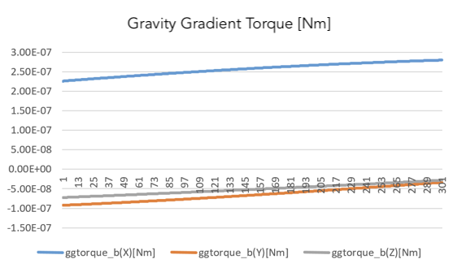

# Specification for Gravity Gradient Torque

## 1.  Overview

1. functions   
   - This class calculates the gravity gradient torque in the `Disturbances` class.

2. related files
   - `gravity_gradient.cpp`, `gravity_gradient.hpp` : Definitions and declarations of the class
   - `disturbance.ini` : Initialization file

3. how to use
   - Make an instance of the `GravityGradient` class in `InitializeInstances` function in `disturbances.cpp`
     - Create an instance by using the initialization function `InitGravityGradient`
   - Set the parameters in the `disturbance.ini`
     - Select `ENABLE` for `calculation` and `logging`
   
     
## 2. Explanation of Algorithm
1. ` CalcTorque_b_Nm` function
   1. overview  
      This function performs disturbance calculation and torque output simultaneously.

   2. algorithm  
      Gravity gradient torque is calculated by the following equations (1). 
      ```math
         \boldsymbol{T}_{GG} = \cfrac{3 \mu}{R_0^5} \boldsymbol{R}_0 \times (\boldsymbol{I}\cdot \boldsymbol{R}_o)
      ```
    
      where $\mu$ is the gravitational constant of the Earth in normal case, $R_0$ is the distance between the Earth center and the satellite, $\boldsymbol{R_0}$ is the vector from Earth center to the satellite, $\boldsymbol{I}$ is the inertia tensor of the satellite.  
      Users can change the $\mu$ for other planet with the constructor.

## 3. Results of verifications

1. verification of gravity gradient torque
   1. overview
      - Check that the gravity gradient torque equation is performed correctly

   2. conditions for the verification
      - PropStepSec: 0.001
      - StepTimeSec: 0.1
      - EndTimeSec: 300
      - Inertia tensor: diag [0.17, 0.1, 0.25]
      - Initial Quaternion_i2b: [0,0,0,1]
      - Initial torque: [0,0,0]
      - Initial angular velocity: [0,0,0]
      - Disturbance torque: All Disable except gravity gradient torque

   3. results
      - The order of the gg torque is $10^7$, which seems a proper value.
      
         

## 4. References

1. 姿勢制御研究委員会, 人工衛星の力学と姿勢ハンドブック, 培風館, 2007. (written in Japanese)
