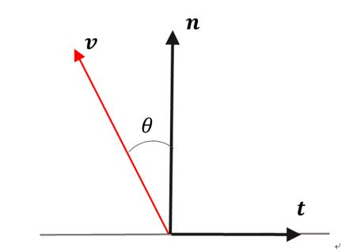

# Surface Force

## 1.  Overview
1. Functions
   - S2E handles air drag and Solar Radiation Pressure(SRP) as surface force disturbances since both disturbances affect spacecraft surfaces. The structure of both equations is identical, but they have different coefficients. 
   - Thus, the `SurfaceForce` base class provides the structure of the equation, and `AirDrag` and `SolarRadiation` subclasses provide specific calculations with appropriate coefficients.
   - Currently, the `SurfaceForce` class supports multi-surface spacecraft without a self-shadowing effect. Users can select the number of surfaces.
   - For the detailed description of `AirDrag` and `SolarRadiation`, please refer [Air Drag](./Spec_SurfaceForce_AirDrag.md) and [Solar Radiation Pressure](./Spec_SurfaceForce_SolarRadiation.md).

2. Related files
   - SurfaceForce.cpp, .h : The base class `SurfaceForce` is defined.

3. How to use
   - Make a subclass that inherits the `SurfaceForce` class.
   - Define the `CalcCoef` function in the subclass.
   - Execute `CalcTorqueForce` in the update function of the subclass.

## 2. Explanation of Algorithm
1. Constructor
   1. overview
      - Initialize structure parameters
   2. inputs and outputs
      - input
        - The position vector of each surface at the body-fixed frame
        - The area of each surface
        - The normal vector of each surface at the body-fixed frame
          - Normal vectors should be the unit vector.
      - output
        - The instance of the class
   3. algorithm: NA
   4. note
      - The origin of all vectors defined here is the body-fixed frame. Users can define the origin of the body-fixed frame by themselves. If users want to define the origin as the center of gravity, they need to set `cg_b = zero vector` in the `Structure.ini`. If users want to define the origin as a specific point, they need to carefully set all vectors to suit their definition.

2. `CalcTorqueForce` function
   1. overview
      - This is the main function to calculate the force and torque generated by the surface force disturbances.

   2. inputs and outputs
      - input
        - `input_b`: direction of disturbance source at the body frame
        - `item`: parameter which decides the magnitude of the disturbances (Solar flux, air density)
        - Surface information defined in the constructor
      - output
        - `force_b_`: Force at the body frame (unit: N)
        - `torque_b_` : Torque at the body frame (unit: Nm)
        - Both variables are defined in the `SimpleDisturbance` base class

   3. algorithm
      - Let us consider the following coordinate on a surface for surface force calculation
        - $`\boldsymbol{n}`$ is the normal vector of the surface
        - $`\boldsymbol{v}`$ is the direction vector of the disturbance source (e.g., sun direction vector or velocity vector)

      

      - $`\boldsymbol{t}`$ is the direction of in-plane force. 

      ```math
      \boldsymbol{t}=\frac{\boldsymbol{v}\times\boldsymbol{n}}{|\boldsymbol{v}\times\boldsymbol{n}|}\times\boldsymbol{n}
      ```

      - Surface force and torque acting on the surface is expressed as following equation
        - $`\boldsymbol{r}_{s}`$ is the position vector of the surface
        - $`\boldsymbol{r}_{cg}`$ is the position vector of the center of mass

      ```math
      \boldsymbol{F}=-C_{n}\boldsymbol{n}+C_{t}\boldsymbol{t}\\
      \boldsymbol{T}=(\boldsymbol{r}_{s}-\boldsymbol{r}_{cg})\times\boldsymbol{F}
      ```

      - Detail of the $`C_{n}`$ and $`C_{t}`$ are defined by subclasses by using `CalcCoef` function

   4. note
      - NA

## 3. Results of verifications
 - Verifications will be done by subclasses.

## 4. References
1. 