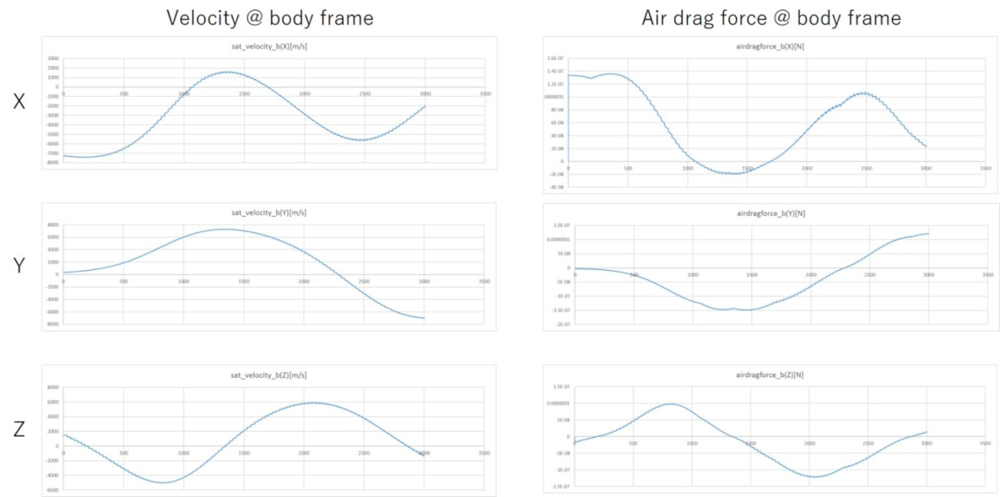

# Surface Force ~Air Drag~

## 1.  Overview

1. Functions
   - `AirDrag` class inherits `SurfaceForce` base class and calculates air drag disturbance force and torque. 

2. Related files
   - AirDrag.cpp, .h : The `AirDrag` class is defined.
   - SurfaceForce.cpp, .h : The base class `SurfaceForce` is defined.
     - **Note**: `SurfaceForce` class inherits `SimpleDisturbance` class, and `SimpleDisturbance` class inherits `Disturbance` class. So, please refer them if users want to understand the structure deeply.
   - Init_Disturbance.cpp : Initialize sequence is defined.
   - Disturbance.ini: the initialize file.

3. How to use
   - Edit `Disturbance.ini` to change the structure parameters.
   - Instantiate the class in `Init_Disturbance.cpp` with `Disturbance.ini`.
   - `Update` function of `AirDrag` is executed in the `Disturbances` class.
   - Other classes and functions can use `GetTorque` and `GetForce` functions defined in the `Disturbances` base class.

## 2. Explanation of Algorithm

1. `CalcCoef`
   1. overview
      - `CalcCoef` calculates the normal and in-plane coefficients for `SurfaceForce` calculation. The air drag force acting on a surface is expressed as the following equation

        ```math
        \boldsymbol{F}=-C_{n}\boldsymbol{n}+C_{t}\boldsymbol{t}\\
        C_{n}=\frac{1}{2}\rho A v^2 C_{n}^{\prime}\\
        C_{t}=\frac{1}{2}\rho A v^2 C_{t}^{\prime}
        ```

      - This  function mainly calculates the common part of the coefficient calculation. $`C_{n}^{\prime}`$ and $`C_{t}^{\prime}`$ are calculated in `CalCnCt` function, and they will be used in this function.

   2. inputs and outputs
      - input
        - $`\rho`$: air density [kg/m3]
        - $`v`$: Relative velocity between the spacecraft and the atmosphere [m/s]
        - $`A`$: Area of the surface [m2] (given by )
      - output
        - coefficients $`C_{n}`$ and $`C_{t}`$

   3. algorithm
      - See above equations.

   4. note: NA

2. `CalCnCt`
   1. overview
      - `CalCnCt` calculates  $`C_{n}^{\prime}`$ and $`C_{t}^{\prime}`$.

   2. inputs and outputs
      - input variables
        - $`\boldsymbol{v}`$: Relative velocity vector between the spacecraft and the atmosphere [m/s]
          - Currently, we assume that this value equals spacecraft velocity in the body-fixed frame.
      - input parameters 
        - $`\sigma_{d}`$: Diffuse coefficients for air drag
          - Ini file provide specularity for air drag $`\sigma_{s}`$, and the diffuse coefficient is derived as $`\sigma_{d}=1-\sigma_{s}`$.
          - **Note**: There is no absorption term for air drag. Thus total reflectivity is set as 1.
        - $`T_{w}`$: Temperature of the surface [K]
        - $`T_{m}`$: Temperature of the atmosphere [K]
        - $`M`$: Molecular weight of the thermosphere [g/mol]
          - In the default ini file, we use $`M=18`$, and it is a little bit smaller than the molecular weight of atmosphere $`M=29`$.  [Structure of the Thermosphere](https://www.sciencedirect.com/science/article/pii/0032063361900368?via%3Dihub) provides information on the molecular weight of the thermosphere. 
      - outputs
     - $`C_{n}^{\prime}`$ and $`C_{t}^{\prime}`$ 
   
3. algorithm
   - $`C_{n}^{\prime}`$ and $`C_{t}^{\prime}`$  are calculated as following equations

     ```math
     C_{n}^{\prime} = \frac{2-\sigma_{d}}{\sqrt{\pi}}\frac{\Pi(S_{n})}{S^{2}}+\frac{\sigma_{d}}{2}\frac{\chi(S_{n})}{S^{2}}\sqrt{\frac{T_{w}}{T_{m}}}\\
     C_{t}^{\prime} =\frac{\sigma_{d}}{\sqrt{\pi}}\frac{\chi(S_{n})}{S^{2}}S_{t}
      ```

   - $`S, S_{n}, S_{t}`$ are defined as follows
      - $`k=1.38064852E-23`$ is the Boltzmann constant
      - $`\theta`$ is the angle between the normal vector and the velocity vector
      - $`\cos{\theta}`$ and $`\sin{\theta}`$ are calculated in `SurfaceForce` base class.

        ```math
        S=\sqrt{\frac{Mv^{2}}{2kT_{w}}}\\
        S_{n}=S\cos{\theta}\\
        S_{t}=S\sin{\theta}\\
        ```
   
   - $`\Pi(x)`$ and $`\chi(x)`$ are defined as follows
     - where `erf` is the [Gauss error function](https://en.wikipedia.org/wiki/Error_function).
   
      ```math
      \Pi(x)=x e^{-x^{2}}+\sqrt{\pi}(x^2+0.5)(1+erf(x))\\
      \chi(x)=e^{-x^{2}}+\sqrt{\pi}x(1+erf(x))
      ```
4. note
   - Please see the reference document for more information on detailed calculations.

## 3. Results of verifications

1. Verification of magnitude of the force
   1. overview
      - The calculated magnitude of the air drag force is compared with other calculation results in three cases.

   2. conditions for the verification
      - See the bottom table.
      
3. results
   - The calculation result is completely the same as the other calculation.
   
     | parameters/results          | Case 1  | Case 2  | Case 3  |
     | --------------------------- | ------- | ------- | ------- |
     | $`\sigma_{d}`$              | 0.8     | 0.6     | 0.4     |
     | $`\theta`$ rad              | 0.202   | 0.202   | 0.202   |
     | $`v`$ m/s                   | 7420    | 7420    | 7420    |
     | Out-plane force (S2E)       | 2.30297 | 2.68680 | 3.07062 |
     | Out-plane force (reference) | 2.30297 | 2.68680 | 3.07062 |
     | Out-plane force (S2E)       | 0.31514 | 0.23636 | 0.15757 |
     | Out-plane force (reference) | 0.31514 | 0.23636 | 0.15757 |
    
1. Verification of direction of the force
   1. overview
      - Next, we confirmed that the direction of the calculated force is correct.
   
   2. conditions for the verification
      - S2E is executed using the default setting.
   
   3. results
      - We confirmed that the direction of the force is opposite the direction of the velocity of the spacecraft.
   
      

## 4. References
1. H. Klinkrad and B. Fritsche, "[ORBIT AND ATTITUDE PERTURBATIONS DUE TO AERODYNAMICS AND RADIATION PRESSURE](https://pdfs.semanticscholar.org/a16c/1abab4c081b4434bda9190f4f7be789c246a.pdf)", in *ESA Workshop on Space Weather*, 1998. 
2. Marcel Nicolet, [Structure of the Thermosphere](https://www.sciencedirect.com/science/article/pii/0032063361900368?via%3Dihub), Planetary and Space Science, 1961
3. [Gauss error function](https://en.wikipedia.org/wiki/Error_function)