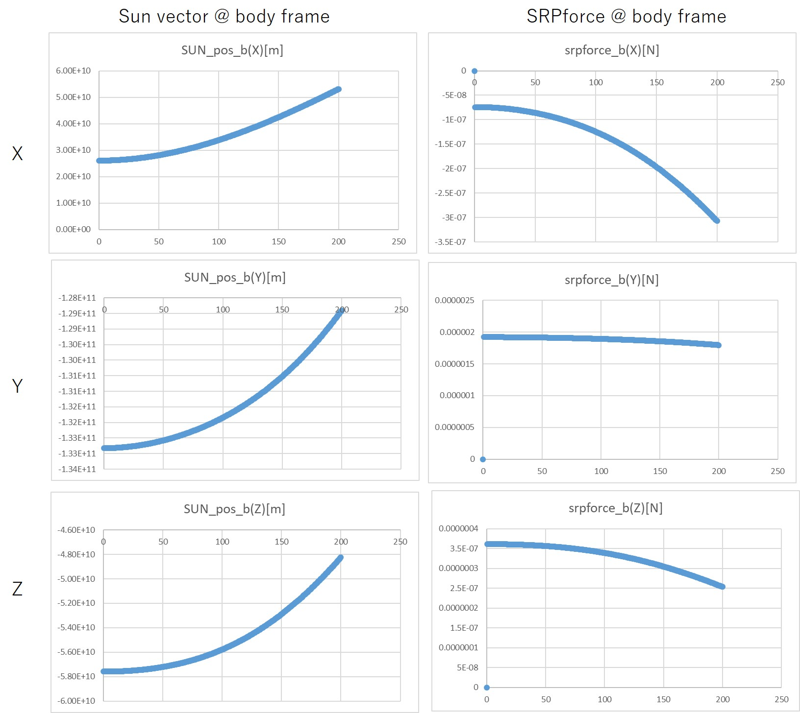

# Surface Force: Solar Radiation Pressure

## 1.  Overview

1. Functions
   - `SolarRadiation` class inherits `SurfaceForce` base class and calculates air drag disturbance force and torque. 

2. Related files
   - SolarRadiation.cpp, .h : The `SolarRadiation` class is defined.
   - SurfaceForce.cpp, .h : The base class `SurfaceForce` is defined.
     - **Note**: `SurfaceForce` class inherits `SimpleDisturbance` class, and `SimpleDisturbance` class inherits `Disturbance` class. So, please refer them if users want to understand the structure deeply.
   - Init_Disturbance.cpp : Initialize sequence is defined.
   - Disturbance.ini: initialize file.

3. How to use
   - Edit `Disturbance.ini` to change the structure parameters.
   - Instantiate the class in `Init_Disturbance.cpp` with `Disturbance.ini`.
   - `Update` function of the `SolarRadiation` is executed in the `Disturbances` class.
   - Other classes and functions can use `GetTorque` and `GetForce` functions defined in the `Disturbances` base class.

## 2. Explanation of Algorithm

1. `CalcCoef` function
   1. overview
      - `CalcCoef` calculates the normal and in-plane coefficients for `SurfaceForce` calculation.

   2. inputs and outputs
      - inputs
        - $v_{s}$:Direction vector of the sun (s/c -> sun) at the body frame
        - $P$ Solar pressure at the position of the spacecraft [N/m^2]
      - setting parameters
        - $\nu$ : Total reflectance
          - $\nu = 1-\alpha$, where $\alpha$ is the absorption of the sun spectrum.
        - $\mu$ : Specularity. Ratio of specular reflection inside the total reflected light.
        - $A$ : Area of the surface
      - outputs
        -  $C_{n}$ and $C_{t}$

   3. algorithm
      - $C_{n}$ and $C_{t}$ are calculated as follows:
        - $\theta$ is the angle between the normal vector and the sun vector.

      ```math
      \begin{align}
        C_{n} &= AP \left((1+\nu\mu)\cos^{2}{\theta}+\frac{2}{3}\nu(1-\mu)\cos{\theta} \right)\\
        C_{t} &= AP(1-\nu\mu)\cos{\theta}\sin{\theta}
      \end{align}
      ```

   4. note
      - NA

## 3. Results of verifications

1. Verification of perfect reflection case
   1. overview
      - In the perfect reflection case, the direction of the SRP force will be opposite from the direction of the sun.

   2. conditions for the verification
      - We assumed that the structure of the spacecraft is a 50-cm cube whose optical property is the perfect specular reflection($\nu=\mu=1$).

   3. results
      - We confirmed that the direction of the SRP force is opposite from the direction of the sun at the body frame.

      

## 4. References

1. 