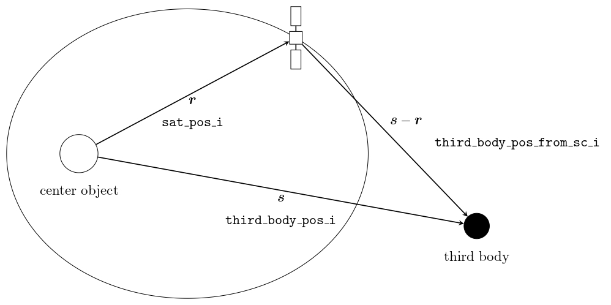
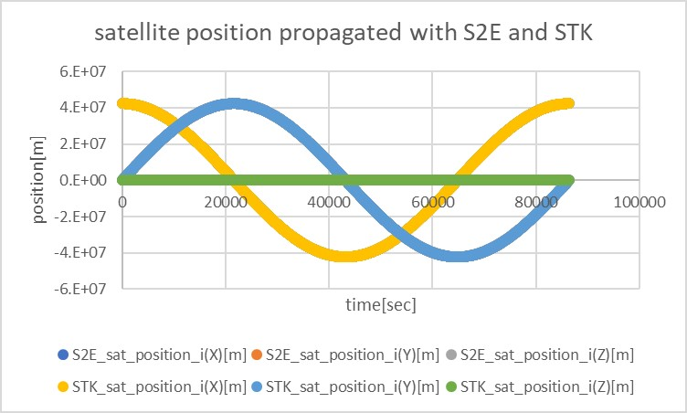
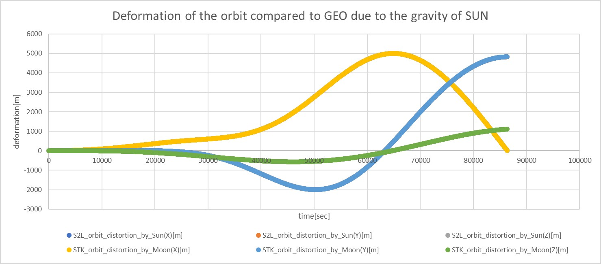
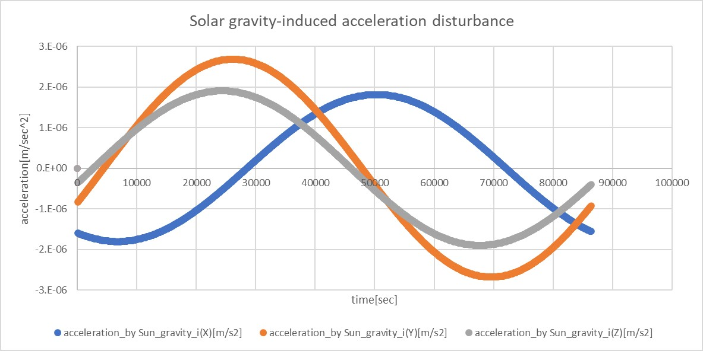
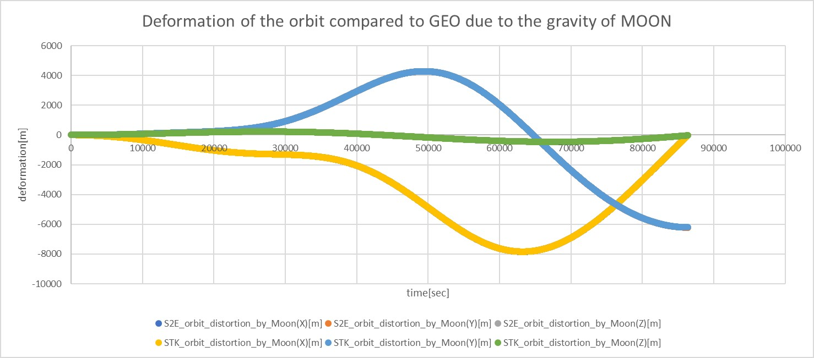
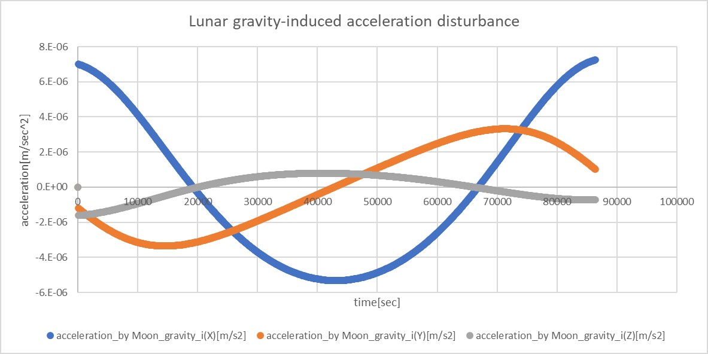
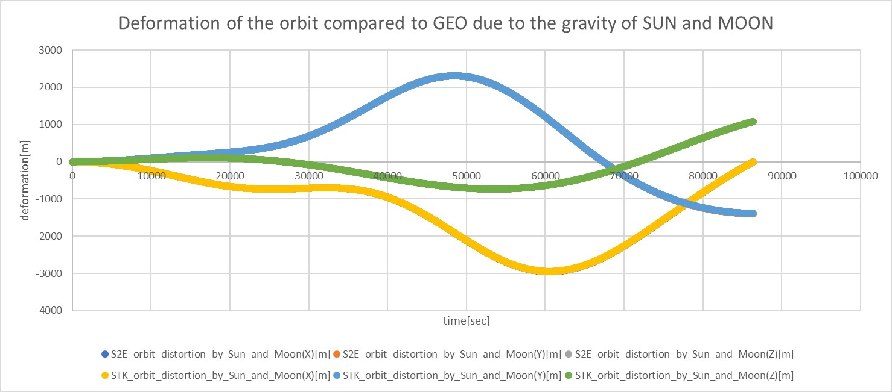
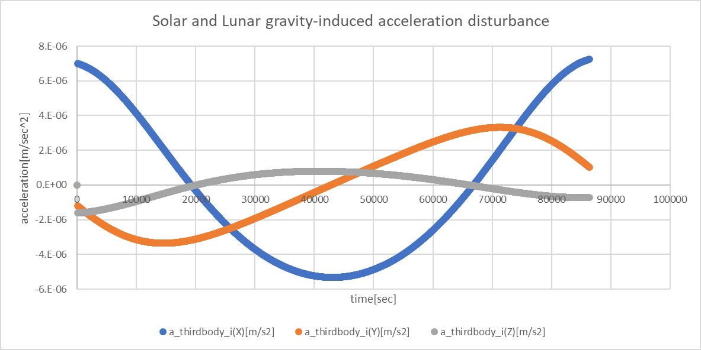

# Specification of Third Body Gravity Disturbance Calculation

## 1.  Overview

1. Functions
   - The `ThirdBodyGravity` class calculates the gravity acceleration generated by the third body, such as Sun, Moon, or planets.

2. Related files
   - `src/Disturbance/ThirdBodyGravity.cpp`
   - `src/Disturbance/ThirdBodyGravity.h`

3. How to use
   - Make an instance of the `ThirdBodyGravity` class in `InitializeInstances` function in `Disturbances.cpp`
   - Chose RK4 orbit propagator
   - Select `ENABLE` and specify `num_of_other_body` and `other_body` in `Disturbance.ini`
     - **NOTE**: All of the `other_body` objects must be included in the `selected_body` of `PlanetSelect.ini`
     - **NOTE**: When the class `ThirdBodyGravity` is instantiated, the class reports an error in the following cases.
       1. The target specified by `center_object` in `PlanetSelect.ini` is included in the list of `third_body`.
       2. The list of `third_body` includes objects which are not in the list of `selected_body` in `PlanetSelect.ini`.
   - **NOTE**: If the same body is specified more than once in the list of `third_body` in `Disturbance.ini`, the second and subsequent entries of the body are ignored.

## 2.Explanation of Algorithm
- The base algorithm is referred to [Satellite Orbits](https://www.springer.com/jp/book/9783540672807) chapter 3.3. 

1. `CalcAcceleration` function
    1. overview
        - This function calculates the acceleration generated by the third body.

    2. inputs and outputs
        - Input
          - position of the third body seen from the **center object** in the inertial coordinate system
          - position of the third body seen from the **spacecraft** in the inertial coordinate system 
          - gravity constant (GM) of the third body
            - NOTE: These inputs are derived from `CelestialInformation`. 

        - Output
          - acceleration generated by the third body in the inertial coordinate system

    3. algorithm
        - Definition of the variables
          - $\boldsymbol{r}$: the position of the spacecraft (written as `sat_pos_i` in the code)
          - $\boldsymbol{s}$: the position of the third body (written as `third_body_pos_i` in the code)
          - $\boldsymbol{s}-\boldsymbol{r}$: the position of the third body seen from the spacecraft (written as `third_body_pos_from_sc_i` in the code)

          

        - The acceleration disturbance effect by the third body is written as follows:

        ```math
        \ddot{\boldsymbol{r}}=GM\left(\frac{\boldsymbol{s}-\boldsymbol{r}}{|\boldsymbol{s}-\boldsymbol{r}|^3}-\frac{\boldsymbol{s}}{|\boldsymbol{s}|^3}\right)
        ```

        - See section 3.3.1 of [Satellite Orbits](https://www.springer.com/jp/book/9783540672807) for a detailed explanation.

## 3. Results of verifications
1. overview
    - The deformation of the orbit caused by the acceleration of the third body gravity is compared between S2E and STK.

2. conditions for the verification
    1. input files
        - Default initialize files
    
    2. initial values 
        ```
        StartYMDHMS=2020/01/01 11:00:00.0
        EndTimeSec=86400
        StepTimeSec=10
        OrbitPropagateStepTimeSec=10
        LogPeriod = 5
        SimulationSpeed = 0
        ```
        - Since the effect of third body gravity increases as one moves away from the central object, it is verified for GEO.

        ```
        init_position(0) = 42241095.67425744
        init_position(1) = 0
        init_position(2) = 0

        init_velocity(0) = 0
        init_velocity(1) = 2.978E+4
        init_velocity(1) = 3071.859163190527
        ```

        - All the disturbance calculations, except for the third-object gravity, are set to DISABLE.

        - The following cases are tested.
          1. Only the gravity of the Sun is taken into account
          2. Only the gravity of the Moon is taken into account
          3. Both the gravity of the Sun and the Moon are taken into account
          4. Only the gravity of Mars is taken into account (TBW)

    3. results
        - Without the third body, S2E and STK show the same result.

         

        1. Only the gravity of the Sun is taken into account
            - The deformation of the orbit compared to GEO is shown in the following figure.

            

            - The acceleration disturbance caused by the Sun's gravity is shown in the following figure.

            

        2. Only the gravity of the Moon is taken into account
            - The deformation of the orbit compared to GEO is shown in the following figure.

            

            - The acceleration disturbance caused by the Moon's gravity is shown in the following figure.

            
        
        3. Both the gravity of the Sun and the Moon are taken into account
            - The deformation of the orbit compared to GEO is shown in the following figure.

            

            - The gravitational disturbance of both the Sun and the Moon is shown in the following figure.

            

        - In all of the above cases, the S2E and STK results are consistent.

## 4. References
1. [Satellite Orbits](https://www.springer.com/jp/book/9783540672807) chapter 3.3. 