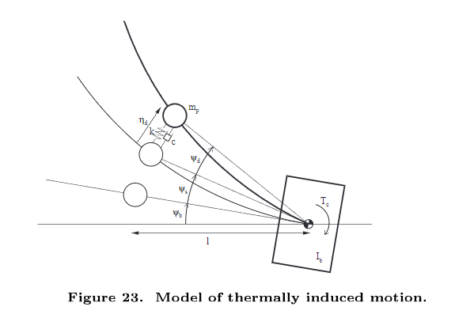
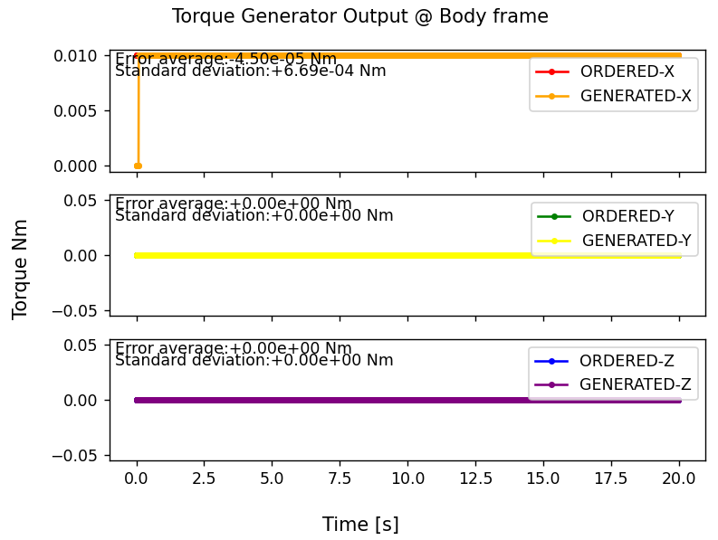
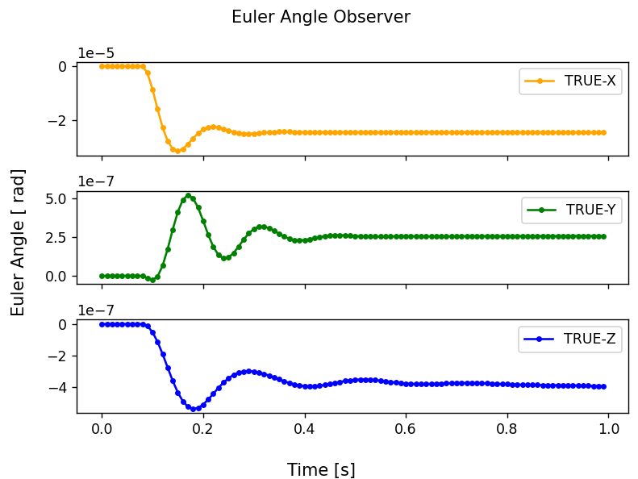
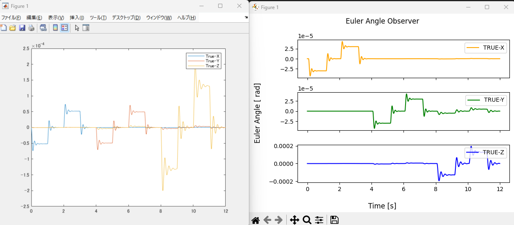
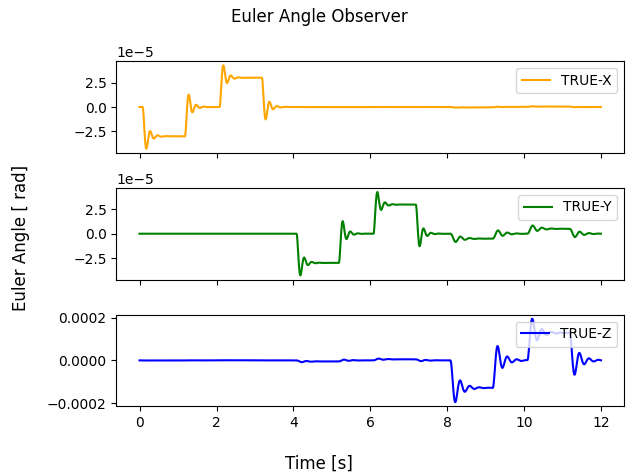

# Specification for Attitude Dynamics with Cantilever Vibration

## 1. Overview

### 1. Functions

- The `AttitudeWithCantileverVibration` class propagates the coupled motion of a rigid spacecraft body and a flexible cantilever, such as a flexible boom or solar array paddle.
- The cantilever is represented by an equivalent spring-mass-damper model with one bending-angle state for each axis.
- Spacecraft angular velocity, attitude quaternion, cantilever angular velocity, and cantilever bending angle are propagated simultaneously with the fourth-order Runge-Kutta method.
- Disturbance and control torque, reaction-wheel angular momentum, and changes in the spacecraft inertia tensor are included in the attitude dynamics.

The model was introduced in [PR #639](https://github.com/ut-issl/s2e-core/pull/639) and is based on the flexible-appendage model described by Iwata et al.



### 2. Files

- [`attitude_with_cantilever_vibration.cpp`](https://github.com/ut-issl/s2e-core/blob/v8.0.4/src/dynamics/attitude/attitude_with_cantilever_vibration.cpp), [`attitude_with_cantilever_vibration.hpp`](https://github.com/ut-issl/s2e-core/blob/v8.0.4/src/dynamics/attitude/attitude_with_cantilever_vibration.hpp): Attitude propagator with cantilever vibration
- [`ode_attitude_with_cantilever_vibration.hpp`](https://github.com/ut-issl/s2e-core/blob/v8.0.4/src/dynamics/attitude/ode_attitude_with_cantilever_vibration.hpp): Ordinary differential equations for the coupled dynamics
- [`initialize_attitude.cpp`](https://github.com/ut-issl/s2e-core/blob/v8.0.4/src/dynamics/attitude/initialize_attitude.cpp): Selection and initialization of the attitude propagation model
- [`satellite.ini`](https://github.com/ut-issl/s2e-core/blob/v8.0.4/settings/sample_satellite/satellite.ini): Attitude propagation mode and initial attitude settings
- [`structure.ini`](https://github.com/ut-issl/s2e-core/blob/v8.0.4/settings/sample_satellite/structure.ini): Spacecraft and cantilever structural parameters

### 3. How to use

- Set `propagate_mode = CANTILEVER_VIBRATION` in the `[ATTITUDE]` section of `satellite.ini`.
- Select `MANUAL` or `CONTROLLED` with `initialize_mode` and set the other initial attitude parameters in the same manner as the normal RK4 attitude propagator.
- Set the cantilever inertia tensor, damping ratio, and intrinsic angular velocity in the `[CANTILEVER_PARAMETERS]` section of `structure.ini`.
- Ensure that `structure_file` in `[SETTING_FILES]` points to the structure initialization file.
- Create the attitude instance with `InitAttitude` and execute propagation with `Propagate`.
- The normal getters inherited from `Attitude` return the spacecraft attitude, angular velocity, and angular momentum. The cantilever bending angle and angular velocity are available in the log output.

### 4. Initialization parameters

The following example shows the settings related to this model.

```ini
// satellite.ini
[ATTITUDE]
propagate_mode = CANTILEVER_VIBRATION
initialize_mode = MANUAL

initial_angular_velocity_b_rad_s(0) = 0.0
initial_angular_velocity_b_rad_s(1) = 0.0
initial_angular_velocity_b_rad_s(2) = 0.0

initial_quaternion_i2b(0) = 0.0
initial_quaternion_i2b(1) = 0.0
initial_quaternion_i2b(2) = 0.0
initial_quaternion_i2b(3) = 1.0

initial_torque_b_Nm(0) = 0.0
initial_torque_b_Nm(1) = 0.0
initial_torque_b_Nm(2) = 0.0

[SETTING_FILES]
structure_file = SETTINGS_DIR_FROM_EXE/sample_satellite/structure.ini
```

```ini
// structure.ini
[CANTILEVER_PARAMETERS]
inertia_tensor_cantilever_kgm2(0) = 0.1
inertia_tensor_cantilever_kgm2(1) = 0.0
inertia_tensor_cantilever_kgm2(2) = 0.0
inertia_tensor_cantilever_kgm2(3) = 0.0
inertia_tensor_cantilever_kgm2(4) = 0.1
inertia_tensor_cantilever_kgm2(5) = 0.0
inertia_tensor_cantilever_kgm2(6) = 0.0
inertia_tensor_cantilever_kgm2(7) = 0.0
inertia_tensor_cantilever_kgm2(8) = 0.1

damping_ratio_cantilever = 0.01
intrinsic_angular_velocity_cantilever_rad_s = 25.5097
```

| Parameter | Unit | Description |
| --- | --- | --- |
| `propagate_mode` | - | Set to `CANTILEVER_VIBRATION` to select this attitude model. |
| `initialize_mode` | - | Initial attitude definition. `MANUAL` uses the initial values in `[ATTITUDE]`; `CONTROLLED` calculates the initial quaternion from `[CONTROLLED_ATTITUDE]`. |
| `initial_angular_velocity_b_rad_s(0..2)` | rad/s | Initial spacecraft angular velocity in the body-fixed frame for manual initialization. |
| `initial_quaternion_i2b(0..3)` | - | Initial frame-conversion quaternion from the inertial frame to the body-fixed frame. |
| `initial_torque_b_Nm(0..2)` | Nm | Initial torque in the body-fixed frame. It is applied only during the first propagation step. |
| `inertia_tensor_cantilever_kgm2(0..8)` | kg m^2 | Row-major 3-by-3 cantilever inertia tensor. |
| `damping_ratio_cantilever` | - | Cantilever damping ratio, $\zeta_p$. |
| `intrinsic_angular_velocity_cantilever_rad_s` | rad/s | Cantilever undamped natural angular frequency, $\omega_p$. |

The cantilever angle and angular velocity are initialized to zero. In the current implementation, the cantilever coordinate frame is identical to the spacecraft body-fixed frame.

## 2. Explanation of algorithm

### 1. Dynamics model

The simplified scalar equations used as the basis of the model are

```math
\begin{align}
(I_b + I_p)\ddot{\psi}_b + I_p\ddot{\psi}_d &= T_c, \\
I_p(\ddot{\psi}_b + \ddot{\psi}_d) + c_p\dot{\psi}_d + k_p\psi_d &= 0,
\end{align}
```

where

- $I_b$ is the inertia of the rigid spacecraft body excluding the cantilever.
- $I_p$ is the cantilever inertia.
- $\psi_b$ is the spacecraft attitude angle.
- $\psi_d$ is the cantilever bending angle relative to the spacecraft body.
- $T_c$ is the torque acting on the spacecraft.
- $c_p$ and $k_p$ are the cantilever damping and spring coefficients.

The implementation extends these equations to three axes and includes the spacecraft gyroscopic term, reaction-wheel angular momentum, and torque caused by a time-varying inertia tensor. The damping and spring terms are parameterized as

```math
\begin{align}
a_p &= 2\zeta_p\omega_p, \\
s_p &= \omega_p^2,
\end{align}
```

where $a_p$ is the attenuation coefficient and $s_p$ is the spring coefficient used by the ordinary differential equation.

### 2. State variables

The propagator integrates the following 13-element state vector:

```math
\boldsymbol{x} =
\begin{bmatrix}
\boldsymbol{\omega}_b &
\boldsymbol{\omega}_p &
\boldsymbol{q}_{i2b} &
\boldsymbol{\psi}_d
\end{bmatrix}^{T},
```

where

- $\boldsymbol{\omega}_b$: spacecraft angular velocity in the body-fixed frame, 3 elements [rad/s]
- $\boldsymbol{\omega}_p$: cantilever angular velocity relative to the body-fixed frame, 3 elements [rad/s]
- $\boldsymbol{q}_{i2b}$: attitude quaternion from the inertial frame to the body-fixed frame, 4 elements
- $\boldsymbol{\psi}_d$: cantilever bending angle relative to the body-fixed frame, 3 elements [rad]

The cantilever kinematics satisfy $\dot{\boldsymbol{\psi}}_d = \boldsymbol{\omega}_p$. The attitude quaternion derivative is calculated from $\boldsymbol{\omega}_b$ in the same manner as the normal RK4 attitude propagator.

### 3. `Propagate` function

#### 1. Overview

1. Calculate the torque associated with the change in the spacecraft inertia tensor between propagation calls.
2. Update the ordinary differential equation with the current inertia tensor, applied torque, and reaction-wheel angular momentum.
3. Convert the physical quantities into the 13-element state vector.
4. Integrate the coupled differential equations up to `end_time_s` with fixed-step fourth-order Runge-Kutta integration.
5. Convert the integrated state back into physical quantities and normalize the attitude quaternion.
6. Update the current propagation time, previous inertia tensor, and spacecraft angular momentum.

The internal integration step is the attitude propagation step supplied to `InitAttitude`. A final shortened integration step is used when the requested end time is not an integer multiple of this step.

### 4. Model assumptions and limitations

- The flexible appendage is reduced to an equivalent low-order cantilever model; higher vibration modes and distributed deformation are not represented.
- The cantilever deformation is expressed by small bending angles about the body-fixed axes.
- A single damping ratio and natural angular frequency are applied to all three cantilever axes.
- The cantilever coordinate frame and the spacecraft body-fixed frame are currently identical.
- The numerical integration method is fixed to fourth-order Runge-Kutta and cannot currently be selected in the initialization file.

### 5. Log output

In addition to the normal `Attitude` log values, the model logs:

- `euler_angular_cantilever_c_rad`: cantilever bending angle [rad]
- `angular_velocity_cantilever_c_rad_s`: cantilever angular velocity [rad/s]

The suffix `c` denotes the cantilever frame, which is currently the same as the spacecraft body-fixed frame.

## 3. Results of verifications

The following results were reported in [PR #639](https://github.com/ut-issl/s2e-core/pull/639). The cantilever natural angular frequency was set to $4.06 \times 2\pi$ rad/s and the damping ratio was set to $0.05$.

### 1. Response to constant torque

The following torque was applied in the spacecraft body-fixed frame. The X-axis torque is approximately `0.01 Nm`, and the Y- and Z-axis torques are zero.



The simulated cantilever bending angles show an oscillatory transient followed by convergence due to damping.



### 2. Comparison with MATLAB

The same time-varying torque conditions were simulated with MATLAB and S2E. The bending-angle histories from both simulations show the same response for all three axes.



### 3. Numerical integration library

The calculation was repeated after the propagator was changed to use the common numerical integration library. The resulting bending-angle histories remained consistent with the result before the change.



The PR also reports successful operation with multiple attitude initialization conditions. These results confirm the coupled vibration response, damping behavior, and consistency of the S2E implementation with the independent MATLAB simulation.

## 4. References

1. T. Iwata, K. Maeda, and H. Hoshino, [“Modeling and Flight Data Analysis of Spacecraft Dynamics with a Large Solar Array Paddle”](https://ntrs.nasa.gov/citations/20080012649), Proceedings of the 20th International Symposium on Space Flight Dynamics, 2007.
2. [S2E-core PR #639: Add flexible structure model](https://github.com/ut-issl/s2e-core/pull/639)
