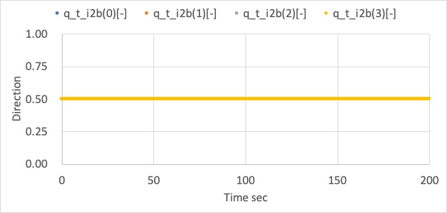
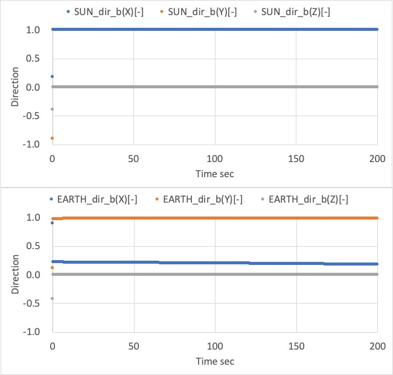
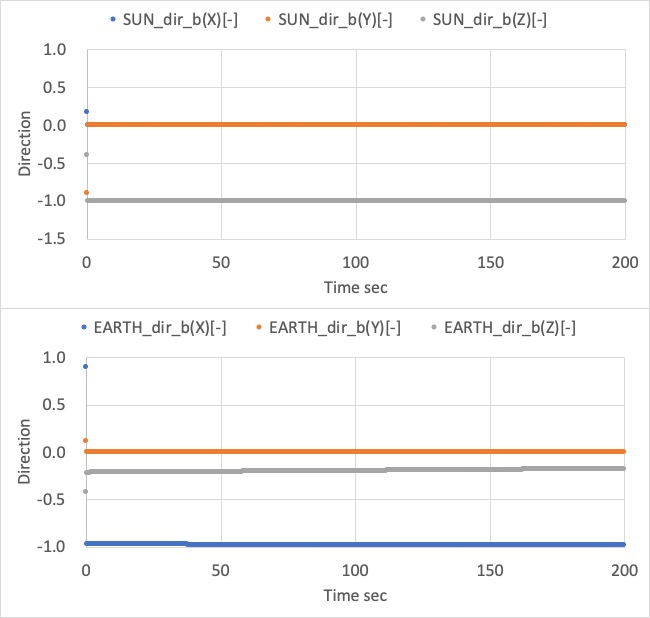
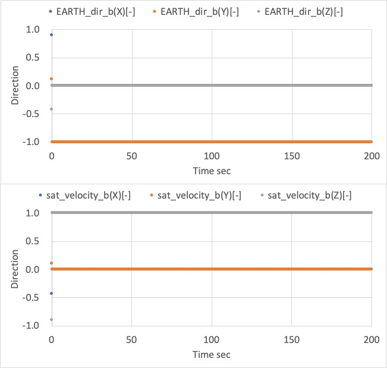
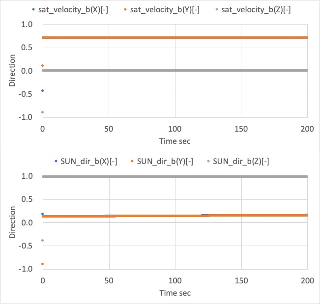

# Controlled Attitude

## 1.  Overview

1. Functions  
   - The `ControlledAttitude` class provides a perfectly controlled attitude instead of free motion attitude dynamics by numerical propagation.
   - Users can set the attitude as sun pointing, earth pointing, and others for any direction in the spacecraft body frame. Of course, users can select an inertial stabilized attitude.
   - It is useful for power, communication, and orbit analyses with S2E.

2. Related files
   - `src/dynamics/attitude/attitude.hpp, .cpp`
	   - Definition of `Attitude` base class
   - `src/dynamics/attitude/controlled_attitude.hpp, .cpp`
     - `ControlledAttitude` class is defined here.
   - `src/dynamics/attitude/initialize_attitude.hpp, .cpp`
	   - Make an instance of `Attitude` class.	
   - `sample_satellite.ini` : Initialization file

3. How to use
   - Inside the codes
     - `ControlledAttitude` class inherits the `Attitude` class, so other functions can access the `ControlledAttitude` class by using get functions in the `Attitude` class.
   - User I/F
     - Firstly, users should set `propagate_mode = CONTROLLED` at the `[ATTITUDE]` section in the `sample_satellite.ini` file.
     - Users can set a target attitude in the initialize file. There are the following setting parameters: `main_mode`, `sub_mode`, `initial_quaternion_i2t`, `pointing_t_b`, and `pointing_sub_t_b`.
     - Firstly, users select the control mode by using `main_mode` and `sub_mode`. For the control mode.  
     - When `main_mode` is set as `INERTIAL_STABILIZE`, `sub_mode` is ignored, and the spacecraft attitude is fixed to the `initial_quaternion_i2t` value in the simulation.
     - When `main_mode` is set as `HOGE_POINTING` modes, the direction of the body-fixed frame defined by `pointing_t_b` is controlled to point the specific direction of the modes. 
       - Ex. 1, the body-fixed +X axis directs to the sun when `main_mode = SUN_POINTING` and `pointing_t_b = [1.0,0.0,0.0]`.
       - Ex. 2, the body-fixed -Z axis directs to the earth center when `main_mode = EARTH_CENTER_POINTING` and `pointing_t_b = [0.0,0.0,-1.0]`.
     - `sub_mode` is only used when users select `POINTING` modes for `main_mode`. `sub_mode` is defined to stop rotation around the pointing direction of `main_mode`. The selected sub-direction in the body-fixed frame cannot perfectly direct the target direction since the primary target and sub-target usually do not satisfy the vertical relationship.
     - `sub_mode` cannot be `INERTIAL_STABILIZE` and the same mode with `main_mode`.
     - The angle between `pointing_t_b` and `pointing_sub_t_b` should be larger than 30 degrees. (90 degrees is recommended)
  - List of attitude control mode
    - INERTIAL_STABILIZE = 0
    - SUN_POINTING = 1
    - EARTH_CENTER_POINTING = 2
    - VELOCITY_DIRECTION_POINTING = 3
    - ORBIT_NORMAL_POINTING = 4
      - orbit normal $n$ is defined as $n=r\times v$, where $r$ is radial direction and $v$ is velocity direction.


## 2. Explanation of Algorithm

1. Initialize function

   1. overview
      - This function initializes the target attitude and confirms that the setting parameters are correct. 
      - The parameter checklist
        - Out of range check for both mode definitions.
        - `main_mode` and `sub_mode` is not the same
        - The angle between `pointing_t_b` and `pointing_sub_t_b` should be larger than 30 degrees.
   2. inputs and outputs
      - NA 
   3. algorithm
      - NA
   4. note
      - NA

2. Propagate function

   1. overview
      - This is the main function executed in every loop of attitude dynamics calculation.

   2. inputs and outputs
      - inputs 
        - setting parameters
      - outputs
        - quaternion_i2b

   3. algorithm
      - Detail algorithm is described in the next function.

   4. note
      - NA   

3. CalcTargetDirection

   1. overview
      - This function calculates the target direction according to the pointing mode.

   2. inputs and outputs
      - inputs 
        - control mode
        - orbit class
        - celestial information class
      - outputs
        - the direction of the target object

   3. algorithm
      - As written in the code.

   4. note
      - NA   

3. PointingCtrl

   1. overview
      - This function calculates the `quaternion_i2b`.

   2. inputs and outputs
      - inputs 
        - the main direction of the target object in ECI frame $t_m^i$
        - the sub direction of the target object  in ECI frame $t_s^i$
        - the main controlled direction in the body frame $d_m^b$
        - the sub controlled direction in the body frame $d_s^b$
      - outputs
        - quaternion_i2b

   3. algorithm
      - Firstly, the $DCM_{t2i}$, which is the frame transformation from the target frame to the inertial frame, is calculated using $t_m^i$ and $t_s^i$ with `CalcDCM`.
      - Next, the $DCM_{t2b}$, which is the frame transformation from the target frame to the body-fixed frame, is calculated using $d_m^b$ and $d_s^b$ with `CalcDCM`.
      - Finally, both DCMs are combined as
        ```math
        DCM_{i2b} = DCM_{t2b} \cdot DCM_{t2i}'
        ```
        and `quaternion_i2b` is calculated from the $DCM_{i2b}$.

   4. note
      - NA   

3. CalcDCM

   1. overview
      - This function calculates a DCM from two given directions.
      - The DCM represents the coordinate transform matrix from the new frame defined by the two directions to the original frame.

   2. inputs and outputs
      - inputs 
        - the main direction in the frame $a$ : $d_m^a$
        - the sub direction in the frame $a$ : $d_s^a$
      - outputs
        - Coordinate transform matrix from the new frame to the original frame $a$

   3. algorithm
      - The first basis vector of the new frame is defined as the main direction.
        ```math
        e_1=d_m^a
        ```
      - The second basis vector needs to be direct to the sub direction, but it should be vertical with $e_1$.
        ```math
        e_2 = \frac{(e_1\times d_s^a) \times e_1}{|(e_1\times d_s^a) \times e_1|}
        ```
      - The third basis vector is defined as right-hand coordinate.
        ```math
        e_3=\frac{e_1\times e_2}{|e_1\times e_2|}
        ```

   4. note
      - NA   

3. note
   - Currently, the `ControlledAttitude` class does not calculate angular velocity, and it is set as 0. The feature will be implemented in the near future. 


## 3. Results of verifications

1. Inertial stabilize 
   1. overview
      - To verify the correctness of pointing control
   2. conditions for the verification
      1. input files
         - default files
      2. initial values
         - main_mode = sub_mode = INERTIAL_STABILIZE
         - initial_quaternion_i2b = [0.5,0.5,0.5,0.5]
   3. results
      - The inertial stabilize control is succeeded.
      

1. Pointing Control 
   1. overview      
      - Several cases described at the bottom were checked to verify the correctness of pointing control.
   2. conditions for the verification
      1. input files
         - default files
      2. cases　　

| case | main mode    | sub mode     | main_pointing_direction_b    | sub_pointing_direction_b |
| ---- | ------------ | ------------ | --------------- | ---------------- |
| 1    | Sun          | Earth Center | [1,0,0]         | [0,1,0]          |
| 2    | Sun          | Earth Center | [0,0,-1]        | [-1,0,0]         |
| 3    | Earth Center | Velocity     | [0,-1,0]        | [0,0,1]          |
| 4    | Velocity     | Sun          | [0.707,0.707,0] | [0,0,1]          |
|      |              |              |                 |                  |

   3. results
      1. Case 1
         - The spacecraft +X axis correctly directs to the sun, and its +Y axis roughly directs to the earth.  

        

      1. Case 2
         - The spacecraft -Z axis correctly directs to the sun, and its -X axis roughly directs to the earth.  

        
      
      1. Case 3
         - The spacecraft -Y axis correctly directs to the earth, and its +Z axis roughly directs to the velocity direction.  
      
        
      
      1. Case 4
         - The spacecraft +XY direction correctly directs to the velocity direction, and its +Z axis roughly directs to the sun.  
      
        
        
## 4. References

1. NA