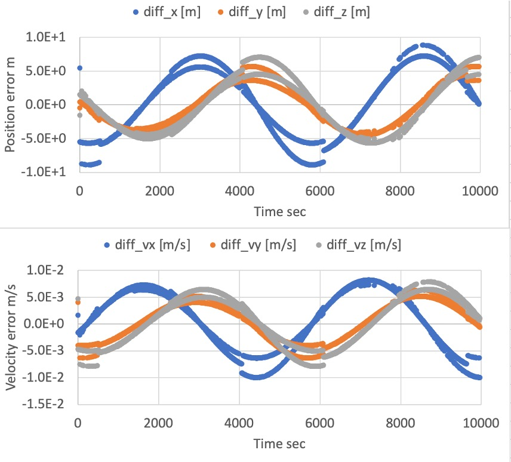
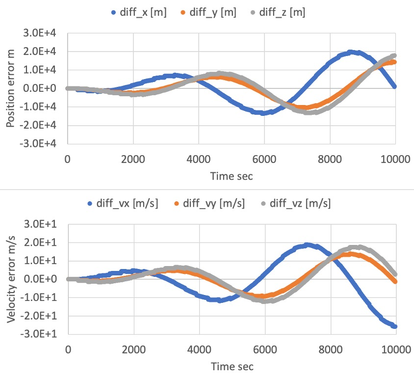

# Specification for Orbit Propagation with Encke's Method

## 1.  Overview

1. functions
   - The `EnckeOrbitPropagation` class calculates the satellite position and velocity with Encke's method, including disturbances and controlled accelerations by the satellite.
   - This orbit propagation mode provides an accurate and efficient orbit calculation with disturbance forces.
   - We can also use it for accurate relative orbit propagation, and the feature will be implemented soon.

2. files
   - src/Dynamics/Orbit/EnckeOrbitPropagation.cpp, .h
   - We use [KeplerOrbit](./Spec_KeplerOrbit.md) libraries to calculate the reference orbit.

3. How to use
   - Select `propagate_mode = ENCKE` in the spacecraft's ini file.
   - Set the values `init_position` and `init_velocity` in the ini file.
     - The units are `m`(meter) and `m/s`.
     - The frame is the inertial frame, and the center is defined in the `PlanetSelect`.
   - Set the value of `error_tolerance`, which decides the threshold for the rectification.

## 2. Explanation of Algorithm
1. `EnckeOrbitPropagation::Initialize` function
   1. Overview
      - This function generates the initial value of the reference orbit and the difference orbit.

   2. Inputs and outputs
      - Input
        - $`\mu`$ : The standard gravitational parameter of the central body
        - $`t`$ : Time in Julian day
        - $`\boldsymbol{r}_{i}`$ : Initial position in the inertial frame
        - $`\boldsymbol{v}_{i}`$ : Initial velocity in the inertial frame
      - Output
        - The reference orbit
        - The difference is set as zero

   3. Algorithm
      - The reference orbit is initialized as the Kepler Orbit with `OrbitalElements::CalcOeFromPosVel` function. The detail of the function is described in [Specification for Kepler Orbit Propagation](./Spec_KeplerOrbit.md)

2. `EnckeOrbitPropagation::Propagate` function
   1. Overview
      - This function is the main algorithm of Encke's method and calculates the orbit of the spacecraft.
      - The method separates the orbit to the reference and the difference. The reference is calculated with the Kepler orbit method as a two-body problem, and the difference is calculated, including the disturbances.
        - $`\boldsymbol{r}_{ref}`$ : Reference orbit
        - $`\boldsymbol{\delta}`$ : Difference
      - Please refer to the references to learn the original idea of Encke's method.

   2. Inputs and outputs
      - Input
        - $`\boldsymbol{a}_d`$ : Acceleration
        - $`t`$ : Current time
      - Output
        - $`\boldsymbol{r}_{i}`$ : Initial position in the inertial frame
        - $`\dot{\boldsymbol{r}}_{i}`$ : Initial velocity in the inertial frame
        
   3. Algorithm
      1. Rectification
         - If the norm of the difference is larger than the tolerance, we need to update the reference orbit as the latest orbit information.
      2. Update reference orbit
         - The reference orbit is calculated with the Kepler orbit calculation method.
      3. Propagate the difference
         - Propagate the following differential equation. At this moment, we use the fourth-order Runge-Kutta method as a propagator.
         ```math
         \ddot{\boldsymbol{\delta}} = -\frac{\mu}{r_{ref}^3}(\boldsymbol{\delta}+f(q)\boldsymbol{r})+\boldsymbol{a}_d\\
         f(q) = q \frac{q^2 + 3q + 3}{(1+q)^{1.5} + 1}\\
         q = \frac{\boldsymbol{\delta}\cdot(\boldsymbol{\delta}-2\boldsymbol{r}_i)}{r_i}
         ```

## 3. Results of verifications

1. Comparison with RK4
   1. Overview
      - We compared the calculated orbit result between RK4 mode and Kepler mode.
      - In the Kepler mode, we verified the correctness of both initialize mode (`INIT_OE` and `INIT_POSVEL`).
       
   2. Conditions for the verification
      - SampleSimbase.ini
        - The following values are modified from the default.
          ```
          EndTimeSec = 10000
          LogOutPutIntervalSec = 5
          ```
      - SampleDisturbance.ini
        - The disturbance setting is depending on the simulation case.
          - All disabled or enabled. Other settings are default.
      - SampleSat.ini
        - The following values are modified from the default.
          - `propagate_mode` is changed for each mode.
          - Orbital elements for Kepler
            ```
            semi_major_axis_m = 6794500.0
            eccentricity = 0.0015
            inclination_rad = 0.9012
            raan_rad = 0.1411
            arg_perigee_rad = 1.7952
            epoch_jday = 2.458940966402607e6
            ```
          - Initial position and velocity (compatible value with the orbital elements)
            ```
            init_position(0) = 1791860.131
            init_position(1) = 4240666.743
            init_position(2) = 4985526.129
            init_velocity(0) = -7349.913889
            init_velocity(1) = 631.6563971
            init_velocity(2) = 2095.780148
            ```

   3. Results
      - The following figure shows the difference between orbit derived with Kepler mode initialized with OE and Encke mode without any disturbances.
        - The error is small (less than 10m), and we confirmed that the Encke propagation mode is correct when the disturbances are zero.
        <div align="center">
        
        </div>

      - The following figure shows the difference between orbit derived with RK4 mode and Encke mode with all disturbances.
        - The error is larger than the non-disturbance case, but the $`10^4 [m]`$ error between the Encke method and the Cowell method is compatible with the ref[2] when using the RK4 in LEO. We confirmed that the Encke propagation mode is correct when all disturbances are included.
        <div align="center">
        
        </div>
      

## 4. References
- [1] David A. Vallado, "Fundamental of Astrodynamics and Applications, Third Edition", ch.8, 2007.
- [2] Simon P. Shuster, "A Survey and Performance Analysis of Orbit Propagators for LEO, GEO, and Highly Elliptical Orbits", 2017.
