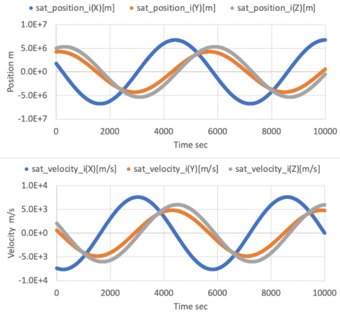
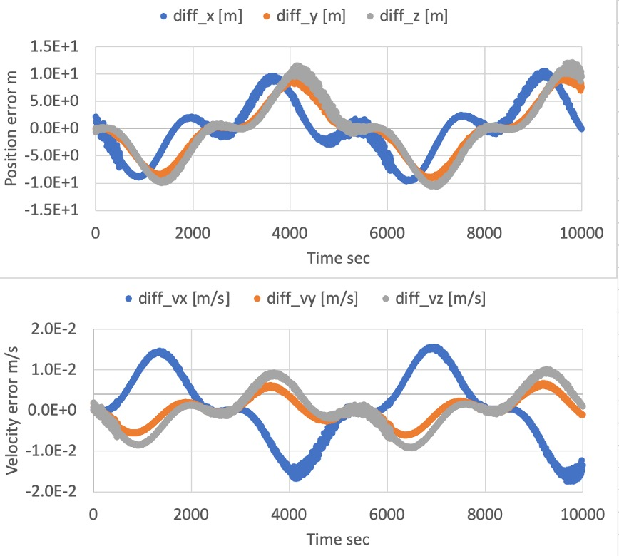
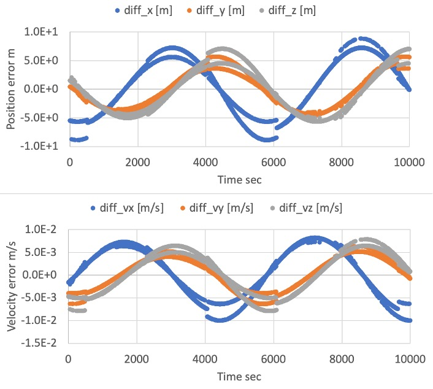

# Specification for Kepler Orbit Propagation

## 1.  Overview

1. Functions
   - The `KeplerOrbit` class calculates the satellite position and velocity with the simple two-body problem. We ignored any disturbances and generated forces by the satellite.
   - This orbit propagation mode provides the simplest and fastest orbit calculation for any orbit(LEO, GEO, Deep Space, and so on.).

2. Files
   - src/Dynamics/Orbit/KeplerOrbitPropagation.cpp, hpp
   - src/Library/Orbit/KeplerOrbit.cpp, hpp
   - src/Library/Orbit/OrbitalElements.cpp, hpp
   - src/Interface/InitInput/Init_Orbit.cpp

3. How to use
   - Select `propagate_mode = KEPLER` in the spacecraft's ini file.
   - Choose a way to define the orbit.
     - Defined by initial position and velocity.
       - Select `init_mode_kepler = INIT_POSVEL`
       - Set the value `init_position` and `init_velocity` in the ini file.
         - The units are `m`(meter) and `m/s`.
         - The frame is inertial frame, and the center is defined in the `PlanetSelect`.
         - The details of the calculation is described in `OrbitalElements::CalcOeFromPosVel`
     - Defined by the orbital elements.
       - Select `init_mode_kepler = INIT_OE`
       - Set the value of following orbital elements
         - $`a`$ : Semi major axis [m]
         - $`e`$ : Eccentricity
         - $`i`$ : Inclination [rad]
         - $`\Omega`$ : Right Ascension of the Ascending Node (RAAN) [rad]
         - $`\omega`$ : Argument of Perigee [rad]
         - $`t_{epoch}`$ : Epoch [julian day]
   
## 2. Explanation of Algorithm

1. `KeplerOrbit::CalcConstKeplerMotion` function
   1. Overview
      - This function calculates the following constant values.
        - Mean motion
        - Frame conversion matrix from in-plane position to the inertial frame position

   2. Inputs and outputs
      - Input
        - Orbital Elements
        - $`\mu`$ : The standard gravitational parameter of the central body
      - Output
        - $`n`$ : Mean motion
        - $`R_{p2eci}`$ : Frame conversion matrix from in-plane position to the inertial frame position
          - We use the name ECI here, but `Earth center` is not essential. When users choose the center body as other than the earth, the origin of the frame is changed to the body.

   3. Algorithm
      - Mean motion
      ```math
      n = \sqrt{\frac{\mu}{a^3}}
      ```
      - Frame conversion matrix from in-plane position to ECI position
        ```math
        R_{p2eci} = R_z(-\Omega)R_x(-i)R_z(-\omega)
        ```
        ```math
        R_x(\theta) = \begin{pmatrix}
                      1 & 0 & 0 \\
                      0 &  \cos{\theta} & \sin{\theta} \\
                      0 & -\sin{\theta} & \cos{\theta}
                      \end{pmatrix}
        ```
        ```math
        R_z(\theta) = \begin{pmatrix}
                      \cos{\theta} & \sin{\theta} & 0 \\
                      \-\sin{\theta} & \cos{\theta} & 0 \\
                      0 & 0 & 1
                      \end{pmatrix}
        ```

2. `KeplerOrbit::CalcPosVel` function
   1. Overview
      - This function calculates the position and velocity of the spacecraft in the inertial frame at the designated time.

   2. Inputs and outputs
      - Input
        - $`t`$ : Time in Julian day
        - Orbital Elements
        - Constants
      - Output
        - $`\boldsymbol{r}_{eci}`$ : Position in the inertial frame
        - $`\boldsymbol{v}_{eci}`$ : Velocity in the inertial frame

   3. Algorithm
      - Calculate mean anomaly $`l`$[rad]
        ```math
        l = n * (t-t_{epoch})
        ```
      - Calculate eccentric anomaly $`u`$[rad] by solving the Kepler Equation
        - Details are described in `KeplerOrbit::SolveKeplerFirstOrder`
      - Calculate two dimensional position $`x^*, y^*`$ and velocity $`\dot{x}^*, \dot{y}^*`$ in the orbital plane
        ```math
        x^* = a(\cos{u}-e)\\
        y^* = a\sqrt{1-e^2}\sin{u}\\
        \dot{x}^* = -an\frac{\sin{u}}{1^e\cos{u}}\\
        \dot{y}^* = an\sqrt{1-e^2}\frac{\cos{u}}{1^e\cos{u}}\\
        ```
      - Convert to the inertial frame
        ```math
        \boldsymbol{r}_{eci} = R_{p2eci}\begin{bmatrix} x^* \\ y^* \\ 0 \end{bmatrix}\\
        \boldsymbol{v}_{eci} = R_{p2eci}\begin{bmatrix} \dot{x}^* \\ \dot{y}^* \\ 0 \end{bmatrix}\\
        ```

3. `KeplerOrbit::SolveKeplerFirstOrder` function
   1. Overview
      - This function solves the Kepler Equation with the first order iterative method.
      - Note: This method is not suit to the high eccentricity orbit. It is better to use the Newton-Raphson method for such case.

   2. Inputs and outputs
      - Input
        - $`e`$ : eccentricity
        - $`l`$ : mean anomaly [rad]
        - $`\epsilon`$ : threshold for convergence [rad]
        - Limit of iteration
      - Output
        - $`u`$ : eccentric anomaly [rad]

   3. Algorithm
      - Set the initial value of eccentric anomaly as follows
        - $`u_0=l`$
      - Calculate $`u_{n+1}`$ with the following equation
        ```math
        u_{n+1} = l + e\sin{u_n}
        ```
      - Iterate the calculation until the following conditions are satisfied
        - $`|u_{n+1} - u_{n}| < \epsilon`$
        - The iteration number overs the limit of iteration

4. `OrbitalElements::CalcOeFromPosVel` function
   1. Overview
      - This function calculates the orbital elements from the initial position and velocity in the inertial frame.

   2. Inputs and outputs
      - Input
        - $`\mu`$ : The standard gravitational parameter of the central body
        - $`t`$ : Time in Julian day
        - $`\boldsymbol{r}_{i}`$ : Initial position in the inertial frame
        - $`\boldsymbol{v}_{i}`$ : Initial velocity in the inertial frame
      - Output
        - orbital element

   3. Algorithm
      - $`\boldsymbol{h}_{i}`$ : Angular momentum vector of the orbit
        ```math
        \boldsymbol{h}_{i} = \boldsymbol{r}_{i} \times \boldsymbol{v}_{i}
        ```
      - $`a`$ : Semi-major axis
        ```math
        a = \frac{\mu}{2\frac{\mu}{r} - v^2}
        ```
      - $`i`$ : Inclination
        ```math
        i = \cos^{-1}{h_z}
        ```
      - $`\Omega`$ : Right Ascension of the Ascending Node (RAAN)
        - Note: This equation is not support $`i = 0`$ case.
        ```math
        \Omega = \sin^{-1}\left(\frac{h_x}{\sqrt{h_x^2 + h_y^2}}\right)
        ```
      - $`x_{p}, y_{p}`$ : Position in the orbital plane
        ```math
        x_{p} = r_{ix} \cos{\Omega} + r_{iy} \sin{\Omega};\\
        y_{p} = (-r_{ix} \sin{\Omega} + r_{iy} \cos{\Omega})\cos{i} + r_{iz}\sin{i};
        ```
      - $`\dot{x}_{p}, \dot{y}_{p}`$ : Velocity in the orbital plane
        ```math
        \dot{x}_{p} = v_{ix} \cos{\Omega} + v_{iy} \sin{\Omega};\\
        \dot{y}_{p} = (-v_{ix} \sin{\Omega} + v_{iy} \cos{\Omega})\cos{i} + v_{iz}\sin{i};
        ```
      - $`e`$ : Eccentricity
        ```math
        c_1 = \frac{h}{\mu}\dot{y}_p - \frac{x_p}{r}\\
        c_2 = -\frac{h}{\mu}\dot{x}_p - \frac{y_p}{r}\\
        e = \sqrt{c_1^2 + c_2^2}
        ```
      - $`\omega`$ : Argument of Perigee
        ```math
        \omega = \tan^{-1}\left(\frac{c_2}{c_1}\right)
        ```
      - $`t_{epoch}`$ : Epoch [Julian day]
        ```math
        f = \tan^{-1}\left(\frac{y_p}{x_p}\right) - \omega\\
        u = \tan^{-1}\frac{\frac{r \sin{f}}{\sqrt{1-e^2}}}{r\cos{f} + ae}\\
        ```
        ```math
        n = \sqrt{\frac{\mu}{a^3}}\\
        dt = \frac{u - e\sin{u}}{n}\\
        t_{epoch} = t - \frac{dt}{24*60*60}
        ```

## 3. Results of verifications

1. Comparison with RK4
   1. Overview
      - We compared the calculated orbit result between RK4 mode and Kepler mode.
      - In the Kepler mode, we verified the correctness of the both initialize mode (`INIT_OE` and `INIT_POSVEL`).
       
   2. Conditions for the verification
      1. input files
         - SampleSimbase.ini
           - The following values are modified from the default.
             ```
             EndTimeSec = 10000
             LogOutPutIntervalSec = 5
             ```
         - SampleDisturbance.ini
           - All disturbances are disabled.
         - SampleSat.ini
           - The following values are modified from the default.
             - `propagate_mode` is changed for each mode.
             - Orbital elements for Kepler
               ```
               semi_major_axis_m = 6794500.0
               eccentricity = 0.0015
               inclination_rad = 0.9012
               raan_rad = 0.1411
               arg_perigee_rad = 1.7952
               epoch_jday = 2.458940966402607e6
               ```
             - Initial position and velocity (compatible value with the orbital elements)
               ```
               init_position(0) = 1791860.131
               init_position(1) = 4240666.743
               init_position(2) = 4985526.129
               init_velocity(0) = -7349.913889
               init_velocity(1) = 631.6563971
               init_velocity(2) = 2095.780148
               ```

   3. Results
      - The orbit calculation result of Kepler mode with `INIT_OE`.
        - The result looks correct.
        <div align="center">
        
        </div>

      - The difference between Kepler orbit calculation with `INIT_OE` and RK4 orbit propagation.
        - The error between them is small (less than 10m), and we confirmed that the calculation of Kepler orbit is correct.
        <div align="center">
        
        </div>

      - The difference between Kepler orbit calculation with `INIT_OE` and `INIT_POSVEL`
        - The error between them is small (less than 10m), and we confirmed that the initializing method is correct.
        <div align="center">
        
        </div>

## 4. References
- Hiroshi Kinoshita, "Celestial mechanisms and orbital dynamics", 1998 (written in Japanese)
