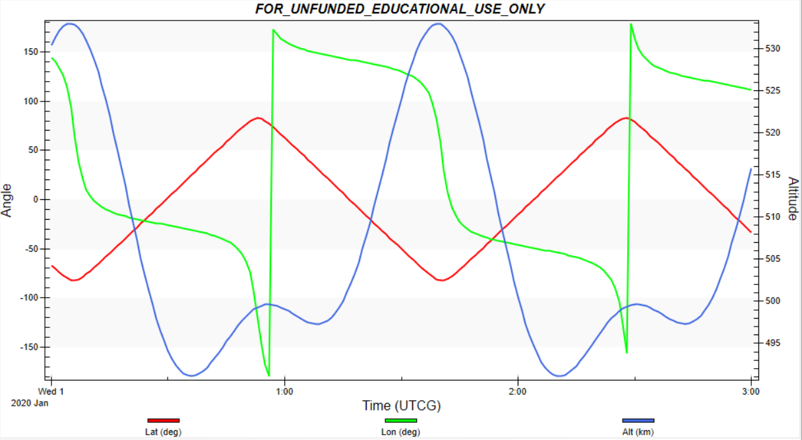
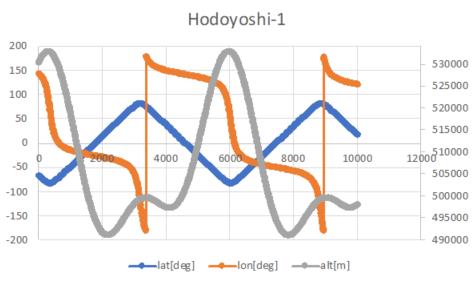
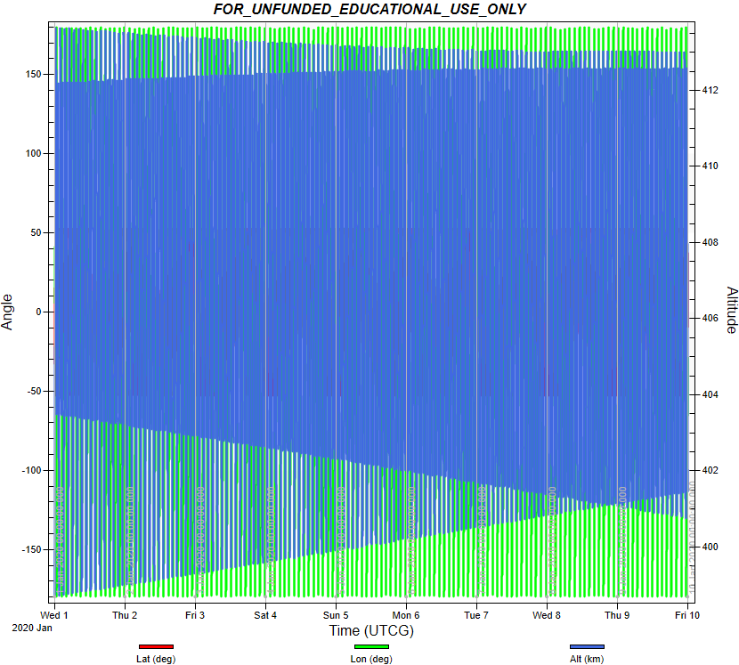
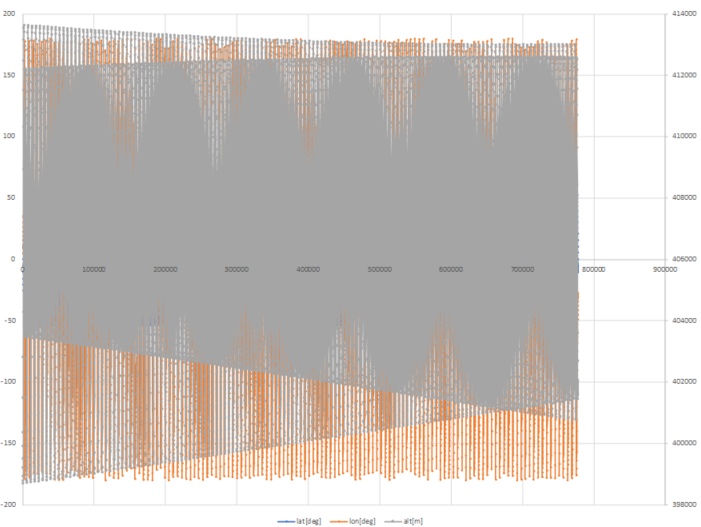
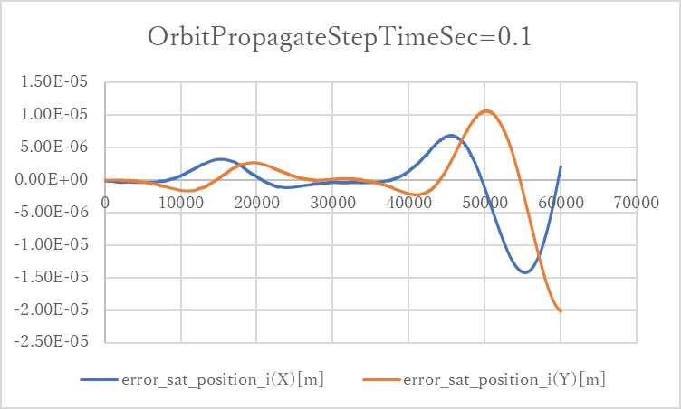
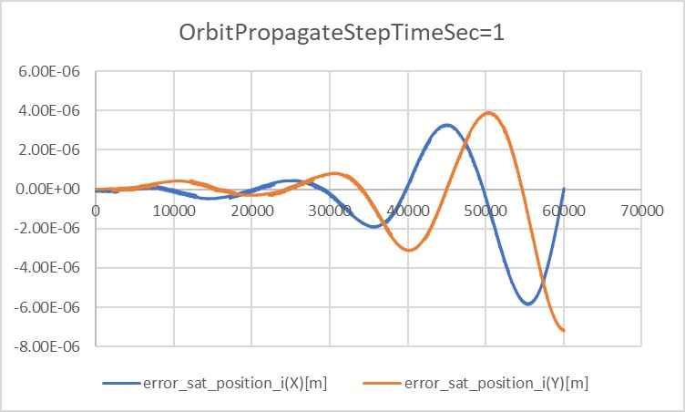
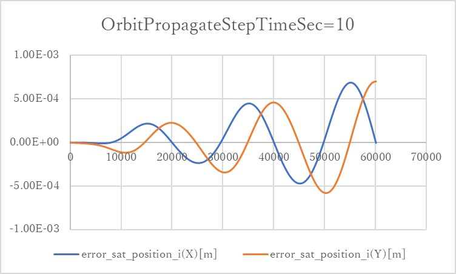
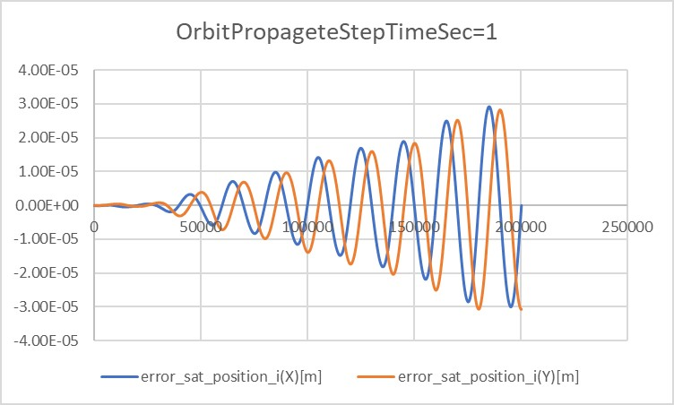
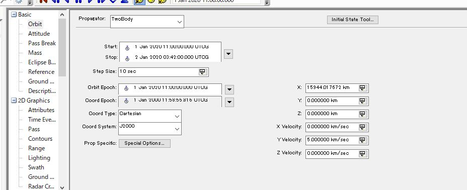
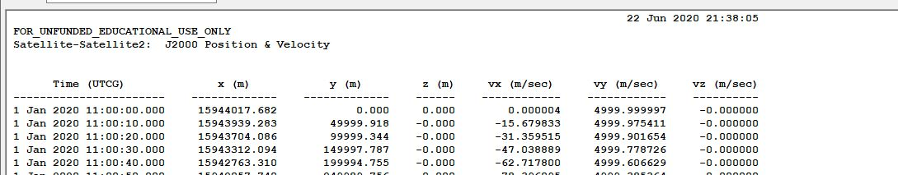

# Specification for Orbit

## 1.  Overview

1. functions
   
   - The Orbit class calculates the position and velocity of satellites with SGP4 or  Forth Order Runge-Kutta method)(RK4)

2. files
- `src/Dynamics/Orbit/EarthCenteredOrbit.cpp`
- `src/Dynamics/Orbit/EarthCenteredOrbit.h`
	- Methods of  Orbit class which uses SGP4 for orbit propagation.
- `src/Dynamics/Orbit/SimpleCircularOrbit.cpp`
- `src/Dynamics/Orbit/SimpleCircularOrbit.h`
	- Methods of  Orbit class which uses RK4 for orbit propagation.
- `src/Dynamics/Orbit/Orbit.h`
	-  Definition of Orbit Class
- `src/Interface/nitInput/Init_Orbit.cpp`
	- Make an instance of orbit class.	

- `src/Library/sgp4/sgp4unit.h`
- `src/Library/sgp4/sgp4io.h`
- `srcLibrary/sgp4/sgp4ext.h`
	- Library of SGP4

3. How to use
- Make an instance of the orbit class in `Initialize` function in `Dynamics.cpp`
- In the orbit.ini file,  Select propagation mode (SGP4 or RK4)
	- If you chose SGP4, set TLE2 to decide the orbit elements of the satellite	
	- If you chose RK4, set the initial position and velocity of the satellite
		- The definition of the coordinate is decided in `PlanetSelect.ini`
   
## 2. Explanation of Algorithm
In the Orbit class, the member variables are updated according to the selection of orbit propagation methodologies: SGP4 or RK4 as defined in the ini file.  The Propagate function is the one that computes the orbital information and the UpdateAtt function is the one that computes the notation in the body coordinate system based on the current orientation.


### Propagate function
　The Propagate function involves the following steps.
1. The process differs depending on the selection of the propagation function SGP4 or RK4 which is loaded from `orbit.ini`.
2. [SGP4] Find the difference between the "current Julian day" and the original period in TLE in units of [minutes] (elapse_time_min), and put it in the argument of the sgp4 function of the SGP4 calculation execution function. At the same time, the geodetic system definition (whichconst) and the trajectory information structure (satrec) are also required, which are defined at the call of the constructor. The position [m] and velocity [m/s] of the spacecraft are assigned to the member variables sat_position_i_ and sat_velocity_i_ as the output of the sgp4 function. Note that the values in this case are the values from the ECI coordinate system.
3. [RK4] The position and velocity of the satellite are updated by using RK4. As the input of RK4, the 6 state variables are set. Thses state variables are the three-dimensional position [$x, y ,z$] and three-dimensional velocity [$v_x$, $v_y$, $v_z$] at the inertia coordinate. Here, the inertia coordinate is decided by the `PlanetSelect.ini`
As the force which works to the satellite motion is the external accerelation [$a_x,a_y,a_z$] calculated from the disturbance class or thruster class and the gravity force from the center planet which is defined in `PlanetSelect.ini`. As a summary, the orbit is calculated as the following equation.
```math
\dot{x} = v_x\\
\dot{y} = v_y\\
\dot{z} = v_z\\
\dot{v}_x = a_x-\mu\frac{x}{r^3}\\
\dot{v}_y = a_y-\mu\frac{y}{r^3}\\
\dot{v}_z = a_z-\mu\frac{z}{r^3}\\
r = \sqrt{x^2+y^2+z^2}
```

4. The latitude[rad], longitude[rad], and altitude[m] of the spacecraft are calculated by the TransECIToGeo function and are assigned to the member variables lat_rad_, lon_rad_, and alt_m_.


### UpdateAtt function
　The UpdateAtt function simply converts the velocity vector of the spacecraft (in ECI coordinate system) to body coordinate system notation using the argument: "Quaternion_i2b".

### TransECIToGeo function
The TransECIGeo function calculates latitude[rad], longitude[rad], and altitude[m] using the arguments: the current Julian day and the position vector of the spacecraft (in the ECI coordinate system). In the computation process, we use the SGP4 function getwgsconst to read the earth's radius and squareness for the calculation.
The latitude is calculated from the South Pole to the equator from -π/2 to 0[rad] and from the equator to the North Pole from 0 to π/2[rad], and the longitude is from 0 to 2π[rad] east of the Greenwich meridian. Altitude is in meters.

### TransECIToECEF function
The TransECIToECEF function can convert the position and the velocity of the satellite from ECI frame to ECEF frame which consider the rotation of the earth.


## 3. Results of verifications

1. Verification of SGP4

   1. Overview
      
      - Verify whether the propagation of SGP4 is correctly installed or not.
      - By comparing the propagation result of SGP4 in STK simulator and S2E
      
   2. Conditions for the verification
      - Conduct verification using the two different initial TLE cases with different time spans.
      1. Hodoyoshi orbit : (span:10000 second)
         - TLE\
         40299U 14070B   20001.00000000 -.00003285  00000-0 -13738-3 0 00007\
         40299 097.3451 081.6192 0014521 069.5674 178.3972 15.23569636286180
         
         
      2. ISS Release orbt (span:10 days)
         - TLE\
         99999U   20001.00000000  .00000007  00000-0  93906-7 0 00002\
         99999 053.4260 297.1689 0008542 245.4975 274.8981 15.55688139000015
         
      

   3. Results
      1. Hodoyoshi orbit : (span:10000 second)
         1. STK
            <div align="center">
               
              </figure>
            </div>
         2. S2E
            <div align="center">
               
              </figure>
            </div>
         The outputs of the satellite position are almost same between two simulators.

      2. ISS Release orbit : (span:10000 second)
         1. STK
            <div align="center">
               
              </figure>
            </div>
         2. S2E
            <div align="center">
               
              </figure>
            </div>
         The outputs of the satellite position are almost same between two simulators.


2. Verification of the error of Fourth Order Runge-Kutta method (RK4)
   1. Overview
      
      - Verify the error of the numerical integration using Simplified General Perturbations Satellite Orbit Model 4 (SGP4) or Fourth Order Runge-Kutta method (RK4).
      - The output of the simulation was compared with the analytical solution.
      
   2. conditions for the verification

      - The Verifications were conducted in the case of `StepTimeSec` and `OrbitPropagateStepTimeSec` were 0.1(sec), 1(sec), and 10(sec).
      - The initial values of the propagation are as follows:
        ```
        init_position(0) = 1.5944017672e7
        init_position(1) = 0.0
        init_position(2) = 0.0

        init_velocity(0) = 0.0
        init_velocity(1) = 5000.0
        init_velocity(2) = 0.0
        ```
      - This is an circular orbit, which period is about 20040(sec). The center of the orbit is Earth.
      - As a reference, the analytical solution was used. The solution is as follows:
      ```math
      x=R\cos(\omega t),y=R\sin(\omega t)\quad when~R=1.5944017672\times10^7, \omega=0.000313597243985794
      ```
      - All of the effects of disturbance and environment were disabled.
      - The simulation time is 60120(sec), which is approximately three-period. In addition, for a long-term test, the case which simulation time is 200400(about 10 periods) was tested. The `OrbitPropagateStepTimeSec` of this case is 1(sec).
    

   3. results
      <div align="center">
        
        
        
        </figure>
      </div>

      - In the cases of `OrbitPropagateStepTimeSec=0.1` and `OrbitPropagateStepTimeSec=1`, the error is kept within $`10^{-6}`$ order. However, once the error grows, it will get bigger and bigger.
      - In the case of `OrbitPropagateStepTimeSec=10`, the error quickly grows up to $`10^{-4}`$ order. 
      
      <div align="center">
        
        </figure>
      </div>

      - In the result of long-term test, it is clear that the error magnitude grows propotionally to the time.

   4. Others
      
      - At first, the output of STK would be used for a reference. However, it didn't work well. Data were input as follows:
      <div align="center">
        
        </figure>
      </div>
      
      - However, the result is as follows:
      <div align="center">
        
        </figure>
      </div>

      - As this figure shows, the initial values in the result are slightly different from the imput.
         + In the .sa files, the initial values of $`x, y, z, v_x, v_y, v_z`$ are converted into elements of orbit and stored. The error might occur in the process of this conversion.
        

## 4. References
