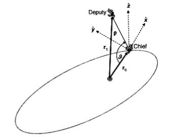
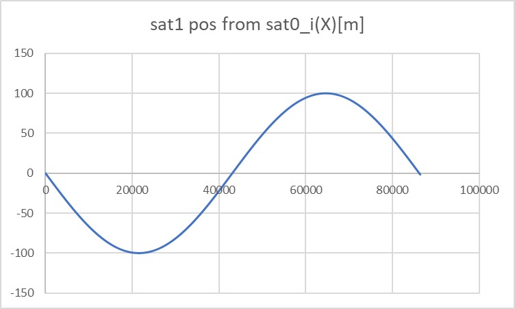
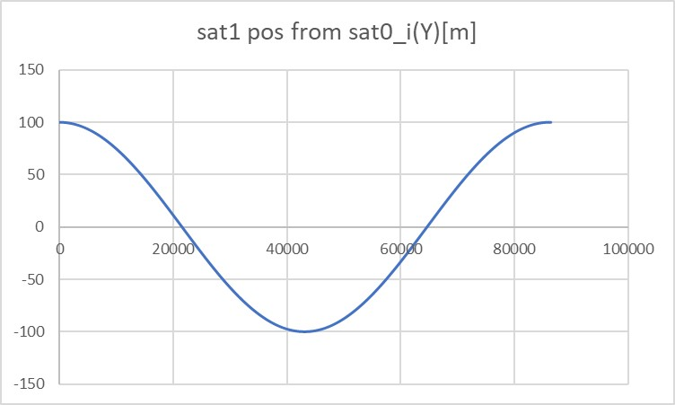

 # Specification for Relative Orbit propagation

## 1. Overview

1. functions

    - The `RelativeOrbit` class calculates the position of a satellite with respect to a reference satellite. This class calculates the position both in the LVLH frame and inertial frame. Users can choose the update method between:
      + relative dynamics propagation using RK4
      + update using STM(State Transition Matrix)

2. Related files
   - `src/dynamics/orbit/orbit.hpp, cpp`
     - Definition of `Orbit` base class
   - `src/dynamics/orbit/initialize_orbit.hpp, .cpp`
     - Make an instance of orbit class.	   
   - `src/dynamics/orbit/relative_orbit.hpp, .cpp`
     + Definition of the class
   - Libraries
     - `src/library/orbit/relative_orbit_models.hpp, .cpp`
       + Library to store equations for various relative dynamics


3. How to use
   
   - Relative orbit propagation is available only when multiple satellites are simulated.
        + The sample case in S2E_CORE simulates a single satellite. For an example of simulating multiple satellites, please refer to the [tutorial](../../Tutorials/HowToSimulateMultipleSatellites.md). 
   - Confirm the instance of `RelativeInformation` is the member of each satellite.
   - Set up the configuration of the `[ORBIT]` section in the `sample_spacecraft.ini`.
        + Set `propagate_mode = RELATIVE` to use the relative orbit propagation
        + Choose `relative_orbit_update_method`.
            * `relative_orbit_update_method = 0` means the orbit is updated with the propagation of the relative dynamics equation( $\dot{\boldsymbol{x}}=\boldsymbol{Ax}+\boldsymbol{Bu}$ , i.e., Hill equation).
            * `relative_orbit_update_method = 1` means the orbit is updated with the STM( $\boldsymbol{x}(t)=\boldsymbol{\Phi}(t,t_0)\boldsymbol{x}(t_0)$ , i.e., Clohessy-Wiltshire solution).
        + When you choose `relative_orbit_update_method = 0`, set `relative_dynamics_model_type`.
        + When you choose `relative_orbit_update_method = 1`, set `stm_model_type`.
        + Set the initial relative position of the satellite in the LVLH frame. LVLH frame definition is:
            * $\boldsymbol{x}$ is a direction vector from the reference satellite ("chief" in the figure) radially outward.
            * The direction of $\boldsymbol{z}$ corresponds to the angular momentum vector of the reference satellite orbit.
            * The direction of $\boldsymbol{y}$ is determined by $\boldsymbol{z}\times\boldsymbol{x}$.
        <figure>
        <div align="center">
        
        <figcaption>Definition of LVLH frame [1]</figcaption>
        </div>
        </figure>

        + Set the ID and ini file name of the reference satellite.
            * NOTE: Confirm the `propagate_mode` of the reference satellite is not 2. The orbit of the reference satellite must be propagated by the methods other than the relative orbit propagation.

4. How to add a new relative dynamics model

    1. New Relative Dynamics equation

        + Add the name of the dynamics model to the `RelativeOrbitModel` enum in `relative_orbit_models.hpp`.
        + Add the function to calculate the system matrix like `CalcHillSystemMatrix` in `relative_orbit_models.hpp`.
        + Edit the `CalculateSystemMatrix` function in `relative_orbit.hpp`.

    2. New STM

        + Add the name of the dynamics model to `StmModel` enum in `relative_orbit_models.hpp`.
        + Add the function to calculate the system matrix as `CalcHcwStm`in `relative_orbit_models.hpp`.
        + Edit the `CalculateStm` function in `relative_orbit.hpp`.

## 2. Explanation of Algorithm

1. `InitializeState`

   1. overview
        + The `InitializeState` function initializes the orbit of the satellite.

   2. inputs and outputs
        + input
            *  `relative_position_lvlh_m`, `relative_velocity_lvlh_m_s`
                - The initial state of the satellite
            * `gravity_constant_m3_s2`
                - The gravity constant of the reference celestial body $\mu$
            * `initial_time_s`
                - Initial simulation time (default value is 0)
        + output
            * none 

   3. algorithm

   4. note

1. `CalculateSystemMatrix`

   1. overview
        + The `CalculateSystemMatrix` function is used only inside the `RelativeOrbit` class. This function calls the system matrix calculation function according to `relative_dynamics_model_type`.

   2. inputs and outputs
        + input
            * `relative_dynamics_model_type`
                - The type of relative dynamics model
            * `reference_sat_orbit`
                - The orbit of the reference satellite
            * `gravity_constant_m3_s2` 
                - The gravity constant $\mu$
        + output
            * none 

   3. algorithm

   4. note

1. `CalculateStm`

   1. overview
        + The `CalculateStm` function is used only inside the `RelativeOrbit` class. This function calls the system matrix calculation function according to `stm_model_type`.

   2. inputs and outputs
        + input
            * `stm_model_type`
                - The type of relative dynamics model
            * `reference_sat_orbit`
                - The orbit of the reference satellite
            * `gravity_constant_m3_s2` 
                - The gravity constant $\mu$
            * `elapsed_sec`
                - Elapsed simulation time
        + output
            * none 

   3. algorithm

   4. note

1. `CalculateHillSystemMatrix`

   1. overview
        + The `CalculateHillSystemMatrix` function calculates the system matrix of the Hill equation. 
        + This function is declared in `relative_orbit_models.hpp` and is used by the

   2. inputs and outputs
        + input
            * `orbit_radius`
                - Radius of the reference satellite orbit $R$
            * `gravity_constant_m3_s2` 
                - The gravity constant $\mu$
        + output
            * `system_matrix`
                - system matrix

   3. algorithm
        + The mean motion of the reference orbit ($n$) is calculated as follows:

        ```math
        n=\sqrt{\frac{\mu}{R^3}}
        ```

        + Then, the system matrix ($\boldsymbol{A}$) is calculated as follows:

        ```math
        \boldsymbol{A}=
        \begin{pmatrix}
        0 & 0 & 0 & 1 & 0 & 0 \\
        0 & 0 & 0 & 0 & 1 & 0 \\
        0 & 0 & 0 & 0 & 0 & 1 \\
        3n^2 & 0 & 0 & 0 & 2n & 0 \\
        0 & 0 & 0 & -2n & 0 & 0 \\
        0 & 0 & -n^2 & 0 & 0 & 0 \\
        \end{pmatrix}
        ```

   4. note

1. `CalculateHcwStm`

   1. overview
        + The `CalculateHcwStm` function calculates the Hill-Clohessy-Wiltshire STM. 
        + This function is declared in `relative_orbit_models.hpp` and is used by the

   2. inputs and outputs
        + input
            * `orbit_radius`
                - Radius of the reference satellite orbit $R$
            * `gravity_constant_m3_s2` 
                - The gravity constant $\mu$
            * `elapsed_sec`
                - Elapsed simulation time
        + output
            * `system_matrix`
                - system matrix

   3. algorithm
        + The mean motion of the reference orbit ($n$) is calculated as follows:

        ```math
        n=\sqrt{\frac{\mu}{R^3}}
        ```

        + Then, the system matrix ($\boldsymbol{A}$) is calculated as follows:

        ```math
        \boldsymbol{\Phi}(t,t0)=
        \begin{pmatrix}
        4-3\cos(nt) & 0 & 0 & \frac{\sin(nt)}{n} & \frac{2}{n}-\frac{2\cos(nt)}{n} & 0 \\
        -6nt+6\sin(nt) & 1 & 0 & -\frac{2}{n}+\frac{2\cos(nt)}{n} & \frac{4\sin(nt)}{n}-3t & 0 \\
        0 & 0 & \cos(nt) & 0 & 0 & \frac{\sin(nt)}{n} \\
        3n\sin(nt) & 0 & 0 & cos(nt) & 2\sin(nt) & 0 \\
        -6n+6n\cos(nt) & 0 & 0 & -2\sin(nt) & -3+4\cos(nt) & 0 \\
        0 & 0 & -n\sin(nt) & 0 & 0 & \cos(nt) \\
        \end{pmatrix}
        ```

   4. note

## 3. Results of verifications

1. Relative Orbit Propagation
   1. overview
      
      - Make sure the relative orbit is correctly propagated using a simple orbit
       
   2. conditions for the verification
      1. input files
            - Initialization files for the two satellites were prepared.
                - `satellite0.ini`
                - `satellite1.ini`
      2. initial values
            - The orbit of the reference satellite (satellite0) is GEO. The initial position of the satellite (satellite1) is $(0\mathrm{m}, 100\mathrm{m}, 0\mathrm{m})^\mathrm{T}$ in LVLH frame. The orbit was propagated for 86400 sec (the period of GEO).  
            - `satellite0.ini`

            ```
            propagate_mode = RK4
            
            //Information used for orbital propagation by the Runge-Kutta method///////////
            //initial satellite position[m] 
            //＊The coordinate system is defined in PlanetSelect.ini
            initial_position_i_m(0) = 4.2164140100E+07  //radius of GEO
            initial_position_i_m(1) = 0
            initial_position_i_m(2) = 0
            //initial satellite velocity[m/s]
            //＊The coordinate system is defined in PlanetSelect.ini
            initial_velocity_i_m_s(0) = 0
            initial_velocity_i_m_s(1) = 3.074661E+03  //Speed of a spacecraft in GEO
            initial_velocity_i_m_s(2) = 0
            ///////////////////////////////////////////////////////////////////////////////
            ```

            - `satellite1.ini`

            ```
            propagate_mode = RELATIVE

            //Information used for relative orbit propagation//////////////////////////////
            //Relative Orbit Update Method (0 means RK4, 1 means STM)
            relative_orbit_update_method = 0
            // RK4 Relative Dynamics model type (only valid for RK4 update)
            // 0: Hill
            relative_dynamics_model_type = 0
            // STM Relative Dynamics model type (only valid for STM update)
            // 0: HCW
            stm_model_type = 0
            // Initial satellite position relative to the reference satellite in LVLH frame[m]
            // * The coordinate system is defined at [PLANET_SELECTION] in SampleSimBase.ini
            initial_relative_position_lvlh_m(0) = 0.0
            initial_relative_position_lvlh_m(1) = 100.0
            initial_relative_position_lvlh_m(2) = 0.0
            // initial satellite velocity relative to the reference satellite in LVLH frame[m/s]
            initial_relative_velocity_lvlh_m_s(0) = 0.0
            initial_relative_velocity_lvlh_m_s(1) = 0.0
            initial_relative_velocity_lvlh_m_s(2) = 0.0
            // information of reference satellite
            reference_satellite_id = 0
            ///////////////////////////////////////////////////////////////////////////////
            ```

   3. results

      - The position of satellite1 seen from satellite0 in the inertia frame was calculated.

        <div align="center">
        
        </div>
         <div align="center">
        
        </div>

      - They correctly move periodically.
      - In this example of verification, the RK4 method is used to propagate relative orbits, but the results were the same when using STM.
      
        

## 4. References

1. Kapila, V., Sparks, A. G., Buffington, J. M., & Yan, Q. (2000). Spacecraft formation flying: Dynamics and control. Journal of Guidance, Control, and Dynamics, 23(3), 561-564.
