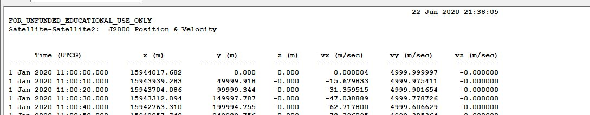

# Specification for Orbit dynamics with RK4 propagation

## 1.  Overview

1. functions
   - The `Rk4OrbitPropagation` class calculates the position and velocity of satellites with 4th Order Runge-Kutta method(RK4).

2. files
   - `src/dynamics/orbit/orbit.hpp, cpp`
	   - Definition of `Orbit` base class
   - `src/dynamics/orbit/initialize_orbit.hpp, .cpp`
	   - Make an instance of orbit class.	
   - `src/dynamics/orbit/rk4_orbit_propagation.hpp, .cpp`

3. How to use
   - Select `propagate_mode = RK4` in the spacecraft's ini file.
   - Select `initialize_mode` as you want.
     - `DEFAULT`             : Use default initialize method (`RK4` and `ENCKE` use position and velocity, `KEPLER` uses init_mode_kepler)
     - `POSITION_VELOCITY_I` : Initialize with position and velocity in the inertial frame
     - `ORBITAL_ELEMENTS`    : Initialize with orbital elements
   
## 2. Explanation of Algorithm

1. `Propagate` function  
   - The position and velocity of the satellite are updated by using RK4. As the input of RK4, the six-state variables are set. These state variables are the three-dimensional position [$x$, $y$ ,$z$] and three-dimensional velocity [$v_x$, $v_y$, $v_z$] at the inertial coordinate. Here, the inertial coordinate is decided by the `PlanetSelect.ini`
   - As the force which works to the satellite motion is the external acceleration [$a_x$,$a_y$,$a_z$] calculated from the disturbance class or thruster class and the gravity force from the center planet, which is defined in `PlanetSelect.ini`. As a summary, the orbit is calculated as the following equation.
   ```math
   \begin{align}
     \dot{x} &= v_x\\
     \dot{y} &= v_y\\
     \dot{z} &= v_z\\
     \dot{v}_x &= a_x-\mu\frac{x}{r^3}\\
     \dot{v}_y &= a_y-\mu\frac{y}{r^3}\\
     \dot{v}_z &= a_z-\mu\frac{z}{r^3}\\
     r &= \sqrt{x^2+y^2+z^2}
   \end{align}
   ```

## 3. Results of verifications

1. Verification of the error of Fourth Order Runge-Kutta method (RK4)
   1. Overview
      - Verify the numerical integration error of the RK4 method.
      - The output of the simulation was compared with the analytical solution.
      
   2. conditions for the verification
      - The Verifications were conducted in the case of `simulation_step_s` and `orbit_update_period_s` were 0.1(sec), 1(sec), and 10(sec).
      - The initial values of the propagation are as follows:
        ```
        initial_position_i_m(0) = 1.5944017672e7
        initial_position_i_m(1) = 0.0
        initial_position_i_m(2) = 0.0

        initial_velocity_i_m_s(0) = 0.0
        initial_velocity_i_m_s(1) = 5000.0
        initial_velocity_i_m_s(2) = 0.0
        ```
      - This is a circular orbit, which period is about 20040(sec). The center of the orbit is Earth.
      - As a reference, the analytical solution was used. The solution is as follows:
      ```math
      x=R\cos(\omega t),y=R\sin(\omega t)\quad when~R=1.5944017672\times10^7, \omega=0.000313597243985794
      ```
      - All of the effects of disturbance and environment were disabled.
      - The simulation time is 60120(sec), which is approximately three-period. In addition, for a long-term test, the case in which simulation time is 200400(about 10 periods) was tested. The `orbit_update_period_s` of this case is 1(sec).
    
   3. results
      <div align="center">
        
        
        
        </figure>
      </div>

      - In the cases of `orbit_update_period_s=0.1` and `orbit_update_period_s=1`, the error is kept within $10^{-6}$ order. However, once the error grows, it will get bigger and bigger.
      - In the case of `orbit_update_period_s=10`, the error quickly grows up to $10^{-4}$ order. 
      
      <div align="center">
        
        </figure>
      </div>

      - In the long-term test result, it is clear that the error magnitude grows proportionally to the time.

   4. Others
      - At first, the output of STK would be used for reference. However, it did not work well. Data were input as follows:
      <div align="center">
        
        </figure>
      </div>
      
      - However, the result is as follows:
      <div align="center">
        
        </figure>
      </div>

      - As this figure shows, the initial values in the result are slightly different from the input.
         + In the .sa files, the initial values of $x, y, z, v_x, v_y, v_z$ are converted into elements of orbit and stored. The error might occur in the process of this conversion.
        

## 4. References
NA

