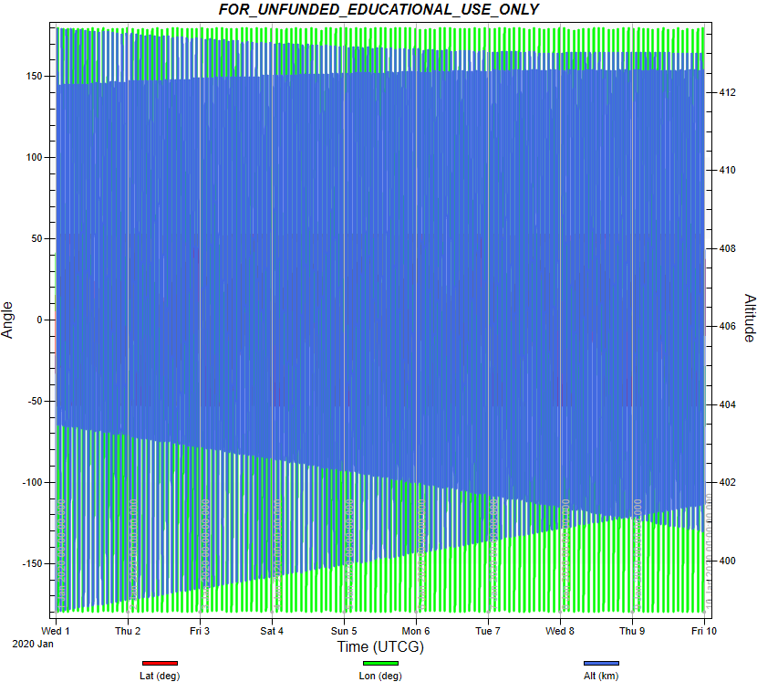

# Specification for SGP4 Orbit Propagation

## 1.  Overview

### 1. functions
- The `Sgp4OrbitPropagation` class calculates the position and velocity of satellites by using SGP4 method with TLE.

### 2. files
- `src/dynamics/orbit/orbit.hpp, cpp`
  - Definition of `Orbit` base class
- `src/dynamics/orbit/initialize_orbit.hpp, .cpp`
  - Make an instance of orbit class.		
- `src/dynamics/orbit/sgp4_orbit_propagation.hpp, .cpp`
  - Library of SGP4
  - `/src/library/external/sgp4`

### 3. How to use
- Select `propagate_mode = SGP4` in the spacecraft's ini file.
- Set the TLE you need like the following example
  ```
  tle1=1 25544U 98067A   20076.51604214  .00016717  00000-0  10270-3 0  9005
  tle2=2 25544  51.6412  86.9962 0006063  30.9353 329.2153 15.49228202 17647
  ```

## 2. Explanation of Algorithm

### 1. Propagate function  
  - The difference between the `current Julian day` and the original period in TLE in units of [minutes] (elapse_time_min) is calculated, and it is used  in the argument of the sgp4 function of the SGP4 calculation execution function. At the same time, the geodetic system definition (`whichconst`) and the trajectory information structure (`satrec`) are also required, which are defined at the call of the constructor. The position [m] and velocity [m/s] of the spacecraft are assigned to the member variables sat_position_i_ and sat_velocity_i_ as the output of the sgp4 function. Note that the values, in this case are the values from the ECI coordinate system.

## 3. Results of verifications

### 1. Verification of SGP4

#### 1. Overview
- Verify whether the propagation of SGP4 is correctly installed or not.
- By comparing the propagation result of SGP4 in STK simulator and S2E

#### 2. Conditions for the verification
- Conduct verification using the two different initial TLE cases with different time spans.
1. Hodoyoshi orbit : (span:10000 second)
    - TLE
    ```
    40299U 14070B   20001.00000000 -.00003285  00000-0 -13738-3 0 00007
    40299 097.3451 081.6192 0014521 069.5674 178.3972 15.23569636286180
    ```

2. ISS Release orbit (span:10 days)
    - TLE
    ```
    99999U   20001.00000000  .00000007  00000-0  93906-7 0 00002
    99999 053.4260 297.1689 0008542 245.4975 274.8981 15.55688139000015
    ```

#### 3. Results
1. Hodoyoshi orbit : (span:10000 second)
    - Left: STK,  Right: S2E
      <div align="center">
          
          
        </figure>
      </div>
      The outputs of the satellite position are almost the same between the two simulators.

2. ISS Release orbit : (span:10000 second)
    - Left: STK,  Right: S2E 
      <div align="center">
          
          
        </figure>
      </div>
      The outputs of the satellite position are almost the same between the two simulators.

## 4. References
NA

