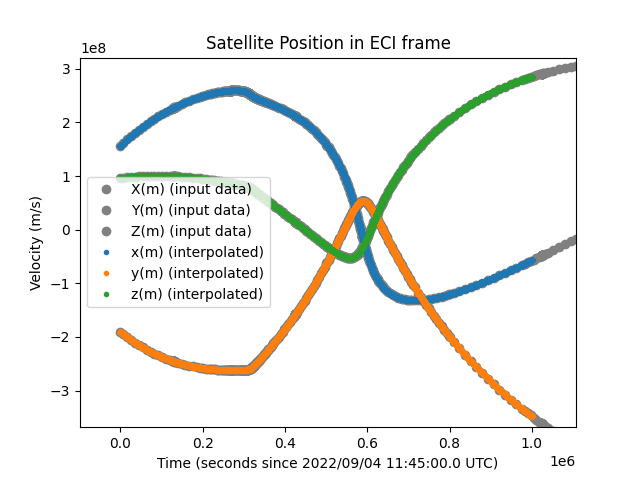
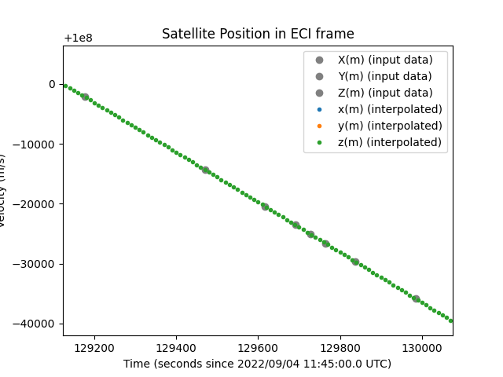
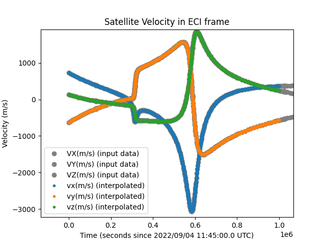
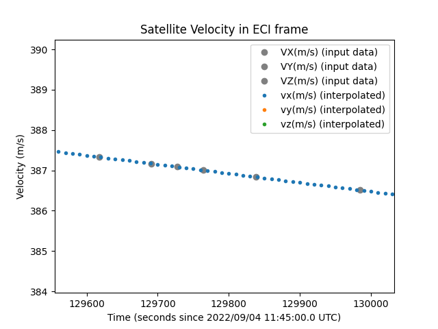

# Specification for Orbit Propagation with Time Series File

## 1.  Overview

### 1. functions
- The `TimeSeriesFileOrbitPropagation` class calculates the position and velocity of satellites with time series file.

### 2. files
- `src/dynamics/orbit/orbit.hpp, cpp`
  - Definition of `Orbit` base class
- `src/dynamics/orbit/initialize_orbit.hpp, .cpp`
  - Make an instance of orbit class.	
- `src/dynamics/orbit/time_series_file_orbit_propagation.hpp, .cpp`
- `/settings/sample_satellite/orbit_files/time_series_orbit.csv`
  - Time series file for orbit propagation

### 3. How to use
- Prepare a time series file for orbit propagation in CSV file format. The order of the headers is Ephemeris time, position in the ECI frame, and velocity, as shown in the following format. Headers are required, but the names are optional. The units are [m].
  ```
  ephemeris_time[s],position_i_x[m],position_i_y[m],position_i_z[m],velocity_i_x[m/s],velocity_i_y[m/s],velocity_i_z[m/s]
  715564027.4963,156763245.9386,-190393643.02541184,95564270.4990822,731.5280577804,-634.4221281717596,132.98336504802236
  715571341.8627,162023931.9353,-194926426.171367,96482978.8459601,707.0923875188,-605.2501479322574,118.38289214154844
  ...
  ```
- Select `propagate_mode = TIME_SERIES_FILE` in the spacecraft's ini file.
- Set `time_series_file_path` as the path of the time series file.
- Set `number_of_interpolation` as the number of interpolation points.
- Select `Interpolation method` as you want.
  - `POLYNOMIAL` : Polynomial interpolation.
  - `TRIGONOMETRIC`  : Trigonometric interpolation. This method is not recommended for aperiodic orbits.
- Set `orbital_period_correction_s` as the correction value of the orbital period. This is only used for trigonometric method.
   
## 2. Explanation of Algorithm

### 1. Initialization
   - Receives the file path and settings for interpolation (number of interpolation points, method).
   - Reads the time series data file using the `IniAccess` class (`ReadCsvDoubleWithHeader`).
   - Searches for the nearest ephemeris time (the time corresponding to the satellite data) based on the current Julian date (JD) using `SearchNearestEphemerisTimeId`.
   - Determines the data to be used for interpolation and calculates the initial position and velocity.

### 4. `Propagate` function
  - Based on the specified end time and current Julian date, calculates the difference from the current ephemeris time.
  - Uses this time difference to check whether interpolation information needs to be updated by calling `UpdateInterpolationInformation`. This function retrieves the spacecraft's position and velocity from the time series data based on the current reference interpolation index and updates the internal state with new data.
  - After updating, it interpolates the current satellite position and velocity using either polynomial or trigonometric methods based on the specified interpolation method.

## 3. Results of verifications

### 1. Verification of the orbit propagation with a time series file
#### 1. Overview
- We calculated the orbit using a sample time series file (`/settings/sample_satellite/orbit_files/time_series_orbit.csv`).
- The output of the simulation was compared with the sample time series data.

#### 2. conditions for the verification
- We set the following values in `settings/sample_simulation_base.ini`.
  ```
  simulation_start_time_utc = 2022/09/04 11:45:00.0
  simulation_duration_s = 1000000
  simulation_step_s = 10
  ```
- `number_of_interpolation` was set to 5.
- The interpolation method was set to the polynominal method.

#### 3. results
The enlarged views confirm that the interpolation is properly performed in both the position and velocity diagrams.
<div align="center">
  
  
  
  
  </figure>
</div>

## 4. References
NA

