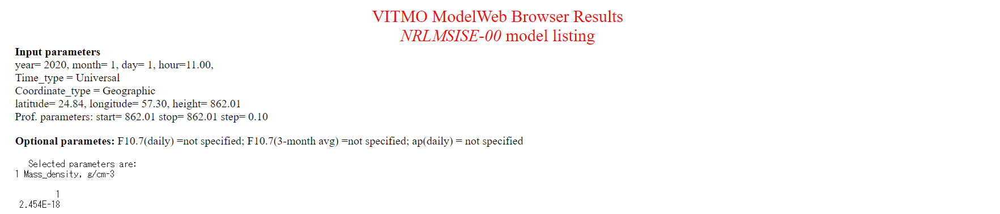
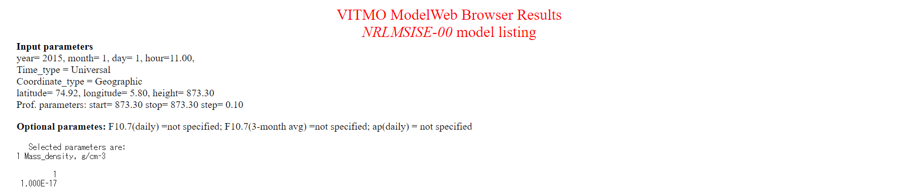

# Specification for Atmosphere model

## 1.  Overview
1. Functions 
  + The `Atmosphere` class calculates an air density at the satellite's position.

2. Related files
  + `src/environment/local/atmosphere.cpp, .hpp`
    + `Atmosphere` class is defined.
  + `src/environment/local/local_environment.cpp, .hpp`
    + `Atmosphere` class is used here as a member variable of `LocalEnvironment` class.
  + `src/library/external/nrlmsise00/wrapper_nrlmsise00.cpp, .hpp`
    + An air density is calculated using an external library, NRLMSISE00 atmosphere model.

3. How to use
  + Select a model and set a standard deviation as `air_density_standard_deviation` for random noise in the `local_environment.ini` file
    + Model
      + `STANDARD`
        + The air density is calculated using scale height.
      + `HARRIS_PRIESTER`
        + The air density is calculated using the Harris-Priester model.
      + `NRLMSISE00`
        + The air density is calculated using the NRLMSISE00 model.
        + If users use this model, the following additional parameters must be set in the `.ini` file.
          + `nrlmsise00_table_file`: The space weather table path
          + `is_manual_parameter_used`: The manual setting parameter defined as follows are used or not
            + manual_daily_f107: User defined f10.7 (1 day)
            + manual_average_f107: User defined f10.7 (30 days average)
            + manual_ap: User defined ap
  + The public functions
    + `CalcAirDensity_kg_m3`: Update the air density (kg/m3) based on the selected model
    + `GetAirDensity_kg_m3`: Return the calculated air density (kg/m3)

## 2. Installation of NRLMSISE00
+ Please check [How to download and compile NRLMSISE00 Library](./General/HowToDownloadNRLMSISE00library.md)


## 3. Explanation of Algorithm
+ STANDARD
  1. Air density calculation
     + Inputs
       + Altitude
     + Outputs
       + Air density
    
     + Algorithm  
       The STANDARD model assumes the air density as follows.
  
       ```math
       \rho \left(h \right) = \rho_0 \exp \left(-\frac{h - h_0}{H} \right)
       ```
       where $h_0$ is a reference height, $\rho_0$ is an air density at the reference height, and $H$ is a scale height. These parameters are referred from the table shown in References [2].

+ NRLMSISE00
  1. Read Space weather table
     + `F10.7` and `Kp/Ap` index, which indicates the solar activity cycle, are necessary as inputs for NRLMSISE00.  
     These parameters, which are only during the simulation period, are read from SpaceWeather.txt.
     + Note
       + If SpaceWeather.txt cannot be read, the atmosphere model is automatically set to STANDARD.
       + SpaceWeather.txt includes data between 2015 and 2044. If the simulation date is out of range, the air density cannot be calculated accurately.

  2. Air density calculation
     + Inputs
       + Decimal year
       + Latitude
       + Longitude
       + Altitude
     + Outputs
       + Air density
     + Algorithm
       + Please refer the following reference.
         + Picone, J. M.; Hedin, A. E.; Drob, D. P.; Aikin, A. C. (2002-12-01). “NRLMSISE-00 empirical model of the atmosphere: Statistical comparisons and scientific issues”. Journal of Geophysical Research: Space Physics 107 (A12)


## 4. Verification
+ NRLMSISE00
  1. Overview
     + The calculated air density was compared with [outputs from web-based NRLMSISE00 model](https://ccmc.gsfc.nasa.gov/modelweb/models/nrlmsise00.php).
  
  2. Conditions for the verification
     1. input file 
        + Default initialize files
   
     2. initial values
        + Case1 : Default initialize files
        ```
        simulation_start_time_utc = 2020/01/01 11:00:00.0
        simulation_duration_s = 200
        simulation_step_s = 0.1
        orbit_update_period_s = 0.1
        log_output_period_s = 0.1
        simulation_speed_setting = 0
        ```
        + Case2 : Start year only was changed to 2015.
        ```
        simulation_start_time_utc = 2015/01/01 11:00:00.0
        simulation_duration_s = 200
        simulation_step_s = 0.1
        orbit_update_period_s = 0.1
        log_output_period_s = 0.1
        simulation_speed_setting = 0
        ```
        + Especially, we chose following TLE for orbit calculation
        ```
        tle1=1 38666U 12003B   12237.00000000 +.00000100  00000-0  67980-4 0 00008
        tle2=2 38666 098.6030 315.4100 0000010 300.0000 180.0000 14.09465034  0011
        ```
  
  3. Results
     + The calculated air density at t = 0.5 [s] was compared with the result of web-based model.
     + S2E
       + Case1 : 2.27E-15 kg / m3
       + Case2 : 1.01E-14 kg / m3
     + Web-based NRLMSISE00
       + Case1 : 2.454E-15 kg / m3  
       
      
       + Case2 : 1.000E-14 kg / m3  
       


## 5. References
1. Picone, J. M.; Hedin, A. E.; Drob, D. P.; Aikin, A. C. (2002-12-01). “NRLMSISE-00 empirical model of the atmosphere: Statistical comparisons and scientific issues”. Journal of Geophysical Research: Space Physics 107 (A12)
2. 半揚稔雄，ミッション解析と軌道設計の基礎，現代数学社, p.324 (in japanese)
3. NRLMSISE-00 Atmosphere Model
, https://ccmc.gsfc.nasa.gov/modelweb/models/nrlmsise00.php
