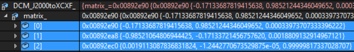
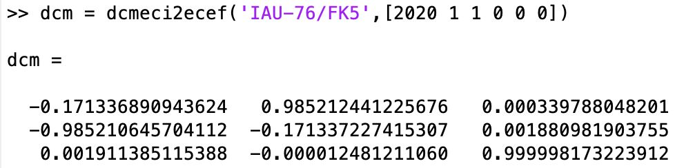

# Specification of Celestial Rotation


## 1.  Overview

1. Functions
   
   - The `CelestialRotation` class calculates the rotational motion of central objects. Currently, only the Earth is supported as the central object.

2. Related files
   
   - `src/Environment/CelestialRotation.cpp`
   - `src/Environment/CelestialRotation.h`
3. How to use
   
   - Make an instance of the `CelestialRotation` class in `CelestialInformation` class
   - Select rotation mode in `SampleSimBase.ini`
     - `Simple` : axial rotation only 
     - `Full` : Precession and Nutation are taken into account

## 2. Explanation of Algorithm

  The algorithm is based on [IERS Conventions 2003](https://www.iers.org/SharedDocs/Publikationen/EN/IERS/Publications/tn/TechnNote32/tn32.pdf;jsessionid=22C15057833E870494CC905A5B05180C.live1?__blob=publicationFile&v=1).

1. `Update`

   1. overview
      - This function calculates the coordinate transformation from ECI to ECEF, calling `Rotation` and `Precession` and `Nutation` functions.
      ```math
      \mathrm{DCM_{ECItoECEF}} = \bf{R}\bf{N}\bf{P}
      ```
       - where $`\bf{R}`$, $`\bf{N}`$, $`\bf{P}`$ stand for the DCM of axial rotation, nutation, precession, respectively.

   2. inputs and outputs
    - Input
       - julian date
    - Output
       - the DCM of the coordinate transformation from ECI to ECEF

   3. algorithm

      ```math
      \mathrm{jdTT} = \mathrm{julian\, date} + \mathrm{dtUT1UTC}
      ```
       - where julian date is the input, dtUT1UTC is the time difference between UT1 and UTC
          - dtUT1UTC = 32.184 [s]

      ```math
      \mathrm{tTT} = \frac{\mathrm{jdTT} - \mathrm{JDJ2000}}{\mathrm{JC}}
      ```
       - where tTT is julian century for terrestrial time, JDJ2000 is Julian Date @ J2000, JC is Julian Century
          - JDJ2000 = 2451545.0 [day]
          - JC = 36525 [day/century]

      By using tTT, we get the DCM of precession ($`\bf{P}`$) and nutation ($`\bf{N}`$)  with `Precession` and `Nutation` functions.
       - $`\varepsilon`$，$`\Delta \varepsilon`$，$`\Delta \psi`$ are calculated in `Nutation` function.

      ```math
      \mathrm{E_q} = \Delta \psi \cos{(\varepsilon + \Delta \varepsilon)} \\
      \mathrm{GAST} = \mathrm{GMST} + \mathrm{E_q}
      ```
       - where GAST is Greenwich Apparent Sidereal Time, GMST is Greenwich Mean Sidereal Time

       - GAST is calculated from julian date in `gstime` function in `src/Library/sgp4/sgp4unit.h`.

      By using GMST, We get the DCM of axial rotation ($`\bf{R}`$) with `Rotation` function.
      
      The coordinate transformation from ECI to ECEF is calculated.
      ```math
      \mathrm{DCM_{ECItoECEF}} = \bf{R}\bf{N}\bf{P}
      ```

   4. note

    - If rotation mode is `Simple`, only axial rotation is calculated.

2. `AxialRotation`

   1. overview

    - This function calculates the axial rotation of the central object.

   2. inputs and outputs

    - Input 
       - Greenwich Apparent Sidereal Time (GAST)

    - Output
       - the DCM of axial rotation ($`\bf{R}`$)

   3. algorithm

   ```math
   \bf{R} = 
   \begin{pmatrix}
   1 & 0 & 0 \\
   0 & \cos{\mathrm{GAST}} & \sin{\mathrm{GAST}} \\
   0 & - \sin{\mathrm{GAST}} & \cos{\mathrm{GAST}}
   \end{pmatrix}
   ```
3. `Precession`

   1. overview

    - This function calculates the precession of the central object.

   2. inputs and outputs

    - Input 
       - julian century for terrestrial time (tTT)
    - Output
       - the DCM of precession ($`\bf{P}`$)

   3. algorithm

   - Precession angles are calculated as follows.

   ```math
   \zeta = 2306.2181" \mathrm{tTT} + 0.30188" \mathrm{tTT}^2 + 0.017998" \mathrm{tTT}^3 \\
   \theta = 2004.3109" \mathrm{tTT} - 0.42665" \mathrm{tTT}^2 - 0.041833" \mathrm{tTT}^3 \\
   z = 2306.2181" \mathrm{tTT} + 1.09468" \mathrm{tTT}^2 + 0.018203" \mathrm{tTT}^3 \\
   \bf{P} = 
   \begin{pmatrix}
   \cos{(-z)} & \sin{(-z)} & 0 \\
   - \sin{(-z)} & \cos{(-z)} & 0 \\
   0 & 0 & 1
   \end{pmatrix}
   \begin{pmatrix}
   \cos{\theta} & 0 & - \sin{\theta} \\
   0 & 1 & 0 \\
   \sin{\theta} & 0 & \cos{\theta}
   \end{pmatrix}
   \begin{pmatrix}
   \cos{(-\zeta)} & \sin{(-\zeta)} & 0  \\
   - \sin{(-\zeta)} & \cos{(-\zeta)} & 0 \\
   0 & 0 & 1
   \end{pmatrix}
   ```

4. `Nutation`

   1. overview

    - This function calculates the nutation of the central object.

   2. inputs and outputs

    - Input 
       - julian century for terrestrial time (tTT)
    - Output
       - Return: the DCM of precession ($`\bf{N}`$)
       - $`\varepsilon`$: mean obliquity of the ecliptic
       - $`\Delta \varepsilon`$: nutation in obliquity
       - $`\Delta \psi`$: nutation in longitude

   3. algorithm

   Delauney angles are calculated as follows.

    ```math
    l = 134.96340251^\circ + 1717915923.2178"\mathrm{tTT} + 31.8792"\mathrm{tTT}^2 + 0.051635"\mathrm{tTT}^3 - 0.00024470"\mathrm{tTT}^4 \\
    l' = 357.52910918^\circ + 129596581.0481"\mathrm{tTT} - 0.5532"\mathrm{tTT}^2 + 0.000136"\mathrm{tTT}^3 - 0.00001149"\mathrm{tTT}^4 \\
    F  = 93.27209062^\circ + 1739527262.8478"\mathrm{tTT} - 12.7512"\mathrm{tTT}^2 - 0.001037"\mathrm{tTT}^3 + 0.00000417"\mathrm{tTT}^4 \\
    D  = 297.85019547^\circ + 1602961601.2090"\mathrm{tTT} - 6.3706"\mathrm{tTT}^2+0.006593"\mathrm{tTT}^3 -0.00003169"\mathrm{tTT}^4 \\
    \Omega  = 125.04455501^\circ - 6962890.5431"\mathrm{tTT} + 7.4722"\mathrm{tTT}^2+0.007702"\mathrm{tTT}^3-0.00005939"\mathrm{tTT}^4 \\
    ```

    - l : mean anomaly of the moon
    - l' : mean anomaly of the sun
    - F : mean argument of latitude of the moon
    - D : mean elongation of the moon from the sun
    - $`\Omega`$ : mean longitude of ascending node of the moon

   $`\varepsilon`$ and $`\Delta \varepsilon`$ and $`\Delta \psi`$ are caluculated as follows.

   ```math
   \varepsilon = 23^\circ26'21".448 - 46".8150\mathrm{tTT} - 0".00059\mathrm{tTT}^2 + 0".001813\mathrm{tTT}^3 \\
   \Delta \epsilon = 9.205\cos{\Omega} + 0.573\cos{2L'} - 0.090\cos{2\Omega} + 0.098\cos{2L}+0.007\cos{l'} - 0.001\cos{l} + 0.022\cos{(2L'+l')} + 0.013\cos{(2L+l)}-0.010\cos({2L'-l')} \, [\mathrm{arcsec}] \\
   \Delta \psi = -17.206\sin{\Omega} - 1.317\sin{2L'} + 0.207\sin{2\Omega} - 0.228\sin{2L} + 0.148\sin{l'}+0.071\sin{l}-0.052\sin{(2L'+l')} - 0.030\sin{(2L+l)}+0.022\sin{(2L'-l')} \, [\mathrm{arcsec}] \\
   ```

   - where $`L = F + \Omega`$，$`L' = L - D`$

   ```math
   \bf{N} = 
   \begin{pmatrix}
   1 & 0 & 0 \\
   0 & \cos{\left(-(\varepsilon + \Delta \varepsilon)\right)} & \sin{\left(-(\varepsilon + \Delta \varepsilon)\right)} \\
   0 & - \sin{\left(-(\varepsilon + \Delta \varepsilon)\right)} & \cos{\left(-(\varepsilon + \Delta \varepsilon)\right)}
   \end{pmatrix}
   \begin{pmatrix}
   \cos{(-\Delta \psi)} & \sin{(-\Delta \psi)} & 0 \\
   - \sin{(-\Delta \psi)} & \cos{(-\Delta \psi)} & 0 \\
   0 & 0 & 1
   \end{pmatrix}
   \begin{pmatrix}
   1 & 0 & 0 \\
   0 & \cos{\varepsilon} & \sin{\varepsilon} \\ 
   0 & - \sin{\varepsilon} & \cos{\varepsilon}
   \end{pmatrix}
   ```


## 3. Results of verifications

1. $`\mathrm{DCM_{ECItoECEF}}`$ calculation in `Update` function
   1. overview
      
      - The $`\mathrm{DCM_{ECItoECEF}}`$ calculation is compared with [Matlab's dcmeci2ecef function](https://jp.mathworks.com/help/aerotbx/ug/dcmeci2ecef.html#d123e38055)

   2. conditions for the verification
      1. input value
       - UTC = 2020/01/01 00:00:00
   3. results

    - Results of S2E

        

    - Results of Matlab

        

    The results agree well. Note that Matlab is based on the reference system of IAU-2000, while S2E is based on IERS Conventions 2003.
      
        

## 4. References

1. 天体の回転運動理論入門講義ノート, 福島 登志夫, 2007.
2. 天体の位置計算, 長沢 工, 2001.
3. IERS Conventions 2003, D. D. McCarthy and G Petit, 2003.
4. MATLAB dcmeci2ecef, retrieved June 17, 2021, from https://jp.mathworks.com/help/aerotbx/ug/dcmeci2ecef.html#d123e38055.