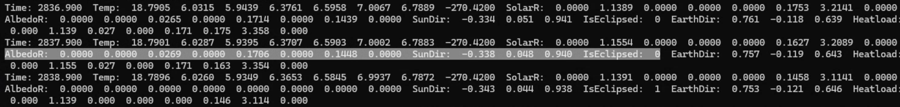

# Specification for Earth Albedo

## 1. Overview

### 1. Functions

- The `EarthAlbedo` class calculates the solar radiation reflected by the Earth at the spacecraft position.
- It uses the solar power density calculated by `SolarRadiationPressureEnvironment`, including the eclipse effect, and applies a constant Earth albedo factor and distance attenuation.
- The calculated irradiance is used by the thermal dynamics to determine the albedo heat input to each thermal node.
- Earth albedo calculation can be enabled or disabled independently for each spacecraft.

This model was introduced in [PR #688](https://github.com/ut-issl/s2e-core/pull/688).

### 2. Files

- [`earth_albedo.cpp`](https://github.com/ut-issl/s2e-core/blob/v8.0.4/src/environment/local/earth_albedo.cpp), [`earth_albedo.hpp`](https://github.com/ut-issl/s2e-core/blob/v8.0.4/src/environment/local/earth_albedo.hpp): Definition and declaration of the `EarthAlbedo` class
- [`local_environment.cpp`](https://github.com/ut-issl/s2e-core/blob/v8.0.4/src/environment/local/local_environment.cpp), [`local_environment.hpp`](https://github.com/ut-issl/s2e-core/blob/v8.0.4/src/environment/local/local_environment.hpp): Initialization, update, and logging of `EarthAlbedo`
- [`node.cpp`](https://github.com/ut-issl/s2e-core/blob/v8.0.4/src/dynamics/thermal/node.cpp), [`node.hpp`](https://github.com/ut-issl/s2e-core/blob/v8.0.4/src/dynamics/thermal/node.hpp): Conversion of Earth albedo irradiance into heat input for each thermal node
- [`temperature.cpp`](https://github.com/ut-issl/s2e-core/blob/v8.0.4/src/dynamics/thermal/temperature.cpp), [`heatload.hpp`](https://github.com/ut-issl/s2e-core/blob/v8.0.4/src/dynamics/thermal/heatload.hpp): Integration of albedo heat input into the thermal calculation
- [`local_environment.ini`](https://github.com/ut-issl/s2e-core/blob/v8.0.4/settings/sample_satellite/local_environment.ini): Example initialization file

### 3. How to use

- Set `calculation = ENABLE` and the albedo factor in the `[EARTH_ALBEDO]` section of `local_environment.ini`.
- Enable the thermal calculation and solar heat-input calculation in the `[THERMAL]` section of `satellite.ini` to include Earth albedo in the thermal-node heat input.
- `LocalEnvironment::Update` updates the Earth albedo irradiance when the orbit is propagated.
- Use the following getters to obtain the calculated state:
  - `GetEarthAlbedoFactor`: configured Earth albedo factor
  - `GetEarthAlbedoRadiationPower_W_m2`: Earth albedo irradiance at the spacecraft position [W/m^2]
  - `GetIsCalcEarthAlbedoEnabled`: Earth albedo calculation flag

### 4. Initialization parameters

```ini
[EARTH_ALBEDO]
calculation = ENABLE
earth_albedo_factor = 0.3
```

| Parameter | Unit | Description |
| --- | --- | --- |
| `calculation` | - | Enables or disables Earth albedo calculation. The sample setting is `DISABLE`. |
| `earth_albedo_factor` | - | Fraction of incident sunlight reflected by the Earth. The intended range is from 0.0 to 1.0, and the sample value is 0.3. |

The current implementation does not clamp or validate `earth_albedo_factor`; users should set a value in the intended range.

To include the result in thermal propagation, the following settings are also required in `satellite.ini`:

```ini
[THERMAL]
calculation = ENABLE
solar_calc_setting = ENABLE
```

## 2. Explanation of algorithm

### 1. `UpdateAllStates` function

#### 1. Overview

- If Earth albedo calculation is disabled, the function returns without updating the irradiance.
- If it is enabled, the function obtains the Earth position relative to the spacecraft from `LocalCelestialInformation` and calculates the Earth albedo irradiance.
- The function is called when the orbit propagation flag is set because the calculation depends on the spacecraft position.

### 2. Earth albedo irradiance

The irradiance at the spacecraft position is calculated as

```math
E_{alb} = E_{sun,sc}\, A_E
          \left(\frac{R_E}{r_{E,sc}}\right)^2 \frac{1}{4},
```

where

- $E_{alb}$ is the Earth albedo irradiance at the spacecraft position [W/m^2].
- $E_{sun,sc}$ is the solar power density at the spacecraft position calculated by `SolarRadiationPressureEnvironment` [W/m^2].
- $A_E$ is `earth_albedo_factor`.
- $R_E$ is the Earth equatorial radius [m].
- $r_{E,sc}$ is the distance between the spacecraft and the Earth center [m].

The factor $1/4$ represents the spherical average used by this simplified model. Since $E_{sun,sc}$ contains the shadow coefficient, the calculated albedo irradiance is also reduced in penumbra and becomes zero in umbra.

### 3. Heat input to a thermal node

For each diffusive thermal node, the albedo irradiance is converted to absorbed heat as

```math
Q_{alb,i} = E_{alb}\, S_i\, \alpha_i
            \max\left(0,\hat{\boldsymbol{r}}_{sc\rightarrow E}
            \cdot\boldsymbol{n}_{i,b}\right),
```

where

- $Q_{alb,i}$ is the albedo heat input to node $i$ [W].
- $S_i$ is the node area [m^2].
- $\alpha_i$ is the node solar absorptivity.
- $\hat{\boldsymbol{r}}_{sc\rightarrow E}$ is the unit vector from the spacecraft to the Earth in the body-fixed frame.
- $\boldsymbol{n}_{i,b}$ is the node normal vector in the body-fixed frame.

Only Earth-facing nodes receive albedo heat. The total external and internal heat input used by `Heatload` is

```math
Q_{total,i} = Q_{sun,i} + Q_{alb,i} + Q_{internal,i} + Q_{heater,i}.
```

### 4. Model assumptions and limitations

- The Earth is represented by a constant, spatially uniform albedo factor. Geographic variation, clouds, seasons, and wavelength dependence are not modeled.
- The model does not calculate the illuminated fraction of the Earth visible from the spacecraft or the Sun-Earth-spacecraft phase angle.
- The spacecraft-local shadow coefficient is used as an approximation for the illumination of the visible Earth. A spacecraft can physically see an illuminated part of the Earth while it is eclipsed, or see mainly the night side while it is sunlit; these cases are not represented accurately.
- The Earth is treated as a point source at its center when calculating incidence on a thermal-node surface. Its finite angular extent is ignored.
- The approximation is intended for simple thermal analysis. A detailed albedo map or surface integration is required when higher accuracy is needed.

### 5. Log output

The component logs the following values:

- `earth_albedo_factor`: configured Earth albedo factor
- `earth_albedo_W_m2`: calculated Earth albedo irradiance at the spacecraft position [W/m^2]

## 3. Results of verifications

The following result was reported in [PR #688](https://github.com/ut-issl/s2e-core/pull/688). Earth albedo and thermal calculations were enabled with `earth_albedo_factor = 0.3`.



- While the spacecraft is outside eclipse, Earth-facing thermal nodes receive albedo heat input. Its magnitude is approximately one order smaller than the direct solar heat input in this test.
- At the transition into eclipse, the Earth albedo heat input becomes zero because the solar power density used by the albedo model contains the eclipse effect.
- The albedo heat input is included in each node's total heat load together with direct solar, internal, and heater heat inputs.

These results confirm the connection between the solar radiation pressure environment, Earth albedo calculation, and thermal-node heat-input calculation.

## 4. References

1. [S2E-core PR #688: Add earth albedo effect for thermal calculation](https://github.com/ut-issl/s2e-core/pull/688)
