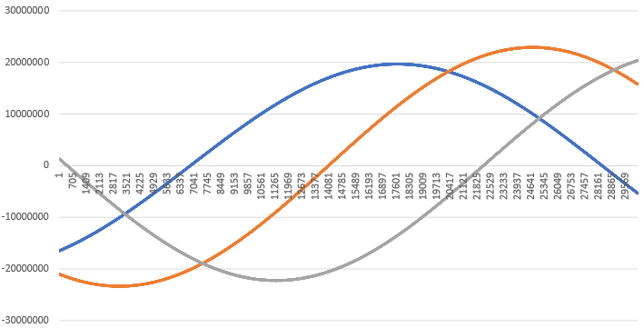

# 姿勢シミュレータ仕様書 - GNSS - 

## 1. 概要
1. 機能
    - .sp3や.clk_30sなどのGNSS衛星の軌道, クロックバイアスに関するデータを読み取り, 他クラスで使用できるためのクラス.
    - `SimBase.ini` により読みだすファイル名と範囲を決定します

2. 関連ファイル
    - `src/Environment/Global/GlobalEnvironment.cpp, .h`
        - GnssSatellites クラスが定義されています. また, 各種GET関数も実装されています.
    - `src/Interface/InitInput/Init_GnssSatellites.cpp`
        - GnssSatellites クラスのための初期化ファイルとなっています. 初期化の内容については `SimBase.ini` ファイル内に記述されています. 
    - `ExtLibraries/sp3`
        - 軌道やクロックバイアスの生成に必要なファイル群(.sp3, .clk_30s)などが入っています.

3. .sp3ファイルなどのダウンロードに関して
- まだダウンロードをする際に使用するスクリプトを書いていません. ディレクトリ分けなどを参考に`ftp://igs.ensg.ign.fr/pub/igs/products/`や`http://mgmds01.tksc.jaxa.jp/`等のサイトから各自ダウンロードしてください. ディレクトリ分けは以下の様になっていることを想定しています.
```
ExtLibraries  
    |  
   sp3  
    ├── CODE  
    │   └── final  
    ├── IGS  
    │   ├── igl    
    │   ├── igr
    │   │   └── clk
    │   ├── igs  
    │   │   └── clk_30s
    │   └── igu
    ├── JAXA
    │   ├── final
    │   ├── madoca
    │   ├── rapid
    │   └── ultra_rapid
    └── QZSS
        ├── final
        ├── rapid
        └── ultra_rapid
```


## 2. 使い方
- `SimBase.ini`内で読みだす方法やパラメーター設定等を行う
    - `directory_path`: 固定
    - `calculation`: 使用するかどうか
    - `true_position_file_sort`: GNSS衛星の座標の真値を生成するファイルの種類を選択
    - `true_position_first`: 読み出す最初のファイル
    - `true_position_last`: 読み出す最後のファイル
    - `true_position_interpolation_method`: 補間方法の選択
    - `true_position_interpolation_number`: 補間で行う点数の選択, なので関数の次数はこれ-1になる.
    - `true_clock_file_extension`: .sp3を使用するかそれとも.clk_30sなどのクロック限定のファイルから選択するか  

  以下同様です

- 用意されている各`Get`関数でGNSS衛星の各座標やクロックバイアスなどを取り出すことが出来ます. 

## 3. アルゴリズム
基本的に内挿で軌道を生成していますが, 一部データが欠けていることがよくあるのでそれに対応しています. 座標に関しては利用可能な座標から抽出して内挿で軌道を生成し, クロックバイアスに関しては厳密に周辺の値のみを取り出して生成しています. 

1. `Init_GnssSatellites.cpp` でファイルの中身を取り出します.
2. `Init()`で座標, クロックバイアスの生成元となるtableを作成します.
    - `time_table_`内に全時刻のUnix Timeが並べられている.
    - `gnss_*_table_*`で全時刻での座標又はクロックバイアスの値が入っている.
    - `available_table_`に全時刻の全衛星がその時のデータが使用可能かどうか入っている. 
    - `time_and_index_list_`: 使用可能なデータの時刻とtable内でのindexのpairが収められている. 
3. `SetUp()`: `time_table_`と`time_and_index_list_`から一番最初の内挿の基準の場所をセット, 基準のindexを`nearest_index_`にセット(後ほどUpdateで使用), `time_vector_`, `ecef_`, `eci_`, `clock_`は内挿の計算に用いる`vector`
4. `Update()`: 時刻を元に座標やクロックバイアスが計算される. 最寄りの時刻が進む先に内挿の計算の元に使われる `time_vector_`, `ecef_`, `eci_`, `clock_` がその基準に合わせて更新される.

## 4. 結果と検証
計算したECI座標の一部を以下に示す. 
