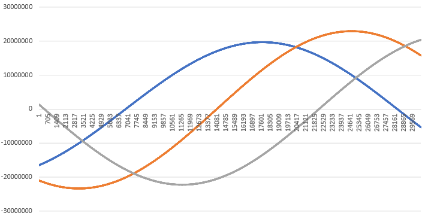

# 姿勢シミュレータ仕様書 - GNSS - 

## 1. 概要
### 1. 機能
- .sp3や.clk_30sなどのGNSS衛星の軌道, クロックバイアスに関するデータを読み取り, 他クラスで使用するためのクラス。
- `settings/environment/sample_gnss.ini` により、利用するファイルや期間などを設定します。

### 2. 関連ファイル
- `src/environment/global/global_environment.cpp, .hpp`
  - GnssSatellites クラスが定義されています. また, 各種GET関数も実装されています.
- `src/environment/global/gnss_satellites.cpp, .hpp`
  - GnssSatellites クラスとその初期化関数が定義されています。初期化の内容については `sample_gnss.ini`  ファイル内に記述されています. 
- `settings/environment/gnss/`
  - 軌道やクロックバイアスの生成に必要なファイル群(.sp3, .clk_30s)などを保管します。

### 3. .sp3ファイルなどのダウンロードに関して
- まだダウンロードをする際に使用するスクリプトを書いていません. IGS: `ftp://igs.ensg.ign.fr/pub/igs/products/`やJAXA: `http://mgmds01.tksc.jaxa.jp/`等のサイトから各自ダウンロードしてください. 
- `settings/environment/gnss/`内部のディレクトリ構成は、自由に設定でき、`sample_gnss.ini`内で設定します。
- ファイルのヘッダーはダウンロード元の情報を参考にしてください。

## 2. 使い方
- `sample_gnss.ini` 内で読みだす方法やパラメーター設定等を行う
    - `directory_path`: ダウンロードしてきた暦ファイルによって、自由にディレクトリを設定する。
    - `calculation`: GNSS衛星配置を計算しない場合はdisableにすることで、計算が軽くなる。
    - `logging`: GNSS衛星の位置情報をログに保存するかどうか
      - 衛星数が多いので、ログファイルが大きくなります。
    - `file_name_header`： 暦ファイル名のヘッダー
    - `orbit_data_period`：暦ファイルの周期
    - `clock_file_name_footer`：クロックファイル名のフッター
    - `start_date`：暦ファイルの開始日（Year + Day of year）
    - `end_date`：暦ファイルの終了日（Year + Day of year）
    

- 用意されている各`Get`関数でGNSS衛星の位置情報やクロックバイアスなどを取り出すことが出来ます. 

## 3. アルゴリズム
基本的に内挿で軌道を生成していますが, 一部データが欠けていることがよくあるのでそれに対応しています. 座標に関しては利用可能な座標から抽出して内挿で軌道を生成し, クロックバイアスに関しては厳密に周辺の値のみを取り出して生成しています. 

1. `initialize_gnss_satellites.cpp` でファイルの中身を取り出します.
2. `Init()`で座標, クロックバイアスの生成元となるtableを作成します.
    - `time_table_`内に全時刻のUnix Timeが並べられている.
    - `gnss_*_table_*`で全時刻での座標又はクロックバイアスの値が入っている.
    - `available_table_`に全時刻の全衛星がその時のデータが使用可能かどうか入っている. 
    - `time_and_index_list_`: 使用可能なデータの時刻とtable内でのindexのpairが収められている. 
3. `SetUp()`: `time_table_`と`time_and_index_list_`から一番最初の内挿の基準の場所をセット, 基準のindexを`nearest_index_`にセット(後ほどUpdateで使用), `time_vector_`, `ecef_`, `eci_`, `clock_`は内挿の計算に用いる`vector`
4. `Update()`: 時刻を元に座標やクロックバイアスが計算される. 最寄りの時刻が進む先に内挿の計算の元に使われる `time_vector_`, `ecef_`, `eci_`, `clock_` がその基準に合わせて更新される.

## 4. 結果と検証
計算したECI座標の一部を以下に示す. 
