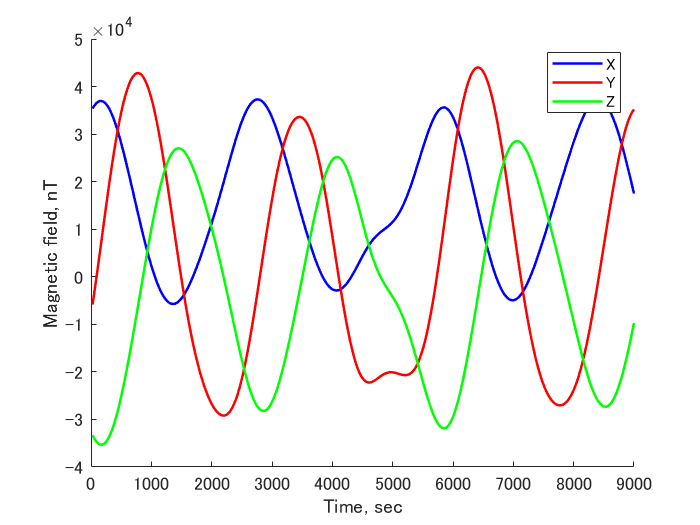
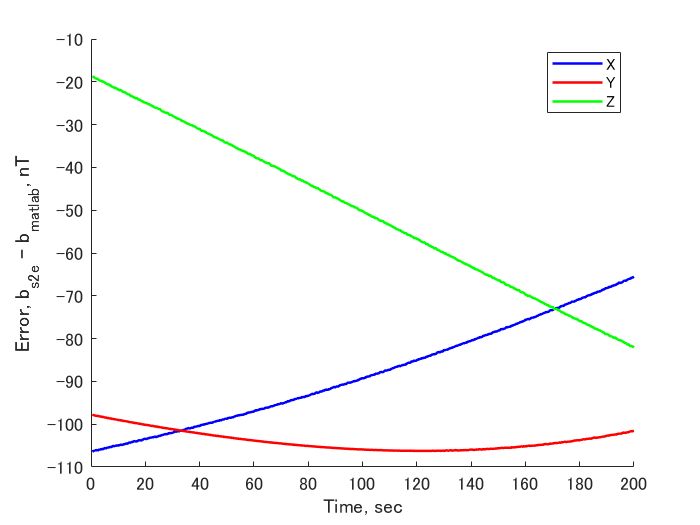

# Specification for Magnetic field model

## 1.  Overview
1. Functions 
  + Atmosphere calculates densities of the atomosphere

2. Related files
  + `src/Environment/MagEnvironment.cpp, .h`
    + MagEnvironment class is defined.
  + `src/Environment/Environment.cpp, .h`
    + MagEnvironment class is used here as a member variable of Envir class.
  + `src/Environment/Init_Envinronment.cpp`
    + MagEnvironment class is instanced here based on the .ini file for environment.
  + `src/Library/nrlmsise00/igrf.cpp, .h`
    + A magnetic field in ECI and body-fixed coordinate is calculated using IGRF model.

3. How to use
  + Set a coefficient file path for IGRF and random walk / white noise in .ini file
    + Example
      ```
      [MAG_ENVIRONMENT]
      calculation = ENABLE
      logging = ENABLE
      coeff_file = ../../src/Library/igrf/igrf13.coef
      mag_rwdev = 0.0//10.0     //磁気ランダムウォーク速度[nT] Default(10.0)
      mag_rwlimit = 0.0//400.0  //磁気ランダムウォーク最大値[nT] Default(400.0)
      mag_wnvar = 0.0//50.0     //磁気ホワイトノイズ分散[nT] Default(50.0)
      ```
  + `CalcMag` : Update the magnetic field (nT)
  + `Addnoise` : Add noise to the result of `CalcMag`
  + `GetMag_i` : Return the magnetic field (nT) in ECI 
  + `GetMag_b` : Return the magnetic field (nT) in body-fixed coordinate


## 2. Explanation of Algorithm
+ IGRF calculates the magnetic field based on a spherical harmonic expansion of magnetic scalar potential $`V`$.
+ Please refer [this link](https://earth-planets-space.springeropen.com/articles/10.1186/s40623-015-0228-9) for the details of IGRF.

## 3. Verification
1. Overview
  + The  calculated magnetic field is compared with [Matlab's IGRF function](https://jp.mathworks.com/help/aerotbx/ug/igrfmagm.html) calculation in ECI.
2. Conditions for the verification
   1. input files
      - Default initialize files
   2. initial values
      - Default initialize files
   
        ```
        StartYMDHMS=2020/01/01 11:00:00.0
        EndTimeSec=200
        StepTimeSec=0.1
        OrbitPropagateStepTimeSec=0.1
        LogPeriod = 5
        SimulationSpeed = 0
        ```
      - Especially, we chose following TLE for orbit calculation
   
        ```
        tle1=1 25544U 98067A   20076.51604214  .00016717  00000-0  10270-3 0  9005
        tle2=2 25544  51.6412  86.9962 0006063  30.9353 329.2153 15.49228202 17647
        ```

3. Results
  + Results of S2E
    

  + Error between S2E and MATLAB
    

## 4. References
1. International Geomagnetic Reference Field: the 12th generation, https://earth-planets-space.springeropen.com/articles/10.1186/s40623-015-0228-9