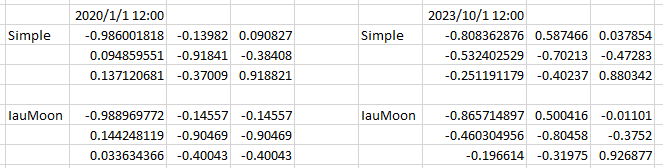

# Specification of Moon Rotation

## 1. Overview

### 1. Functions

- The `MoonRotation` class calculates the direction cosine matrix (DCM) from the J2000 inertial frame to the Moon-Centered Moon-Fixed (MCMF) frame.
- Users can select an idle model, a simple model based on the instantaneous Earth-Moon orbital geometry, or the `IAU_MOON` frame calculated by CSPICE.
- The calculated DCM is managed by `CelestialInformation` and is used by features such as the lunar gravity-field disturbance calculation.

This feature was introduced in [PR #511](https://github.com/ut-issl/s2e-core/pull/511).

### 2. Files

- [`moon_rotation.cpp`](https://github.com/ut-issl/s2e-core/blob/v8.0.4/src/environment/global/moon_rotation.cpp), [`moon_rotation.hpp`](https://github.com/ut-issl/s2e-core/blob/v8.0.4/src/environment/global/moon_rotation.hpp): Definition and declaration of the `MoonRotation` class
- [`moon_rotation_utilities.cpp`](https://github.com/ut-issl/s2e-core/blob/v8.0.4/src/math_physics/planet_rotation/moon_rotation_utilities.cpp), [`moon_rotation_utilities.hpp`](https://github.com/ut-issl/s2e-core/blob/v8.0.4/src/math_physics/planet_rotation/moon_rotation_utilities.hpp): Mean Earth and Principal Axis frame calculations
- [`celestial_information.cpp`](https://github.com/ut-issl/s2e-core/blob/v8.0.4/src/environment/global/celestial_information.cpp), [`celestial_information.hpp`](https://github.com/ut-issl/s2e-core/blob/v8.0.4/src/environment/global/celestial_information.hpp): Initialization and periodic update of `MoonRotation`
- [`lunar_gravity_field.cpp`](https://github.com/ut-issl/s2e-core/blob/v8.0.4/src/disturbances/lunar_gravity_field.cpp): Use of the MCMF transformation in the lunar gravity-field calculation
- [`sample_simulation_base.ini`](https://github.com/ut-issl/s2e-core/blob/v8.0.4/settings/sample_simulation_base.ini): Example initialization file

### 3. How to use

- Set `inertial_frame = J2000` in the `[CELESTIAL_INFORMATION]` section.
- Include both `EARTH` and `MOON` in `selected_body_name` when using the `SIMPLE` model.
- Set the `rotation_mode` entry with the same index as the `MOON` entry in `selected_body_name`.
- Call `CelestialInformation::UpdateAllObjectsInformation` to update the Moon rotation together with the other celestial information.
- Obtain the transformation with `GetMoonRotation().GetDcmJ2000ToMcmf()`.
- When transforming a position vector, first ensure that its origin is the Moon center. The returned value is a DCM and does not translate the vector origin.

The sample configuration selects the Moon as body index 2:

```ini
[CELESTIAL_INFORMATION]
inertial_frame = J2000

number_of_selected_body = 3
selected_body_name(0) = EARTH
selected_body_name(1) = SUN
selected_body_name(2) = MOON

rotation_mode(0) = FULL
rotation_mode(1) = DISABLE
rotation_mode(2) = SIMPLE
```

### 4. Rotation modes

| Setting | Description |
| --- | --- |
| `IDLE` | Sets the J2000-to-MCMF DCM to the identity matrix. |
| `SIMPLE` | Constructs a Mean Earth frame from the Earth-Moon relative orbit and applies a constant DE430 Mean Earth-to-Principal Axis correction. |
| `IAU_MOON` | Uses CSPICE to calculate the state transformation from `J2000` to `IAU_MOON` and extracts its 3-by-3 rotation matrix. |

If the setting is not `IDLE`, `SIMPLE`, or `IAU_MOON`, the mode falls back to `IDLE`. Therefore, `DISABLE` also results in the identity matrix when used as a Moon rotation setting.

The `IAU_MOON` mode requires CSPICE kernels that define time conversion and the `IAU_MOON` orientation. The sample CSPICE kernel settings satisfy these requirements.

## 2. Explanation of algorithm

### 1. `Update` function

#### 1. Overview

- In `SIMPLE` mode, obtain the Moon position and velocity relative to the Earth and calculate the Principal Axis Moon-fixed frame.
- In `IAU_MOON` mode, obtain the current ephemeris time from `SimulationTime` and request the `J2000`-to-`IAU_MOON` state transformation from CSPICE.
- In `IDLE` mode, set the DCM to the identity matrix.

The output is

```math
\boldsymbol{C}_{J2000\rightarrow MCMF}.
```

### 2. `SIMPLE` mode

#### 1. Mean Earth frame

Let $\boldsymbol{r}_{E\rightarrow M}^{i}$ and $\boldsymbol{v}_{E\rightarrow M}^{i}$ be the Moon position and velocity relative to the Earth in the J2000 inertial frame. The Mean Earth frame basis vectors expressed in J2000 are calculated as

```math
\begin{align}
\boldsymbol{e}_{x,ME}^{i}
  &= -\frac{\boldsymbol{r}_{E\rightarrow M}^{i}}
           {|\boldsymbol{r}_{E\rightarrow M}^{i}|}, \\
\boldsymbol{e}_{z,ME}^{i}
  &= \frac{\boldsymbol{r}_{E\rightarrow M}^{i}
           \times \boldsymbol{v}_{E\rightarrow M}^{i}}
          {|\boldsymbol{r}_{E\rightarrow M}^{i}
           \times \boldsymbol{v}_{E\rightarrow M}^{i}|}, \\
\boldsymbol{e}_{y,ME}^{i}
  &= \boldsymbol{e}_{z,ME}^{i} \times \boldsymbol{e}_{x,ME}^{i}.
\end{align}
```

The +X axis points from the Moon toward the Earth, the +Z axis is the Earth-Moon orbital normal, and the +Y axis completes the right-handed frame. The basis vectors form the rows of the J2000-to-Mean-Earth DCM:

```math
\boldsymbol{C}_{J2000\rightarrow ME} =
\begin{bmatrix}
(\boldsymbol{e}_{x,ME}^{i})^T \\
(\boldsymbol{e}_{y,ME}^{i})^T \\
(\boldsymbol{e}_{z,ME}^{i})^T
\end{bmatrix}.
```

#### 2. Principal Axis correction

The fixed rotation from the Mean Earth frame to the DE430 Principal Axis frame is calculated with

```math
\begin{align}
\theta_x &= 0.285\ \mathrm{arcsec}, \\
\theta_y &= 78.580\ \mathrm{arcsec}, \\
\theta_z &= 67.573\ \mathrm{arcsec}, \\
\boldsymbol{C}_{ME\rightarrow PA}
  &= \boldsymbol{R}_z(\theta_z)
     \boldsymbol{R}_y(\theta_y)
     \boldsymbol{R}_x(\theta_x).
\end{align}
```

The final simple-model transformation is

```math
\boldsymbol{C}_{J2000\rightarrow MCMF}
  = \boldsymbol{C}_{ME\rightarrow PA}
    \boldsymbol{C}_{J2000\rightarrow ME}.
```

### 3. `IAU_MOON` mode

The implementation calls the CSPICE `sxform_c` function with `from = J2000`, `to = IAU_MOON`, and the current ephemeris time. CSPICE returns a 6-by-6 state transformation, from which the upper-left 3-by-3 rotation matrix is stored as the J2000-to-MCMF DCM.

Only the orientation DCM is retained. The angular-velocity terms contained in the full state transformation are not exposed by `MoonRotation`.

### 4. Model assumptions and limitations

- `SIMPLE` mode approximates the lunar orientation from the instantaneous Earth-Moon direction and orbital plane plus a constant frame correction. Detailed physical librations and higher-accuracy time-dependent orientation effects are not explicitly modeled.
- `IAU_MOON` accuracy and valid time coverage depend on the loaded CSPICE kernels.
- The implementation and getter explicitly define the inertial input frame as J2000. A different `inertial_frame` setting is not converted internally by `MoonRotation`.
- The DCM changes only vector orientation; users must separately express position vectors relative to the Moon center.

### 5. Use in the lunar gravity field

`LunarGravityField` converts the spacecraft position from the Moon-centered inertial frame to MCMF with the Moon rotation DCM, evaluates the spherical-harmonic lunar gravity acceleration in MCMF, and converts the result back to the inertial frame. A non-idle Moon rotation model is therefore required for a physically meaningful non-spherical lunar gravity-field calculation.

## 3. Results of verifications

PR #511 compared the DCM calculated by `SIMPLE` mode with the DCM produced by CSPICE in `IAU_MOON` mode at `2020/01/01 12:00` and `2023/10/01 12:00`.



The comparison confirms that the simple orbital-geometry model produces a lunar-fixed orientation similar to the CSPICE `IAU_MOON` result at both evaluated epochs. The results are not identical because the two modes use different orientation models and the simple model omits detailed lunar libration behavior.

## 4. References

1. [S2E-core PR #511: Add moon rotation](https://github.com/ut-issl/s2e-core/pull/511)
2. J. G. Williams, D. H. Boggs, and W. M. Folkner, [“DE430 Lunar Orbit, Physical Librations, and Surface Coordinates”](https://naif.jpl.nasa.gov/pub/naif/generic_kernels/spk/planets/de430_moon_coord.pdf), 2013.
3. [A Standardized Lunar Coordinate System for the Lunar Reconnaissance Orbiter and Lunar Datasets](https://lunar.gsfc.nasa.gov/library/LunCoordWhitePaper-10-08.pdf).
