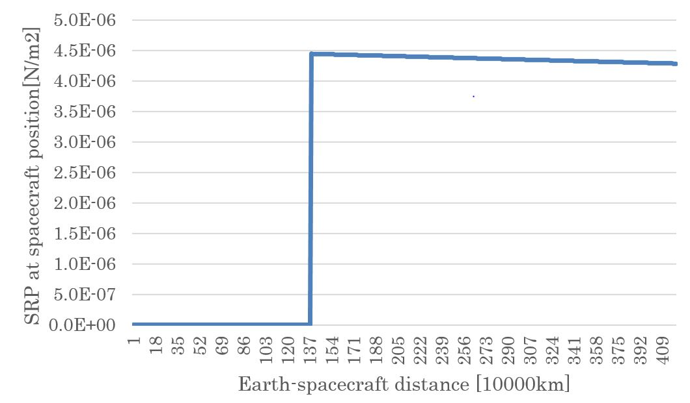
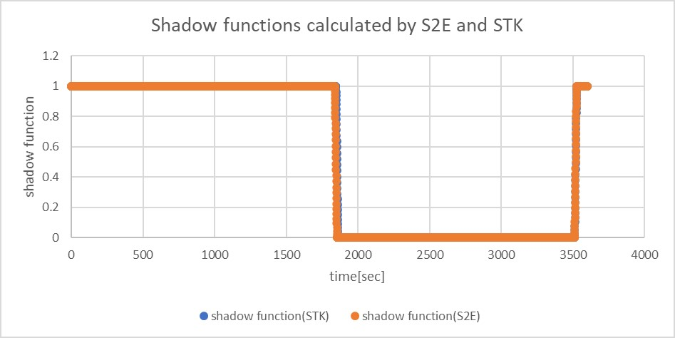

# Specification for Solar Radiation Pressure Environment

## 1.  Overview

### 1. Functions
- `SolarRadiationPressureEnvironment` calculates solar power flux at the spacecraft's position, including the earth's eclipse effect.

### 2. Related files
- `src/environment/local/solar_radiation_pressure_environment.cpp, .hpp`
  - `SolarRadiationPressureEnvironment` class is defined. 
- `src/environment/local/local_environment.cpp, .hpp`
  - `SolarRadiationPressureEnvironment` class is used here as a member variable of `LocalEnvironment` class.

### 3. How to use
- Call `UpdateAllStates` function to calculates solar power flux and updates the eclipse flag.
- Users can get calculated values by using the following functions:
  - `GetPressure_N_m2`: Return solar pressure (N/m2) with eclipse effect for SRP disturbance calculation.
  - `GetPowerDensity_W_m2`: Return solar power density (W/m2) with eclipse effect for Electrical Power System calculation.
  - `GetPressureWithoutEclipse_Nm2`: Return solar pressure (N/m2) without eclipse effect.
  - `GetSolarConstant_W_m2`: Return solar constant value 1366 [W/m2]
  - `GetShadowCoefficient`: Return shadow function $\nu$.
    - When the spacecraft is in umbra, $\nu=0$.
    - When the spacecraft is in sunlight, $\nu=1$.
    - When the spacecraft is in penumbra, $0<\nu<1$.
  - `GetIsEclipsed`: Return eclipse or not

   
## 2. Explanation of Algorithm
### 1. Pressure calculation in `UpdateAllStates` function

#### 1. overview
- Solar radiation pressure at the position of the spacecraft is calculated by using the inverse square law.

#### 2. inputs and outputs
- Constants
  - Solar constant: $P_{\odot} = 1366$ W/m2
  - Speed of light: $c = 299792458$ m/s
  - Astronomical Unit: $AU = 149597870700$ m
- Input variables
  -  The sun position in the body-fixed frame of the spacecraft: $\boldsymbol{r}_{\odot-sc}$ m
      -  Unbold $r_{\odot-sc}$ is the norm of $\boldsymbol{r}_{\odot-sc}$
- Output
- Solar radiation pressure: $P_{sc}$ N/m2

#### 3. algorithm
```math
P_{sc}=\frac{P_{sun}}{c}\left(\frac{AU}{r_{\odot-sc}}\right)^{2}
```

#### 4. note
- It is known that the solar constant value varies between 1365 and 1367 W/m2, but it is handled as a constant value in S2E. 

### 2. `CalcShadowCoefficient` function
#### 1. overview
- This function determines that the spacecraft is inside the eclipse of the earth or not.

#### 2. inputs and outputs
- Constants
  - Radius of the earth: $r_{\oplus}=6378137$ m
  - Radius of the sun: $r_{\odot}=6.96\times10^{8}$ m
- Input variables
  - The sun position in the body-fixed frame of the spacecraft: $\boldsymbol{r}_{\odot-sc}$ m
  - The earth position in the body-fixed frame of the spacecraft: $\boldsymbol{r}_{\oplus-sc}$ m
- Output
  - none

#### 3. algorithm
```math
\begin{align}
A_{\odot} &= \sin^{-1}\left(\frac{r_{\odot}}{r_{\odot-sc}}\right)\\
A_{\oplus} &= \sin^{-1}\left(\frac{r_{\oplus}}{r_{\oplus-sc}}\right)\\
\delta &= \cos^{-1}\left(\frac{r_{\odot-sc}}{r_{\oplus-sc}}\cdot \boldsymbol{r}_{\oplus-sc}\cdot(\boldsymbol{r}_{\odot-sc}-\boldsymbol{r}_{\oplus-sc})\right)\\
\end{align}
```

#### 4. note
- See the following description of the `CalcShadowFunction` for the calculation of the shadow function.

### 3. `CalcShadowFunction` function
#### 1. overview
- This function calculates the degree of the Sun's occultation by the Earth.
- The base algorithm is referred to [Satellite Orbits](https://www.springer.com/jp/book/9783540672807) chapter 3.4. 

#### 2. inputs and outputs
- Input
  - The apparent radius of the Sun: $A_{\odot}$
  - The apparent radius of the Earth: $A_{\oplus}$
  - The apparent separation of the centers of the Sun and the Earth: $\delta$
  - The angle between the center of the Sun and the common chord: $x$
  - The length of the common chord of the apparent solar disk and apparent celestial disk: $y$
- Output
  - The shadow function: $\nu$

#### 3. algorithm
- If the occultation is total, then $\nu=0$.
- If the occultation is partial but maximum, then $\nu=1-\left(\frac{A_{\oplus}}{A_{\odot}}\right)^2$
- If the occultation is partial, then $\nu = 1-\frac{S}{\pi A^2_{\odot}}$
  - S is given by the following calculation.

```math
S=A_{\odot}^2\arccos\left(\frac{x}{A_{\odot}}\right)+A_{\oplus}^2\arccos\left(\frac{\delta-x}{A_{\oplus}}\right)-\delta\cdot y
```
- In other cases, since it means that no occultation takes place, then $\nu=1$.


## 3. Results of verifications

### 1. Verification of pressure calculation in `UpdateAllStates` function
#### 1. overview
- The pressure calculation above is verified.

#### 2. conditions for the verification
- A test code written in the `SRPEnvironment.cpp` is used.
- The sun position and the earth position are fixed, and the spacecraft position varies as following values.
  - Sun-spacecraft distance: 149604270700m - 153797870700m
  - Earth-spacecraft distance: 6400000m - 4200000000m

#### 3. results
- The pressure calculation is verified.



### 2. Verification of calculation in `CalcShadowFunction` function
#### 1. overview
- The calculation of the shadow function is verified.
- The result of the `CalcShadowFunction` of S2E is compared with the results of the `solar intensity` of STK.

#### 2. conditions for the verification
- Orbit
  - The orbit of the ISS was used for verification.
  - The TLE data are as follows.
  ```
  1 25544U 98067A   20250.86981481  .00000008  00000-0  82464-5 0  9991
  2 25544  51.6470 304.2415 0002004  86.5035 251.6018 15.49214189244677
  ```

- Simulation time
  - The simulation time is as follows.
  ```
  //Simulation start date，[UTC]
  StartYMDHMS=2020/09/13 12:00:00.0
  //Simulation finish time，[sec]
  EndTimeSec=3600
  ```

#### 3. Results
- The calculation of the shadow function is verified.



## 4. References
1. Montenbruck, O., Gill, E., & Lutze, F. (2002). Satellite orbits: models, methods, and applications. Appl. Mech. Rev., 55(2), B27-B28.
