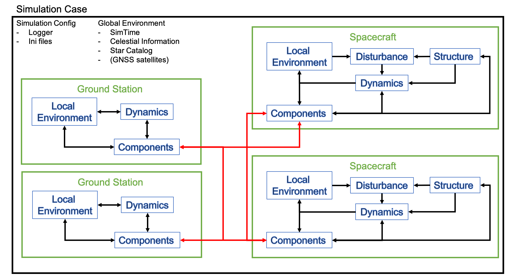
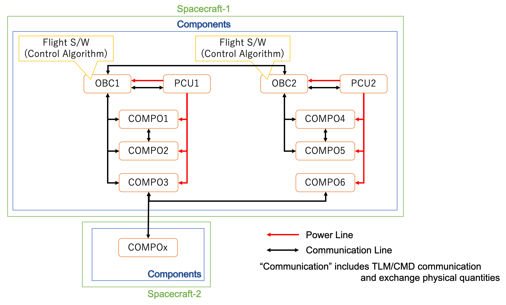

# Overall Structure of S2E

## 1. Overview
- This document explains the overall structure of the S2E.

## 2. Structure of S2E
- The following figure shows the structure of the S2E.

### 2.1. Simulation Case
- The highest layer of the structure of S2E is the `Simulation Case`, which is defined in the `src/Simulation/Case/SimulationCase.cpp`.
- The `SimulationCase` always has `SimulationConfig` and `Global Environment`.
  - `SimulationConfig` has basic information on the interface of the simulation, such as `log output` and `initialize input` information.
  - `GlobalEnvironment` is defined as the common environment for the whole simulation case. It includes time, celestial information, star catalog, and GNSS satellite position.
- Users can make their `SimulationCase` by inheriting the `SimulationCase` base class and adding simulation target objects (e.g., spacecraft and ground station) for their demand.
- The defined simulation objects can use the information of `SimulationConfig` and `GlobalEnvironment`.

### 2.2. Spacecraft
- An essential simulation object is the `Spacecraft` class. 
- `Spacecraft` class has the following features to simulate the behavior of spacecraft in space.
  - `Structure`
    - This class handles the structure information of the spacecraft, such as the mass, the inertia tensor, surface information, and residual magnetic moment.
    - The information is used to calculate disturbance and propagate dynamics.
  - `LocalEnvironment`
    - This class handles space environment information around the spacecraft, such as air density, magnetic field, solar energy, and eclipse.
    - The information is used to calculate disturbance and emulate environment sensors.
  - `Disturbance`
    - This class handles disturbances forces(accelerations) and torques.
     - The information is used to propagate dynamics.
  - `Dynamics`
    - This class handles dynamics calculation for attitude, orbit, and thermal.
    - This is the core of the numerical simulation.
  - `Components`
    - This class emulates the behavior of components mounted on the spacecraft. The spacecraft can measure the physical quantities and generate control output by using the components.
    - This class is not defined in the Spacecraft base class, and users have to define it themselves.
- Users can add multiple spacecraft into their `SimulationCase`, and these spacecraft can communicate via communication components.

### 2.3. Ground Station
- TBW

### 2.4. Structure of initializing files
- The structure of the initializing files follows the above figure.
- `SimBase.ini` sets the parameters for `SimulationCase`, and file paths to each simulation object.
- `Sat.ini` sets the parameters for `Spacecraft` and file paths to each component.

## 3. Structure of spacecraft components
**Note:** the structure of components is implemented now. So the following figure is just an idea, and it may be modified.

- Each component can communicate with other components.
- All components have a power wire, and power control components control the switch.
