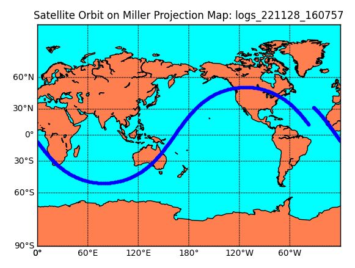
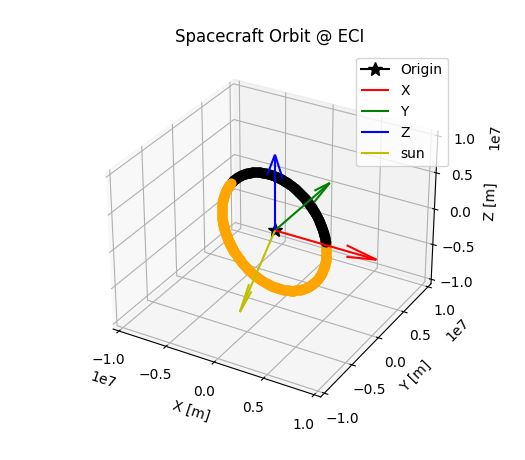
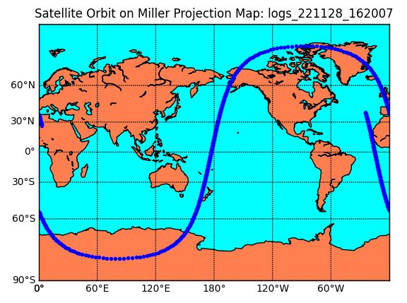
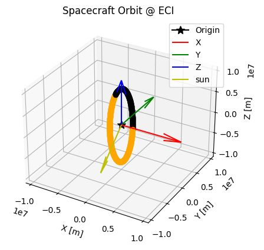

# Getting Started

## 1.  Overview

- This tutorial explains how to use the S2E simulator without any source code modification.   
- Users can start this tutorial just after users clone the [s2e-core](https://github.com/ut-issl/s2e-core) repository. 
- The supported version of this document
  - Please confirm that the version of the documents and s2e-core is compatible.
  
## 2. Clone, Build, and Execute 

1. Clone [s2e-core](https://github.com/ut-issl/s2e-core).
2. Read `README.md` to check the overview of S2E.
3. Build and execute the `s2e-core` by referring following documents depends on your development environment.
   - [How to compile with Visual Studio](../General/HowToCompileWithVisualStudio.md)
   - [How to compile with Ubuntu](../General/HowToCompileWithUbuntuInDocker.md)


## 3. Check log output 

1. Check `./data/sample/logs` to find CSV log output file  
   - The file name includes executed time as `YYMMDD_HHMMSS_default.csv`
   - The included executed time is defined by the user computer settings.
2. Open the CSV log file
3. You can see the simulation output
4. The meaning of each value is described in the first row
   - A general rule of the header descriptions are summarized [here](../General/NamingRuleForUserInterface.md).
5. You can write a graph from the CSV file as you need.
   - You can find plot examples written in Python in the `scripts/Plot` directory.
   - Please see [How to Visualize Simulation Results](../General/HowToVisualizeSimulationResults.md) for more details.
   
## 4. Edit Simulation Conditions

1. Move to `./data/sample/initialize_files`  directory  
2. You can find the several **initialize** files ([INI files](https://en.wikipedia.org/wiki/INI_file)). In these initialize files, simulation conditions are defined, and you can change the conditions without rebuild of S2E by editing the initialize files.
3. Open `sample_simulation_base.ini`, which is the base file of the initialize files.
   - In this base file, other initialize files are defined.
   - You can see simulation conditions as time definitions, randomize seed definitions, etc. 
4. Open `sample_satellite.ini`, which is the file to set the spacecraft parameters.
5. Edit the value of angular momentum `initial_angular_velocity_b_rad_s(0-2)` in the `[Attitude]` section as you want.
6. Edit the value of `initialize_mode` from `CONTROLLED` to `MANUAL`.
7. Rerun the `s2e-core` **without a rebuild**
8. Check the new log file in `./data/sample/logs` to confirm the initial angular velocity is changed as you want.
9. Of course, you can change other values similarly.

## 5. Edit Simulation Conditions: Disturbances

1. Move to `./data/sample/ini`  directory again  
2. Open `sample_disturbance.ini`, which defines conditions to calculate orbital disturbance torques and forces
   - Currently, S2E supports the following disturbances:
     - Gravity Gradient torque
     - Magnetic Disturbance torque
     - Air drag torque and force
     - Solar radiation pressure torque and force
     - Geo Potential acceleration
     - Third body gravity acceleration
3. You can select `ENABLE` or `DISABLE` of calculation and log output for each disturbance
4. Edit all `calculation` parameters of each disturbance as `calculation = DISABLE`
5. Rerun the `s2e-core` **without a rebuild**
6. Check the new log file in `./data/sample/logs` to confirm the spacecraft is not affected by any disturbance torque and the angular velocity and quaternion are not changed. You can also plot by following command and see all the disturbance torque and force are zero. (assuming you already created a `pipenv` virtual environment)
   ```
   # Windows
   cd scripts/Plot
   pipenv run python .\plot_disturbance_torque.py --file-tag <log file tag>
   pipenv run python .\plot_disturbance_force.py --file-tag <log file tag>
   ```
7. Edit  `calculation` of [THIRD_BODY_GRAVITY] as `calculation = ENABLE`
8. Rerun the S2E_CORE **without a rebuild**
11. Rerun the python script to check the third body gravity is generated.

## 6. Edit Simulation Conditions: Orbit

1. Move to `./data/sample/ini`  directory  
1. Open `sample_satellite.ini` and see the `[Orbit]` section, which defines conditions to calculate orbit motion
   - Currently, S2E supports several types of orbit propagation. Please see [Orbit](./Specifications/Dynamics/Spec_Orbit.md) specification documents for more details.
1. Please set the parameters as follow:
   - `propagate_mode = SGP4`: SGP4 Propagator
   - `initialize_mode` is not used in the SGP4 propagate mode.
   - TLE: ISS orbit (default)
1. To get a long-term orbit simulation data, edit the following simulation time settings in `sample_simulation_base.ini`
   - `simulation_duration_s = 6000`
   - `log_output_period_s = 10` (to decrease the output file size)
1. To visualize the orbit result, execute the `plot_satellite_orbit_on_miller.py` and `plot_orbit_eci.py` by following command. You can see the plots as follows. Please see [general](../General/HowToVisualizeSimulationResults.md) documents for more details on visualization of simulation results.
   ```
   # Windows
   cd scripts/Plot
   pipenv run python .\plot_satellite_orbit_on_miller.py --file-tag <log file tag>
   pipenv run python .\plot_orbit_eci.py --file-tag <log file tag>
   ```  
   
   

1. Change TLE as you want
   - Example: PRISM (Hitomi)
     ```
     tle1=1 33493U 09002B   22331.71920614  .00003745  00000-0  29350-3 0  9995
     tle2=2 33493  98.2516 327.9413 0016885   9.3461 350.8072 15.01563916753462
     ```
1. Rerun the `s2e-core` **without a rebuild**
1. Check the new log file in `./data/sample/logs` to confirm the spacecraft position in ECI frame `spacecraft_position_i` is changed.
1. To visualize the orbit result, execute the `plot_satellite_orbit_on_miller.py` and `plot_orbit_eci.py`. You can see the different plots as follows.  
  
  

## 7. Edit Simulation Conditions: Environment

1. Move to `./data/sample/ini`  directory  
2. Open `sample_local_environment.ini`, which defines conditions to calculate the environment around the spacecraft
   - Currently, S2E supports the following environment models:
     - Celestial information: CSPICE
     - Geomagnetic field model: IGRF with random variation
     - Solar power model: Considering solar distance and eclipse
     - Air density: NRLMSISE-00 model with random variation
3. Edit values of `magnetic_field_random_walk_standard_deviation_nT, magnetic_field_random_walk_limit_nT, magnetic_field_white_noise_standard_deviation_nT` 
4. Rerun the `s2e-core` **without a rebuild**
5. Check the new log file in `./data/sample/logs` to confirm the magnetic field at the spacecraft position in ECI frame `geomagnetic_field_at_spacecraft_position_i`, the magnetic field in body frame `geomagnetic_field_at_spacecraft_position_b`, and magnetic disturbance torque in body frame `magnetic_disturbance_torque_b` are changed.
