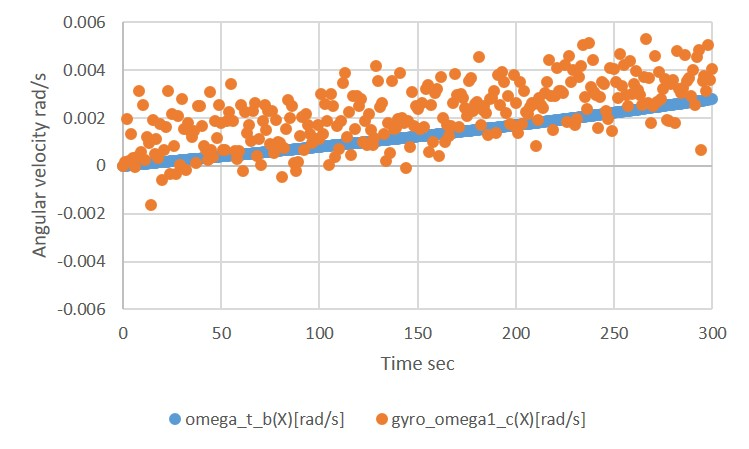

# How To Add Components

## 1.  Overview

- In [How To Make New Simulation Scenario](./Tutorials/HowToMakeNewSimulationScenario.md) tutorial, we have made a `S2E_USER` directory to create own simulation scenario.
- This tutorial explains how to add components in your scenario.

## 2. Add a Gyro sensor

- This chapter explains how to add a gyro component in your `S2E_USER` simulation case

1. Open `User_Components.h`

2. Add following descriptions at the bottom line of `#include "OBC.h"`

   ```c++
   #include "Gyro.h"
   ```

3. Add following descriptions at the bottom line of `OBC* obc_;`

   ```c++
   GYRO* gyro_;
   ```

4. Open `User_Components.cpp`

5. Edit the constructor function as follows to create instance of the GYRO class

   ``` c++
   UserComponents::UserComponents(const Dynamics* dynamics, const SimulationConfig* config)
     :dynamics_(dynamics), config_(config)
   {
     IniAccess iniAccess = IniAccess(config_->mainIniPath);
     obc_ = new OBC();
     
     string gyro_ini_path = iniAccess.ReadString("COMPONENTS_FILE", "gyro_file");
     gyro_ = new Gyro(InitGyro(1, 1, gyro_ini_path, dynamics_));
   }
   ```

6. Add following descriptions at the bottom line of `delete obc_;` in the destructor

   ```c++
   delete gyro_;
   ```

7. Edit the `CompoLogSetUp` function as follows to register log output

   ``` c++
   void UserComponents::CompoLogSetUp(Logger & logger)
   {
     logger.AddLoggable(gyro_);
   }
   ```

8. Open `User_SimBase.ini`

9. Add following descriptions at the bottom line of `[COMPONENTS_FILE]` to set the initialize file for the gyro sensor

   ```c++
   gyro_file = ../../data/ini/components/Gyro_xxx.ini
   ```

10. Compile the `S2E_USER` and execute it

11. Check the log output file to find `gyro_omega1_c` that is the gyro sensor's output angular velocity value in the component frame.

    - Since the default initialize file is described as the sensor has no noise, the value of `gyro_omega1_c` and `omega_t_b` is completely same.

12. Edit the `data/ini/components/Gyro_xxx.ini` file to add several noise, and rerun the `S2E_USER`

13. Check the log output file to find `gyro_omega1_c`. Now the sensor output has several errors you set in the initialize file like the following figure.

    - We edited the file as `Bias_c(0) = 0.001` and `nr_stddev_c(0) = 0.001` to get the following figure.

    

## 3. Add another Gyro sensor

- You can add multiple components in your `S2E_USER` simulation case similar with above sequence.

1. Open `User_Components.h`

2. Add following descriptions at the bottom line of `GYRO* gyro_;`

   ```c++
   GYRO* gyro2_;
   ```

3. Open `User_Components.cpp`

4. Edit the constructor function as follows to create instance of the GYRO class

   ``` c++
   UserComponents::UserComponents(const Dynamics* dynamics, const SimulationConfig* config)
     :dynamics_(dynamics), config_(config)
   {
     IniAccess iniAccess = IniAccess(config_->mainIniPath);
     obc_ = new OBC();
     
     string gyro_ini_path = iniAccess.ReadString("COMPONENTS_FILE", "gyro_file");
     gyro_ = new Gyro(InitGyro(1, 1, gyro_ini_path, dynamics_));
     gyro_ini_path = iniAccess.ReadString("COMPONENTS_FILE", "gyro_file_2");
     gyro2_ = new Gyro(InitGyro(2, 2, gyro_ini_path, dynamics_));
   }
   ```

5. Add following descriptions at the bottom line of `delete gyro_;` in the destructor

   ```c++
   delete gyro2_;
   ```

6. Edit the `CompoLogSetUp` function as follows to register log output

   ``` c++
   void UserComponents::CompoLogSetUp(Logger & logger)
   {
     logger.AddLoggable(gyro_);
     logger.AddLoggable(gyro2_);
   }
   ```

7. Open `User_SimBase.ini`

8. Add following descriptions at the bottom line of `[COMPONENTS_FILE]` to set the initialize file for the gyro sensor

   ```c++
   gyro_file_2 = ../../data/ini/components/Gyro_yyy.ini
   ```

9. Copy the `data/ini/components/Gyro_xxx.ini` file and rename it as `Gyro_yyy.ini`

10. Edit `Gyro_yyy.ini` to custom the noise performance of the second gyro sensor

11. Compile the `S2E_USER` and execute it

12. Check the log output file to find `gyro_omega2_c` that is the second gyro sensor's output angular velocity value in the component frame.