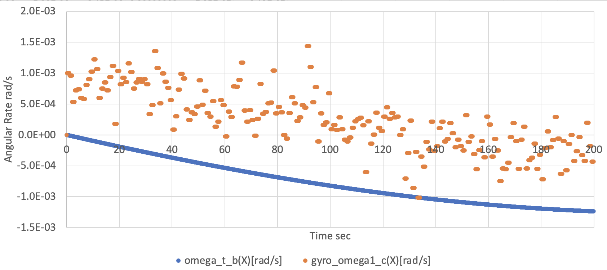

# How To Add Components

## 1.  Overview

- In the [How To Make New Simulation Scenario](./HowToMakeNewSimulationScenario.md) tutorial, we have made an `s2e-user` directory for our simulation scenario.
- This tutorial explains how to add components to your scenario.
- A similar procedure is available for other components in the `s2e-core`.
- The supported version of this document
  - Please confirm that the version of the documents and s2e-core is compatible.


## 2. Add a Gyro sensor

- This chapter explains how to add a gyro sensor component to your `s2e-user` simulation case.

1. Open & edit `user_components.hpp`
   - Add the following descriptions at the one line below of `#include <components/real/cdh/on_board_computer.hpp>`
     ```c++
     #include <components/real/aocs/gyro_sensor.hpp>
     ```
   - Add the following descriptions at the one line below of `  OnBoardComputer *obc_;  //!< Onboard Computer`
     ```c++
     GyroSensor *gyro_sensor_;  //!< Gyro sensor
     ```

4. Open and edit `user_components.cpp`
   - Edit the constructor function as follows to create an instance of the `GyroSensor` class at the one line below of `obc_ = new OnBoardComputer(clock_generator);`.
     ``` c++
     // Common
     IniAccess iniAccess = IniAccess(configuration_->spacecraft_file_list_[spacecraft_id]);
     const double compo_step_sec = global_environment_->GetSimulationTime().GetComponentStepTime_s();

     // Initialize of GYRO class
     std::string file_name = iniAccess.ReadString("COMPONENT_FILES", "gyro_file");
     configuration_->main_logger_->CopyFileToLogDirectory(file_name);
     gyro_sensor_ = new GyroSensor(InitGyroSensor(clock_generator, 1, file_name, compo_step_sec, dynamics));
     ```

   - Add the following descriptions at the one line up of `delete obc_;` in the destructor.
     ```c++
     delete gyro_sensor_;
     ```

   - Edit the `LogSetup` function as follows to register log output
     ``` c++
     void UserComponents::LogSetup(Logger &logger) { logger.AddLogList(gyro_sensor_); }
     ```

8. Open `user_satellite.ini` and edit `initial_angular_velocity_b_rad_s` to add initial angular velocity.
   - Users can select any value.

9. Add the following descriptions at the bottom line of `[COMPONENT_FILES]` to set the initialize file for the gyro sensor.

   ```c++
   gyro_file = ../../data/initialize_files/components/gyro_sensor_xxx.ini
   ```

10. Build the `s2e-user` and execute it

11. Check the log output file to find `gyro_sensor1_measured_angular_velocity_c`, the gyro sensor's output angular velocity value in the component frame.

    - Since the default initializing file is described as that the sensor has no noise, the value of `gyro_sensor1_measured_angular_velocity_c` and `spacecraft_angular_velocity_b` is completely the same.

12. Edit the `data/initialize_files/components/gyro_sensor_xxx.ini` file to add several noises, and rerun the `s2e-user`

13. Check the log output file to find `gyro_sensor1_measured_angular_velocity_c`. Now the sensor output has several errors you set in the initialize file like the following figure.

    - We edited the file as `constant_bias_c_rad_s(0) = 0.001` and `normal_random_standard_deviation_c_rad_s(0) = 0.001` to get the following figure.

    

## 3. Add another Gyro sensor

- You can add multiple components in your `s2e-user` simulation case similar to the above sequence.

1. Open `user_components.hpp`

2. Add the following descriptions at the one line below of `GyroSensor *gyro_sensor_;`

   ```c++
   GyroSensor *gyro_sensor_2_;  //!< Gyro sensor 2
   ```

3. Open `user_components.cpp`

4. Edit the constructor function to add the following description to create the second instance of the GYRO class

   ``` c++
   file_name = iniAccess.ReadString("COMPONENT_FILES", "gyro_file_2");
   configuration_->main_logger_->CopyFileToLogDirectory(file_name);
   gyro_sensor_2_ = new GyroSensor(InitGyroSensor(clock_generator, 2, file_name, compo_step_sec, dynamics));
   ```

5. Add the following descriptions at the one line below of `delete gyro_;` in the destructor

   ```c++
   delete gyro_sensor_2_;
   ```

6. Edit the `LogSetUp` function as follows to register log output

   ``` c++
   void UserComponents::LogSetup(Logger &logger) {
     logger.AddLogList(gyro_sensor_);
     logger.AddLogList(gyro_sensor_2_);
   }
   ```

7. Open `user_satellite.ini`

8. Add the following descriptions at the bottom line of `[COMPONENT_FILES]` to set the initialize file for the gyro sensor

   ```c++
   gyro_file_2 = ../../data/initialize_files/components/gyro_sensor_yyy.ini
   ```

9. Copy the `data/initialize_files/components/gyro_sensor_xxx.ini` file and rename it as `gyro_sensor_yyy.ini`

10. Edit `gyro_sensor_yyy.ini` to custom the noise performance of the second gyro sensor
    - Edit sensor ID like `[GYRO_SENSOR_1]` to `[GYRO_SENSOR_2]`
    - Edit sensor ID like `[SENSOR_BASE_GYRO_SENSOR_1]` to `[SENSOR_BASE_GYRO_SENSOR_2]`

11. Build the `s2e-user` and execute it

12. Check the log output file to find `gyro_sensor2_measured_angular_velocity_c`, the second gyro sensor's output angular velocity value in the component frame.
