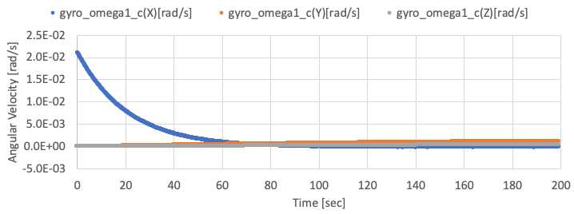
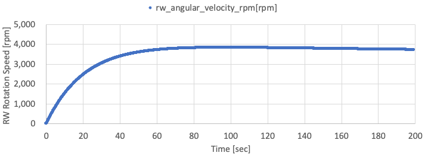

# How To Add Control Algorithms

## 1.  Overview
- In the [How To Make New Components](./HowToMakeNewComponents.md) tutorial, we have newly made components emulating codes in [s2e-core](https://github.com/ut-issl/s2e-core) and adding the new components into our simulation scenario.
- Now we can simulate the behavior of spacecraft **free motion** and emulate the behavior of sensors and actuators. 
- This tutorial explains how to add a **Control Algorithm** into the simulation scenario. 
- For a practical satellite project, we should implement the control algorithm as actual flight software like [C2A](https://github.com/ut-issl/c2a-core) into the S2E. However, using actual flight software is usually overdoing for use cases as research, the initial phase of satellite projects.
- So, we introduce the following three methods, and users can choose a suitable method.
  - Direct: Directly control physical quantity without sensors, actuators, and their noises
    - For theoretical researches and preliminary analysis for satellite projects
  - Component: Control using sensors and actuators without flight S/W framework
    - For engineering researches and preliminary analysis for satellite projects
  - FlightSW: Control using sensors and actuators with flight S/W framework
    - For actual satellite projects
- The Supported version of this document
  - s2e-core: [v4.0](https://github.com/ut-issl/s2e-core/releases/tag/v4.0)

## 2. Direct method
- This chapter introduces the simplest way to add a control algorithm without sensors and actuators.
- This method directly measures the satellite's physical quantity and generates torque and force acting on the satellite.
- To do that, users need to edit the `Update` function in the `UserSat.cpp`.
- The `UserSat` class already has satellite attitude, orbit, and local environment information since it inherits the `Spacecraft` base class. So users can easily access these values.
- To measure physical quantities, users can use getter functions defined in the `Attitude`, `Orbit`, and `LocalEnvironment` classes as `dynamics_->GetAttitude().GetOmega_b()`.
- To generate torque and force, users can use `dynamics_->AddTorque_b` and `dynamics_->AddForce_b`.
- The sample codes are in `SampleCodes/ControlAlgorithm/DirectMethod/`, and you can see very simple detumbling with the proportional control method.
- To use the sample code, you need to copy the `User_sat_with_control.cpp` and build it instead of `User_sat.cpp`.
  - You need to edit `CMakeLists.txt` to add the copied `User_sat_with_control.cpp` to the `SOURCE_FILES` instead of the `User_sat.cpp`.
- By using the sample code with initial angular velocity = [0.05, -0.03, 0.01] rad/s, the following results are given.
  - You need to edit the initialize file to set the initial angular velocity.
    
      

      
   
      

## 3. Component method
- This chapter introduces a method to add a control algorithm using sensors and actuators.
- This method measures a satellite's physical quantity via sensors, generates torque and force via actuators, and executes control algorithms on OBC.
- This tutorial assumes the spacecraft has a three-axis gyro sensor, a reaction wheel, and an OBC.
- The sample codes are in `SampleCodes/ControlAlgorithm/ComponentMethod/`
- Firstly, users need to make the `User_OBC` class to emulate the OBC.
  - Copy the `User_OBC` files to the `S2E_USER/src/Components` from the `ComponentMethod/src/Components`, and add the `User_OBC.cpp` to the `set(SOURCE_FILES)` in the `CMakeLists.txt` to compile it.
  - The `User_OBC` class has the `UserComponent` class as a member, and users can access all components to get sensing information or set the output of actuators.
  - In this tutorial, the angular velocity is measured by the gyro sensor. RW's output torque is calculated using the X-axis of the measured angular velocity, and the torque is set to RW.
- Next, users need to add the `User_OBC` into the `User_Component` class. You can copy the `User_Components` files to the `S2E_USER/src/Simulation/Spacecraft` from the `ComponentMethod/src/Simulation`.
- Finally, users need to add new source codes to the `CMakeLists.txt` to compile them.
- By using the sample code, the following results are given.
  - The X-axis angular velocity is controlled, but other axes are not controlled well since the satellite only has an RW on X-axis. The X-axis angular velocity has offset value since the gyro has offset noise.

      
      
      

  - The following two figure shows the observed angular velocity by gyro and the rotation speed of the RW. You can find the observed X-axis angular velocity reaches zero by the control.

      
      

## 4. FlightSW method: Control algorithm within C2A
- TBW
