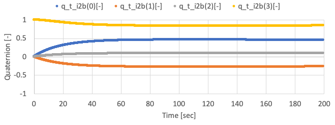

# How To Add Control Algorithms

## 1.  Overview
- In the [How To Make New Components](./Tutorials/HowToMakeNewComponents.md) tutorial, we have newly made components emulating codes in [S2E_CORE_OSS](https://gitlab.com/ut_issl/s2e/s2e_core_oss) and add the new components into our own simulation scenario.
- Now we can simulate the behavior of spacecraft **free motion** and emulate the behavior of sensors and actuators. 
- This tutorial explains how to add a **Control Algorithm** into the simulation scenario. 
- For practical satellite project, we should implement the control algorithm as real flight software like [C2A](https://gitlab.com/ut_issl/c2a/c2a_core_oss) into the S2E. However, usually, using real flight software is overdoing for use cases as research, the initial phase of satellite projects.
- So, we introduce the following three methods, and users can choose a suitable method.
  - Direct: Directly control physical quantity without sensors, actuators, and their noises
    - For theoretical researches and preliminary analysis for satellite projects.
  - Component: Control using sensors and actuators without flight S/W framework
    - For engineering researches and preliminary analysis for satellite projects. 
  - FlightSW: Control using sensors and actuators with flight S/W framework
    - For actual satellite projects.
- Supported version of this document
  - S2E_CORE_OSS:c4c7cf6567c077f0918f07a9a82c2d7e4531ceb7

## 2. Direct method
- In this chapter, the simplest way to add a control algorithm without sensors and actuators is introduced.
- This method directly measures satellite physical quantity, and directly generate torque and force acting on the satellite.
- To do that, users need to edit the `Update` function in the `UserSat.cpp`.
- The `UserSat` class already has satellite attitude, orbit, and local environment information since it inherits `Spacecraft` base class. So users can easily access these values.
- To measure physical quantities, users can use getter functions defined in `Attitude`, `Orbit`, and `LocalEnvironment` classes as `dynamics_->GetAttitude().GetOmega_b()`.
- To generate torque and force, users can use `dynamics_->AddTorque_b` and `dynamics_->AddForce_b`.
- The sample codes are in `SampleCodes/ControlAlgorithm/DirectMethod/`, and you can see very simple detumbling with the proportional control method.
- To use the sample code with initial angular velocity = [0.1,0.0,0.0] rad/s, you need to copy the `User_sat_with_control.cpp` and `User_sat_with_control.h` and build them instead of `User_sat.cpp`.
  - You need to edit `CMakeLists.txt` to add the copied `User_sat_with_control.cpp` to the `SOURCE_FILES`.
- By using the sample code, the following results are given.
    
    
    

## 3. Component method
- In this chapter, a method to add control algorithm using sensors and actuators is introduced.
- This method measures satellite physical quantity via sensors, and generate torque and force via actuators, and a control algorithms are executed on OBC.
- We assume the spacecraft has a three-axis gyro sensor, a reaction wheel, and an OBC in this tutorial.
- The sample codes are in `SampleCodes/ControlAlgorithm/ComponentMethod/`
- Firstly, users need to make `User_OBC` class emulates the OBC.
  - Copy the `User_OBC` files to the `S2E_USER/src/Components` from the `ComponentMethod/src/Components`
  - The `User_OBC` class has the `UserComponent` class as a member, and users can access the all components to get sensing information or to set the output of actuators.
  - In this tutorial, the angular velocity is measured by the gyro sensor. The output torque for RW is calculated by using the X-axis of the measured angular velocity, and the torque is set to RW.
- Next, users need to add the `User_OBC` into the `User_Component` class. You can copy the `User_Components` files to the `S2E_USER/src/Simulation/Spacecraft` from the `ComponentMethod/src/Simulation`.
- Finally, users need to add a code into the `UserSat.cpp` to generate torque and force from the components. You can copy the `UserSat` files to the `S2E_USER/src/Simulation/Spacecraft` from the `ComponentMethod/src/Simulation`.
- By using the sample code, the following results are given.
  - The X-axis angular velocity is controlled, but other axes are not controlled well since the satellite only has an RW on X-axis.
    
    
    

## 4. FlightSW method ~Control algorithm within C2A~
- TBW